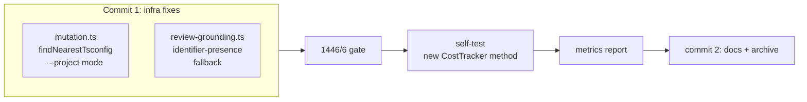

## Goal

Two deterministic infrastructure fixes before Stage 6 Phase 1, plus a Docker rebuild to
bake in the audit fix already applied to `pnpm-lock.yaml`.

**Fix 1 — `runStrykerPreflight` false positive:** `tsc --noEmit <file.ts>` runs tsc in
standalone mode, which cannot resolve cross-package workspace imports. A file that compiles
correctly under `tsc --build` fails in isolation because `@bollard/engine/src/errors.js`
etc. aren't in scope. The fix: walk up from the mutated file to find its nearest
`tsconfig.json` and run `tsc --noEmit --project <tsconfig>` instead. Gives tsc the full
package context. Falls back to standalone if no tsconfig found.

**Fix 2 — Semantic review grounding identifier-presence fallback:** `verifyReviewGrounding`
currently drops any finding whose `grounding[].quote` isn't a verbatim substring of the
diff or plan. Semantic reviewers describe emergent behavior ("humanReadable() returns a
formatted string") which is accurate but not copy-pasted. The fix: when a verbatim match
fails on a `source: "diff"` quote, extract named identifiers from the `finding` text and
check if any appear in the diff. If yes, keep the finding. This is still a deterministic
post-filter (ADR-0001 pattern) — no LLM involved.

**Current state (main @ 2a34903+prompts):**
- Tests: **1441 passed / 6 skipped**
- Stryker: skipped on last 2 self-tests (false positive tsc preflight)
- Semantic grounding: 40% (isUnlimited() run) — target > 50%
- Audit: `pnpm audit --fix` already applied; rebuild bakes it in



---

## Step 1 — Docker rebuild + audit check

```bash
docker compose build dev
docker compose run --rm dev audit
```

Expected: no high-severity advisories. If any remain after the rebuild, report them — do
NOT auto-fix further without understanding the dependency chain.

---

## Step 2 — Fix `runStrykerPreflight` in `packages/verify/src/mutation.ts`

### Import change (line 4)

Add `dirname` and `resolve` to the existing `node:path` import:

```typescript
import { dirname, join, resolve } from "node:path"
```

(`existsSync` is already imported from `node:fs`.)

### Add `findNearestTsconfig` helper (insert just before `runStrykerPreflight`)

```typescript
/**
 * Walk up from `filePath` toward `rootDir` to find the nearest tsconfig.json.
 * Returns the absolute path to the tsconfig, or null if none found before root.
 * Exported for unit testing.
 */
export function findNearestTsconfig(filePath: string, rootDir: string): string | null {
  let dir = dirname(resolve(filePath))
  const root = resolve(rootDir)
  while (dir.length >= root.length && dir !== root) {
    const candidate = join(dir, "tsconfig.json")
    if (existsSync(candidate)) return candidate
    const parent = dirname(dir)
    if (parent === dir) break
    dir = parent
  }
  return null
}
```

### Replace `runStrykerPreflight` body (lines 558–579)

Keep the function signature and JSDoc exactly as-is. Replace the body:

```typescript
export async function runStrykerPreflight(
  workDir: string,
  mutateFiles: string[],
): Promise<string | null> {
  if (mutateFiles.length === 0) return null

  const tsFiles = mutateFiles.filter(
    (f) => f.endsWith(".ts") || f.endsWith(".tsx") || f.endsWith(".js") || f.endsWith(".jsx"),
  )
  if (tsFiles.length === 0) return null

  // Find nearest tsconfig.json for each mutated file. Running `tsc --noEmit file.ts`
  // uses standalone mode — cross-package workspace imports are unresolvable, causing
  // false-positive failures even when the full project compiles cleanly (Phase 3
  // regression observed in isUnlimited() self-test 2026-06-04).
  const root = resolve(workDir)
  const tsconfigs = new Set<string>()
  for (const f of tsFiles) {
    const tsconfig = findNearestTsconfig(resolve(f), root)
    if (tsconfig !== null) tsconfigs.add(tsconfig)
  }

  if (tsconfigs.size === 0) {
    // No tsconfig found — fall back to original standalone check
    try {
      await execFileAsync("tsc", ["--noEmit", ...tsFiles], { cwd: workDir, timeout: 15_000 })
      return null
    } catch (err: unknown) {
      const msg = err instanceof Error ? err.message : String(err)
      return `tsc preflight failed on ${tsFiles.join(", ")}: ${msg.slice(0, 500)}`
    }
  }

  for (const tsconfig of tsconfigs) {
    try {
      await execFileAsync("tsc", ["--noEmit", "--project", tsconfig], {
        cwd: workDir,
        timeout: 30_000,
      })
    } catch (err: unknown) {
      const msg = err instanceof Error ? err.message : String(err)
      return `tsc preflight failed (project ${tsconfig.replace(root + "/", "")}): ${msg.slice(0, 500)}`
    }
  }
  return null
}
```

### Tests — `packages/verify/tests/mutation-preflight.test.ts`

Add the `findNearestTsconfig` import at the top alongside `runStrykerPreflight`.

Add 2 new tests inside `describe("runStrykerPreflight", ...)`:

```typescript
it("finds tsconfig.json when present in the file's parent directory", async () => {
  const dir = await mkdtemp(join(tmpdir(), "bollard-preflight-tsconfig-"))
  const tsconfigPath = join(dir, "tsconfig.json")
  await writeFile(tsconfigPath, JSON.stringify({ compilerOptions: { strict: true } }), "utf-8")
  const result = findNearestTsconfig(join(dir, "src", "foo.ts"), dir)
  // No tsconfig in src/ — should find the one in dir
  // Note: src/ doesn't exist but findNearestTsconfig only checks dirname, not existence
  expect(result).toBe(tsconfigPath)
})

it("returns null when no tsconfig.json exists between file and root", async () => {
  const dir = await mkdtemp(join(tmpdir(), "bollard-preflight-noconfig-"))
  const result = findNearestTsconfig(join(dir, "src", "foo.ts"), dir)
  expect(result).toBeNull()
})
```

Also import `findNearestTsconfig` at the top of the test file.

---

## Step 3 — Fix `verifyReviewGrounding` in `packages/verify/src/review-grounding.ts`

### Add `findingIdentifiersInCorpus` helper (insert just before `verifyReviewGrounding`)

```typescript
/**
 * Identifier-presence fallback for semantic review grounding.
 * Extracts meaningful named identifiers (camelCase methods, PascalCase types,
 * UPPER_SNAKE constants) from the finding text and checks if at least one appears
 * in the diff corpus entries. Used when a verbatim quote match fails for a
 * source:"diff" grounding item — the reviewer accurately describes the change
 * but uses behavioral language rather than copy-pasting code text.
 *
 * Requires identifiers of length ≥ 4 to avoid matching common words ("diff",
 * "file", "type", etc.).
 *
 * Exported for unit testing.
 */
export function findingIdentifiersInCorpus(findingText: string, corpus: ReviewCorpus): boolean {
  const identifiers =
    findingText.match(/\b[a-z][a-zA-Z0-9]{3,}(?:\(\))?|\b[A-Z][A-Z0-9_]{3,}\b|\b[A-Z][a-zA-Z0-9]{3,}/g) ??
    []
  if (identifiers.length === 0) return false
  const diffText = corpus.entries
    .filter((e) => e.source === "diff")
    .map((e) => e.text)
    .join("\n")
  return identifiers.some((id) => diffText.includes(id))
}
```

### Modify the grounding check inside `verifyReviewGrounding`

Find the existing block:
```typescript
      if (!quoteMatchesCorpus(g.quote, g.source, corpus)) {
        const truncated = g.quote.length > 120 ? `${g.quote.slice(0, 120)}...` : g.quote
        dropped.push({
          id: finding.id,
          reason: "grounding_not_in_corpus",
          detail: truncated,
        })
        groundingFailed = true
        break
      }
```

Replace with:
```typescript
      if (!quoteMatchesCorpus(g.quote, g.source, corpus)) {
        // For diff-sourced quotes, fall back to identifier-presence: if the finding
        // text names at least one identifier that appears in the diff, the finding is
        // grounded even when the quote is behavioral rather than verbatim code text.
        if (g.source === "diff" && findingIdentifiersInCorpus(finding.finding, corpus)) {
          continue
        }
        const truncated = g.quote.length > 120 ? `${g.quote.slice(0, 120)}...` : g.quote
        dropped.push({
          id: finding.id,
          reason: "grounding_not_in_corpus",
          detail: truncated,
        })
        groundingFailed = true
        break
      }
```

### Tests — `packages/verify/tests/review-grounding.test.ts`

Import `findingIdentifiersInCorpus` alongside the existing imports.

Add 3 new tests inside `describe("verifyReviewGrounding", ...)`:

```typescript
  it("keeps diff finding with paraphrased quote when identifiers match corpus (identifier fallback)", () => {
    const doc = parseReviewDocument(
      JSON.stringify({
        findings: [
          {
            id: "r1",
            severity: "warning",
            category: "plan-divergence",
            finding: "humanReadable() returns a formatted cost string",
            grounding: [{ quote: "returns a formatted cost string", source: "diff" }],
          },
        ],
      }),
    )
    // diff contains humanReadable — identifier from finding text
    const corpus = buildReviewCorpus("+  humanReadable(): string {\n+    return 'formatted'\n", {})
    const result = verifyReviewGrounding(doc, corpus)
    expect(result.kept).toHaveLength(1)
    expect(result.dropped).toHaveLength(0)
  })

  it("drops diff finding when quote is paraphrased and no identifiers match", () => {
    const doc = parseReviewDocument(
      JSON.stringify({
        findings: [
          {
            id: "r1",
            severity: "info",
            category: "naming-consistency",
            finding: "method returns wrong value",
            grounding: [{ quote: "returns wrong value", source: "diff" }],
          },
        ],
      }),
    )
    // diff has no identifiers matching the finding text
    const corpus = buildReviewCorpus("+  foo(): number {\n+    return 42\n", {})
    const result = verifyReviewGrounding(doc, corpus)
    expect(result.kept).toHaveLength(0)
    expect(result.dropped.some((d) => d.reason === "grounding_not_in_corpus")).toBe(true)
  })

  it("identifier fallback does not apply to plan-sourced quotes (verbatim required)", () => {
    const doc = parseReviewDocument(
      JSON.stringify({
        findings: [
          {
            id: "r1",
            severity: "warning",
            category: "plan-divergence",
            finding: "humanReadable method is not in the plan",
            grounding: [{ quote: "paraphrased plan text", source: "plan" }],
          },
        ],
      }),
    )
    const corpus = buildReviewCorpus("+  humanReadable(): string {}\n", {
      summary: "actual plan text here",
    })
    const result = verifyReviewGrounding(doc, corpus)
    // plan source still requires verbatim — identifier fallback only for diff
    expect(result.kept).toHaveLength(0)
    expect(result.dropped.some((d) => d.reason === "grounding_not_in_corpus")).toBe(true)
  })
```

---

## Step 4 — Validate

```bash
docker compose run --rm dev run typecheck
docker compose run --rm dev run lint
docker compose run --rm dev run test
```

Gate: **1446 passed / 6 skipped** (1441 + 2 preflight + 3 grounding = +5).

---

## Step 5 — Commit infrastructure changes

```bash
git add packages/verify/src/mutation.ts \
        packages/verify/src/review-grounding.ts \
        packages/verify/tests/mutation-preflight.test.ts \
        packages/verify/tests/review-grounding.test.ts
git commit -m "$(cat <<'EOF'
determinism: project-aware Stryker preflight + semantic review identifier fallback

runStrykerPreflight: replace tsc --noEmit <files> (standalone mode) with
findNearestTsconfig + tsc --noEmit --project <tsconfig>. Standalone mode
cannot resolve cross-package workspace imports — causes false-positive
preflight failures even when tsc --build passes cleanly. +2 tests.

verifyReviewGrounding: add identifier-presence fallback for source:"diff"
quotes. When a verbatim match fails, extract named identifiers (camelCase,
PascalCase, UPPER_SNAKE) from the finding text and check if any appear in
the diff corpus. Finding is kept if at least one matches. Plan-sourced
quotes still require verbatim match. +3 tests.

Both changes are deterministic post-filters (ADR-0001 pattern). No LLM
calls added. +5 tests; 1446/6.
EOF
)"
```

---

## Step 6 — Bollard-on-Bollard self-test

**Before running:** verify the chosen method does not already exist on main:
```bash
grep -n "breakdown\b" packages/engine/src/cost-tracker.ts
```
If found, pick a different method from this list (all verified absent):
- `CostTracker.breakdown(): { totalCostUsd: number; limitUsd: number; remainingUsd: number; percentUsed: number; isUnlimited: boolean }`
- `CostTracker.fraction(): number` — ratio 0.0–1.0, vs percentUsed which is 0–100
- `CostTracker.remaining(): number` — `Math.max(0, limit - total)`

Use whichever is absent. The task should produce a meaningful diff (method body + type annotations) for the semantic reviewer to work with.

```bash
docker compose run --rm -e BOLLARD_AUTO_APPROVE=1 dev sh -c \
  'pnpm --filter @bollard/cli run start -- run implement-feature \
   --task "Add CostTracker.breakdown(): { totalCostUsd: number; limitUsd: number; remainingUsd: number; percentUsed: number; isUnlimited: boolean } method returning a structured snapshot of current cost state" \
   --work-dir /app'
```

---

## Step 7 — Report

| Metric | Target | isUnlimited() | breakdown() |
|--------|--------|---------------|-------------|
| CLI | 17/17 | ✓ | ? |
| Cost | < $1.96 | $1.05 | ? |
| Coder turns | < 40 | 17 | ? |
| Contract | > 80% | 6/6 (0%) | ? |
| Boundary | > 80% | 7/7 (0%) | ? |
| Semantic kept | **> 50%** | **2/5 (40%)** | **? ← primary** |
| static-checks | **pass** | fail→skip (CVE) | ? |
| Mutation | **runs** | skipped (preflight) | ? |

**Primary validations:**
- `static-checks`: should now pass (audit CVE fixed, overwrite guard preventing coder tsc errors)
- Mutation: Stryker should run — `run-mutation-testing` node should report `totalMutants > 0`
- Semantic grounding: > 50% with identifier-presence fallback

If static-checks still fails, identify the exact check that failed (typecheck / lint / audit / secretScan) — it's a different root cause from what we fixed.

If Stryker still skips, check whether it's the preflight or a different error (totalMutants = 0 vs preflight fail).

---

## Step 8 — Conditional baseline retag

**Only if:** CLI success AND cost < $3.00.

```bash
docker compose run --rm dev sh -c \
  'pnpm --filter @bollard/cli run start -- cost-baseline tag post-determinism-fixes'
```

Current baseline: `post-prompt-hardening` @ $1.0537.

---

## Step 9 — Docs and archive

**CLAUDE.md:**
1. Self-test paragraph for breakdown() run
2. Known Limitations — update `runStrykerPreflight` entry:
   ```
   - **Stage 5e Phase 3 (updated):** `runStrykerPreflight` now finds the nearest
     `tsconfig.json` and runs `tsc --noEmit --project <tsconfig>` instead of standalone
     per-file mode. Fixes false-positive preflight failures on cross-package imports.
     Falls back to standalone when no tsconfig found.
   ```
3. Add semantic grounding entry after the three-prompt hardening bullet:
   ```
   - ~~**Semantic review identifier-presence fallback:**~~ **DONE (2026-06-XX).** `findingIdentifiersInCorpus`
     in `review-grounding.ts` — when verbatim quote fails on source:"diff", checks if identifiers
     from finding text appear in diff. Still deterministic (ADR-0001). Plan quotes unchanged. +3
     tests. 1446/6.
   ```
4. Update test count.

**ROADMAP.md:** Stage 5e section — add determinism fixes bullet.

**Archive + docs commit:**
```bash
git mv spec/prompts/determinism-fixes-selftest.md spec/archive/
git add CLAUDE.md spec/ROADMAP.md spec/self-test-<method>-results.md \
        spec/archive/determinism-fixes-selftest.md
git commit -m "docs: determinism fixes + <method> self-test results"
```

Include `.bollard/cost-baseline.json` if Step 8 ran. Push.

---

## Final self-check

1. `docker compose run --rm dev run typecheck` — exit 0
2. `docker compose run --rm dev run lint` — exit 0
3. `docker compose run --rm dev run test` — **≥ 1446 passed / 0 failed**
4. `git log --oneline -3` — infra commit + self-test implementation + docs commit
5. `ls spec/prompts/` — this prompt absent
6. `git status` — clean

---

## Out of scope

- DO NOT change `normaliseForComparison` or `quoteMatchesCorpus` — only add the fallback
- DO NOT apply identifier-presence to `source: "plan"` quotes — those remain verbatim-only
- DO NOT touch prompt files — those are already committed
- DO NOT start Stage 6 Phase 1 infrastructure in this pass
