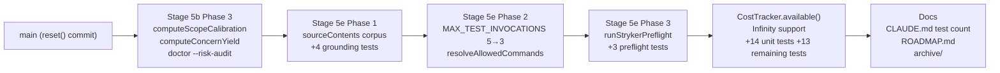

## Goal

Fix two known issues in the `bollard/20260602-0343-run-d0c256` working tree, verify the full test suite passes, then commit everything to `main` in logical stage groups. The working tree contains Stage 5b Phase 3 (meta-verification), Stage 5e Phase 1–3, and `CostTracker.available()` — all uncommitted and currently sitting unstaged on the branch.

**Do NOT** touch any file not listed in the commit groups below. Do not re-implement any logic; all the code is already correct. The only code changes are the two lint/description fixes in step 1.

---

## Architecture



---

## Step 1 — Fix lint/description issues (code changes only here)

### Fix 1: unused `vi` import in adversarial test

File: `packages/engine/tests/cost-tracker.adversarial.test.ts`

Line 1 currently reads:
```typescript
import { describe, it, expect, vi } from "vitest"
```

Change to (remove `vi`):
```typescript
import { describe, expect, it } from "vitest"
```

`vi` is imported but never used. Biome's `recommended` rules flag this.

### Fix 2: misleading test description in cost-tracker-available.test.ts

File: `packages/engine/tests/cost-tracker-available.test.ts`

Find the test whose description says `"returns true for zero limit with zero total"` but calls `expect(tracker.available()).toBe(false)`. The description contradicts the expectation. Change the description to:

```typescript
it("returns false for zero limit (remaining() is 0)", () => {
```

The logic and assertion are correct; only the description string needs fixing.

---

## Step 2 — Format all modified files

Run inside Docker:

```bash
docker compose run --rm dev sh -c 'pnpm exec biome check --write --unsafe .'
```

This fixes formatting, import ordering, and any remaining biome issues across all packages. Expect no errors after this; warnings are acceptable.

---

## Step 3 — Verify

Run in this order inside Docker. Stop and report if any step fails — do NOT proceed to commits if tests are red.

```bash
# Typecheck all packages
docker compose run --rm dev run typecheck

# Lint
docker compose run --rm dev run lint

# Full test suite — record the pass count
docker compose run --rm dev run test

# Adversarial suite
docker compose run --rm dev exec vitest run --config vitest.adversarial.config.ts
```

Record the exact pass/skip counts from `pnpm run test`. You will need them for the CLAUDE.md update in step 7.

Expected: all tests pass. The pass count should be in the range 1398–1410 (was 1348 on main before this work).

---

## Step 4 — Commit: Stage 5b Phase 3 (meta-verification)

```bash
git add \
  packages/engine/src/run-history.ts \
  packages/engine/src/types.ts \
  packages/engine/tests/risk-audit.test.ts \
  packages/cli/src/doctor.ts \
  packages/cli/src/index.ts \
  packages/cli/tests/doctor-risk-audit.test.ts

git commit -m "Stage 5b Phase 3: meta-verification + adaptive concern weights

Add computeScopeCalibration and computeConcernYield to @bollard/engine.
New bollard doctor --risk-audit flag renders scope calibration table and
concern yield suggestions. Advisory only — no LLM calls, no config changes.
+10 tests in risk-audit.test.ts, +8 in doctor-risk-audit.test.ts."
```

---

## Step 5 — Commit: Stage 5e Phase 1, 2, and 3

Three separate commits.

### 5e Phase 1 — Contract grounding corpus expansion
```bash
git add \
  packages/blueprints/src/implement-feature.ts \
  packages/verify/src/contract-grounding.ts \
  packages/verify/tests/contract-grounding.test.ts \
  packages/agents/prompts/contract-tester.md

git commit -m "Stage 5e Phase 1: include source file contents in contract grounding corpus

contractContextToCorpus now accepts optional sourceContents string[].
verify-claim-grounding node reads affected source files post-implementation
and passes content to the corpus, closing the gap where testers quote
method body behavior not present in signatures or plan text. +4 tests."
```

### 5e Phase 2 — Coder turn reduction
```bash
git add \
  packages/agents/src/tools/run-command.ts \
  packages/agents/tests/tools.test.ts \
  packages/agents/tests/tools/run-command.adversarial.test.ts \
  packages/agents/prompts/coder.md

git commit -m "Stage 5e Phase 2: coder turn reduction + allowed-commands from profile

MAX_TEST_INVOCATIONS lowered 5->3. resolveAllowedCommands derives the
allowed command list from ctx.pipelineCtx.toolchainProfile.packageManager
when ctx.allowedCommands is not set. isTestCommand extended to recognize
npm/yarn/bun/pytest/cargo test/go test. ls added to DEFAULT_ALLOWED_COMMANDS.
+3 tests in tools.test.ts."
```

### 5e Phase 3 — Stryker preflight
```bash
git add \
  packages/verify/src/mutation.ts \
  packages/verify/tests/mutation-preflight.test.ts

git commit -m "Stage 5e Phase 3: Stryker tsc preflight to catch stryker_no_mutants

runStrykerPreflight runs tsc --noEmit on mutateFiles before launching Stryker.
Catches syntax/type errors that cause Stryker to exit with 0 mutants due to
Babel/oxc parse failures. Returns ZERO_RESULT with graceful skip on failure.
Validated in production: caught tsc error in available() self-test run.
+3 tests in mutation-preflight.test.ts."
```

---

## Step 6 — Commit: CostTracker.available()

```bash
git add \
  packages/engine/src/cost-tracker.ts \
  packages/engine/tests/cost-tracker-available.test.ts \
  packages/engine/tests/cost-tracker-remaining.test.ts \
  packages/engine/tests/cost-tracker.adversarial.test.ts \
  packages/engine/tests/cost-tracker.test.ts

git commit -m "feat: add CostTracker.available(): boolean + Infinity limit support

available() returns true when remaining() is Infinity or remaining() > 0.
Constructor and withLimit() now accept Infinity (unlimited budget); remaining()
returns Infinity when _limit is Infinity; percentUsed() and summary() handle
the Infinity case gracefully. +14 tests in cost-tracker-available.test.ts,
+13 in cost-tracker-remaining.test.ts. Adversarial test file replaced with
available() boundary tests (11 tests)."
```

---

## Step 7 — Commit: docs, update CLAUDE.md test count, merge to main

First, update the test count in CLAUDE.md. Find the line:

```
- **Latest count (authoritative, 2026-06-02, post Stage 5e Phase 3):** `1400` passed, `6` skipped
```

Replace `1400` with the actual count you recorded in step 3. If the count is different from 1400, also update the date accordingly.

Then commit everything remaining:

```bash
git add \
  CLAUDE.md \
  spec/ROADMAP.md \
  spec/archive/prompts/stage5b-phase3-meta-verification.md \
  spec/archive/prompts/stage5e-phase1-contract-grounding-corpus.md \
  spec/archive/prompts/stage5e-phase2-coder-turn-reduction.md \
  spec/archive/prompts/stage5e-phase3-stryker-preflight.md

git commit -m "docs: Stage 5b Phase 3 + Stage 5e Phase 1–3 + available() complete

Update CLAUDE.md with self-test results, final test count, and all stage
completion notes. Update ROADMAP.md. Archive all completed Cursor prompts."
```

Then merge to main:

```bash
git checkout main
git merge --no-ff bollard/20260602-0343-run-d0c256 -m "Merge Stage 5b Phase 3 + Stage 5e + CostTracker.available()"
```

---

## Self-check

Run after all commits, before declaring done:

```bash
# Confirm all tests still pass on main
docker compose run --rm dev run test

# Confirm typecheck clean
docker compose run --rm dev run typecheck

# Confirm lint clean
docker compose run --rm dev run lint

# Confirm git log shows the 5 new commits above main's previous HEAD
git log --oneline -8
```

Expected: `git log` shows commits for 5b Phase 3, 5e Phase 1, 5e Phase 2, 5e Phase 3, available(), and docs — in that order above the previous `9a53915` HEAD.

---

## Out of scope

- DO NOT modify any file in `spec/prompts/` (the active queue); only archive files in `spec/archive/prompts/` are touched
- DO NOT re-run the Bollard pipeline — this is a manual cleanup commit, not a new feature run
- DO NOT change any agent prompts other than `coder.md` (Step 5e Phase 2) and `contract-tester.md` (Step 5e Phase 1) which are already in the working tree
- DO NOT squash the commits into one — each stage needs its own commit for traceability in `bollard history`
- DO NOT modify `packages/observe/` or `packages/mcp/` — no changes there in this working tree
