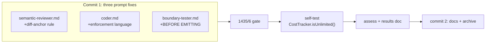

## Goal

Three prompt fixes before Stage 6 Phase 1. All are prompt-only (no tests, no infrastructure).
Then a self-test to confirm the overwrite guard (Phase 5e) is reducing tsc errors and mutation
skips, and that the grounding improvements are holding.

**Current baselines (main @ 2a34903):**
- Tests: **1435 passed / 6 skipped**
- Cost baseline: `post-5e-hardening` @ $1.5494
- Semantic grounding: 1/4 kept (humanReadable() run) — target > 50%
- Contract grounding: 8/8 (humanReadable() run) — ✓
- Boundary grounding: 14/14 (humanReadable() run) — ✓
- static-checks: **fail → skip** on last two self-tests — overwrite guard should clear this
- Mutation: **skipped (tsc preflight)** on last two self-tests — same root cause



---

## Step 1 — Fix semantic-reviewer.md

**File:** `packages/agents/prompts/semantic-reviewer.md`

In the `## BEFORE EMITTING — Self-check` section, the current checklist has 4 points ending
with "severity is warranted". Add a **5th point** immediately before "Only emit after this
check passes":

```markdown
5. **Diff quotes include the changed-line prefix:** For `source: "diff"` quotes, the quote
   must include the leading `+` or `-` character. Never quote a context line (no prefix) as
   evidence of what changed — context lines are unchanged code, not the diff. If your only
   candidate quote is a context line, find a `+`/`-` line that supports the finding instead,
   or drop the finding.
```

This makes the "Good" example's `+` prefix a stated requirement, not just an illustration.
No other changes to the file.

---

## Step 2 — Fix coder.md

**File:** `packages/agents/prompts/coder.md`

Replace the opening line of the **File Editing Strategy** section (currently line 19):

**Old:**
```
**Prefer `edit_file` over `write_file` for modifying existing files.** The `edit_file` tool has two modes:
```

**New:**
```
**Use `edit_file` for existing files — `write_file` is enforced for new files only.** Attempting `write_file` on a file that already exists returns an error and wastes a turn. The `edit_file` tool has two modes:
```

No other changes to the file.

---

## Step 3 — Fix boundary-tester.md

**File:** `packages/agents/prompts/boundary-tester.md`

After the grounding bullet that ends with "Paraphrases will be rejected by the deterministic
verifier." (currently inside the `grounding` field description), and before the `source` label
bullet, insert the bad/good example block:

Locate this exact text:
```
  - `quote` must be a **verbatim substring** copied from the **task description**, **acceptance criteria**, **runtime constraints** (if any), or the **type signatures / imports / types** you received in this message. Copy-paste the fragment exactly. Paraphrases will be rejected by the deterministic verifier.
  - `source` is a human-readable label
```

Replace with:
```
  - `quote` must be a **verbatim substring** copied from the **task description**, **acceptance criteria**, **runtime constraints** (if any), or the **type signatures / imports / types** you received in this message. Copy-paste the fragment exactly. The verifier runs a literal substring match — paraphrases are always rejected.
  - `source` is a human-readable label
```

Then, after the "If you cannot ground a claim..." line (currently the last bullet before the
`{{#if isTypeScript}}` block), add:

```markdown
**DO NOT paraphrase grounding quotes.**

Bad (paraphrase — will be rejected):
```json
{ "quote": "throws when given a negative value", "source": "criterion:2" }
```

Good (verbatim — exact characters from the acceptance criteria):
```json
{ "quote": "add() rejects negative cost values", "source": "criterion:2" }
```

## BEFORE EMITTING — Self-check (run this for every claim)

1. **Locate the quote:** Find each `grounding[].quote` as a literal substring in the task
   description, acceptance criteria, runtime constraints, or type signatures you received.
   If you cannot locate it character-for-character, replace it with a quote you CAN locate
   — or drop the claim.
2. **No paraphrase:** The quote must be copy-pasted. "throws on negative" is a paraphrase
   of "rejects negative cost values" — find the exact wording from the spec text.
3. **Source matches:** `source: "criterion:N"` must quote from acceptance criteria.
   `source: "signature:Foo.bar"` must quote from the type signature block.
4. **Test exercises the claim:** The `test` field must directly assert the property stated
   in `claim`. A test that passes regardless of whether the claim is true is not a test.

Only emit after this check passes for every claim.
```

---

## Step 4 — Validate

```bash
docker compose run --rm dev run typecheck
docker compose run --rm dev run lint
docker compose run --rm dev run test
```

Gate: **exactly 1435 passed / 6 skipped** (prompt-only, +0 tests). If the count differs,
only the three prompt files should have changed — diff and diagnose before committing.

---

## Step 5 — Commit all three prompt fixes

```bash
git add packages/agents/prompts/semantic-reviewer.md \
        packages/agents/prompts/coder.md \
        packages/agents/prompts/boundary-tester.md
git commit -m "$(cat <<'EOF'
prompts: tighten grounding rules across three agents

semantic-reviewer: add rule 5 to BEFORE EMITTING — source:diff quotes
must include leading +/- character; context lines do not count as
evidence of change (root cause of 75% drop rate in humanReadable() run)

coder: replace advisory 'Prefer edit_file' with enforcement language
matching the write_file overwrite guard (existing files return error;
prompt now accurately describes the infrastructure constraint)

boundary-tester: add bad/good paraphrase example + BEFORE EMITTING
4-point checklist for grounding self-verification (14/14 on last run;
checklist adds structural consistency with contract/semantic reviewers)

Prompt-only; +0 tests; 1435/6
EOF
)"
```

---

## Step 6 — Bollard-on-Bollard self-test

**Task:** `Add CostTracker.isUnlimited(): boolean method`

Single-line implementation (`return this._limit === Infinity`), not on main,
bounded scope. Good choice because:
- Small diff → semantic reviewer must anchor to changed `+` lines
- No existing method to accidentally overwrite → overwrite guard won't fire (but validates it doesn't block new files)
- Low implementation complexity → coder should be < 20 turns

```bash
docker compose run --rm -e BOLLARD_AUTO_APPROVE=1 dev sh -c \
  'pnpm --filter @bollard/cli run start -- run implement-feature \
   --task "Add CostTracker.isUnlimited(): boolean method that returns true when the tracker has no spend limit (i.e. limitUsd is Infinity)" \
   --work-dir /app'
```

**After run completes:**
```bash
docker compose run --rm dev sh -c \
  'pnpm --filter @bollard/cli run start -- history show <run-id>'
```

---

## Step 7 — Report

Capture and compare against targets:

| Metric | Target | humanReadable() | isUnlimited() |
|--------|--------|-----------------|----------------|
| CLI success | 17/17 | ✓ | ? |
| Total cost | < $1.96 | $1.55 | ? |
| Coder turns | < 40 | 26 | ? |
| Contract grounding | > 80% | 8/8 (0%) | ? |
| Boundary grounding | > 80% | 14/14 (0%) | ? |
| Semantic kept | **> 50%** | **1/4 (25%)** | **? ← primary validation** |
| static-checks | pass | fail → skip | ? |
| Mutation | runs | skipped | ? |

**Primary validation:** semantic grounding rate. If it's still ≤ 25%, the diff-anchor rule
alone is insufficient and a structural change to `verify-review-grounding.ts` may be needed.

**Secondary validation:** static-checks and mutation. If static-checks now passes (or fails
for a reason other than coder-introduced tsc errors), the overwrite guard is working. If
Stryker runs, the tsc preflight is no longer blocking it.

Write `spec/self-test-isunlimited-results.md` using same format as prior self-test docs.

---

## Step 8 — Conditional baseline retag

**Only if:** CLI success (17/17) AND cost < $3.00.

```bash
docker compose run --rm dev sh -c \
  'pnpm --filter @bollard/cli run start -- cost-baseline tag post-prompt-hardening'
docker compose run --rm dev sh -c \
  'pnpm --filter @bollard/cli run start -- cost-baseline diff'
```

If retag threshold not met, document in results spec and skip.

---

## Step 9 — Docs and archive

**CLAUDE.md:**
1. Self-test paragraph for isUnlimited() run (run id, cost, turns, all grounding rates,
   static-checks result, mutation result, overwrite guard note)
2. After humanReadable() DONE bullet in Stage 5e: add entry for prompt hardening:
   ```
   - ~~**Three-prompt grounding hardening:**~~ **DONE (2026-06-XX).** semantic-reviewer diff-anchor
     rule (+prefix required), coder write_file enforcement language, boundary-tester BEFORE EMITTING.
     Prompt-only; +0 tests; 1435/6. Self-test: isUnlimited() run `<id>`, $X.XX, XX turns.
   ```

**ROADMAP.md:** Stage 5e section — add bullet for prompt hardening pass.

**Archive:**
```bash
git mv spec/prompts/prompt-hardening-selftest.md spec/archive/
```

**Docs commit:**
```bash
git add CLAUDE.md spec/ROADMAP.md spec/self-test-isunlimited-results.md \
        spec/archive/prompt-hardening-selftest.md
git rm spec/prompts/prompt-hardening-selftest.md
git commit -m "docs: three-prompt hardening + isUnlimited() self-test results"
```

Include `.bollard/cost-baseline.json` in this commit if Step 8 ran.

---

## Final self-check

1. typecheck + lint + test — **1435/6 / 0 failed** (+ any tests promoted from self-test)
2. `git log --oneline -3` — prompt commit + docs commit on main
3. `ls spec/prompts/` — this file absent
4. `git diff main -- packages/agents/prompts/planner.md` — empty (not touched)
5. `bollard cost-baseline show` — `post-prompt-hardening` tag present if Step 8 ran
6. `git status` — clean

---

## Out of scope

- DO NOT change `planner.md`, `behavioral-tester.md`, `review-grounding.ts`
- DO NOT start Stage 6 Phase 1 infrastructure (`FileOwnershipStore`, CLI commands)
- DO NOT promote adversarial tests unless Signal 1 fires at `approve-pr`
- DO NOT modify the three prompt files after the commit in Step 5
