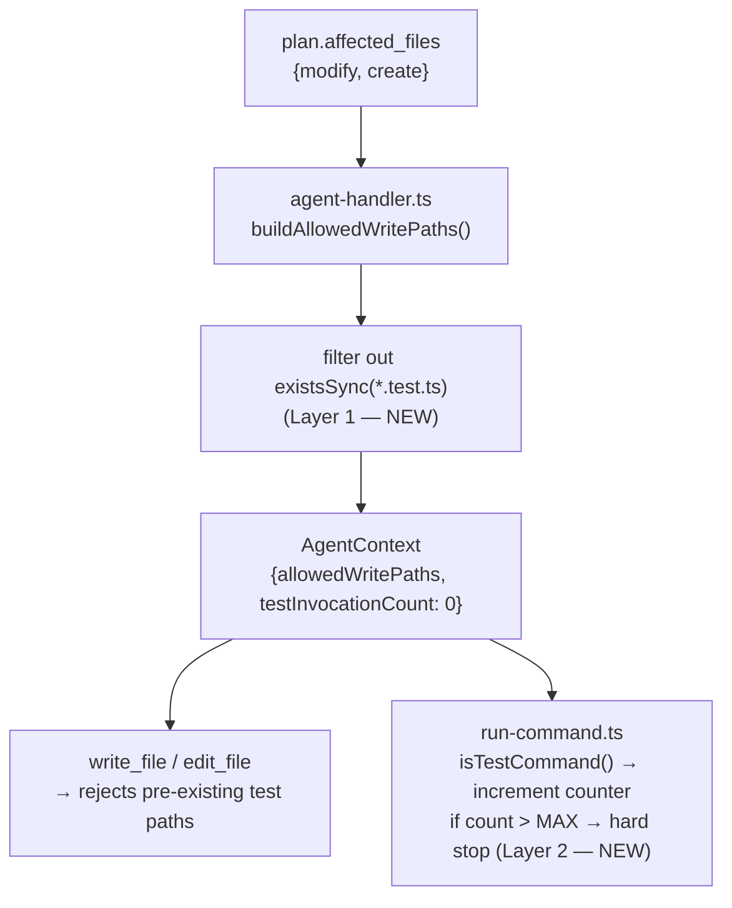

# Cursor Prompt — Fix: Coder Test-File Surgery Loop (Phase 16)

> **Context:** Analysis of 8 authoritative Bollard-on-Bollard self-test runs shows cost is dominated
> by the coder entering a test-file surgery loop — not by task complexity. `limitUsd()` (1-line getter)
> cost $5.02 / 54 turns because the coder spent turns 13–52 repeatedly editing `cost-tracker.test.ts`,
> running `pnpm test`, getting failures, and editing again. `toJSON()` (similar complexity) cost $1.32
> / 16 turns with no such loop.
>
> **Root cause:** Two missing constraints:
> 1. The coder can edit pre-existing test files (e.g. `packages/engine/tests/cost-tracker.test.ts`)
>    even though those are not in the plan's `affected_files`. The scope guard (`allowedWritePaths`)
>    currently populates from `plan.affected_files.modify + create`, and planners sometimes include
>    the existing test file there — which then becomes a legal write target.
> 2. There is no limit on how many times the coder can invoke `pnpm test` / `vitest`. Once stuck,
>    it loops indefinitely until `maxTurns` (60) fires.
>
> **Fix:** Two-layer guard:
> - **Layer 1 (primary):** After building `allowedWritePaths` from the plan, remove any paths that
>   resolve to a pre-existing `*.test.ts` or `*.test.js` file in the repo. The coder must write a
>   *new* test file, not edit the existing suite. Pre-existing test files are detected with
>   `existsSync` at the time the coder agent context is built.
> - **Layer 2 (failover):** Add `testInvocationCount` to `AgentContext`. `run-command.ts` increments
>   it whenever `isTestCommand()` is true. After `MAX_TEST_INVOCATIONS` (= 5), return a hard-stop
>   message instead of running the command. The coder must then report remaining failures instead of
>   retrying.
>
> **Read CLAUDE.md fully before starting.** Then read:
> - `packages/agents/src/types.ts` — `AgentContext`, `ExecutorOptions`
> - `packages/agents/src/tools/run-command.ts` — `isTestCommand`, `runCommandTool.execute`
> - `packages/cli/src/agent-handler.ts` lines 520–570 — where `allowedWritePaths` is set
> - `packages/agents/tests/tools/run-command.adversarial.test.ts` — existing 5 tests (67 lines)

---

## Architecture



---

## Step 1 — Strip pre-existing test files from `allowedWritePaths`

**File:** `packages/cli/src/agent-handler.ts`

Find the block (around line 531–541) that builds `allowedWritePaths`:

```typescript
if (agentRole === "coder" && ctx.plan) {
  const plan = ctx.plan as {
    affected_files?: { modify?: string[]; create?: string[] }
  }
  const affectedFiles = [
    ...(plan.affected_files?.modify ?? []),
    ...(plan.affected_files?.create ?? []),
  ]
  if (affectedFiles.length > 0) {
    agentCtx.allowedWritePaths = affectedFiles.map((f) => resolve(workDir, f))
  }
}
```

Change it to:

```typescript
if (agentRole === "coder" && ctx.plan) {
  const plan = ctx.plan as {
    affected_files?: { modify?: string[]; create?: string[] }
  }
  const affectedFiles = [
    ...(plan.affected_files?.modify ?? []),
    ...(plan.affected_files?.create ?? []),
  ]
  if (affectedFiles.length > 0) {
    const resolved = affectedFiles.map((f) => resolve(workDir, f))
    // Strip pre-existing test files — the coder must write a new test file,
    // never edit an existing test suite. This prevents the test-surgery loop
    // where the coder edits cost-tracker.test.ts 40+ times trying to get a
    // clean vitest run. New test files (not yet on disk) are still allowed.
    const { existsSync } = await import("node:fs")
    agentCtx.allowedWritePaths = resolved.filter((p) => {
      const isTestFile = /\.test\.[jt]s$/.test(p)
      return !(isTestFile && existsSync(p))
    })
  }
}
```

**Important:** `existsSync` is already available in Node — import it from `"node:fs"` inline (or add
to the top-level imports if `existsSync` is not already imported). Check the existing imports at the
top of `agent-handler.ts` before adding a duplicate.

**Behavior:**
- A path in the plan's `affected_files` that is a test file AND already exists on disk → stripped
- A path that is a test file AND does not yet exist (new file the coder will create) → kept
- All non-test files → unchanged

---

## Step 2 — Test invocation counter

### 2a — `AgentContext` (packages/agents/src/types.ts)

Add one field to `AgentContext`:

```typescript
export interface AgentContext {
  pipelineCtx: PipelineContext
  workDir: string
  allowedCommands?: string[]
  allowedWritePaths?: string[]
  progress?: AgentProgressCallback
  /** Tracks how many times a test command (pnpm test / vitest) has been invoked this session. */
  testInvocationCount?: number
}
```

### 2b — `run-command.ts` (packages/agents/src/tools/run-command.ts)

Add the constant near the top (after `MAX_OUTPUT_LINES`):

```typescript
/** Hard stop after this many test-command invocations per coder session. */
const MAX_TEST_INVOCATIONS = 5
```

Inside `runCommandTool.execute`, immediately after the `cd` intercept block and before the
allowlist check, add the counter logic:

```typescript
// Test invocation counter — Layer 2 of the test-surgery-loop guard.
// After MAX_TEST_INVOCATIONS runs of pnpm test / vitest, return a hard stop
// instead of running the command. The coder must report remaining failures
// rather than looping indefinitely. testInvocationCount is mutated in-place
// on the shared AgentContext — it persists for the lifetime of the agent session.
if (isTestCommand(parts)) {
  ctx.testInvocationCount = (ctx.testInvocationCount ?? 0) + 1
  if (ctx.testInvocationCount > MAX_TEST_INVOCATIONS) {
    return [
      `Error: test suite invoked ${ctx.testInvocationCount} times this session (max ${MAX_TEST_INVOCATIONS}).`,
      `Stop retrying. Report the remaining failures as-is and end your response.`,
      `Continuing to loop on test failures wastes the turn budget without making progress.`,
    ].join(" ")
  }
}
```

Place this block **after** the `cd` intercept and **before** the allowlist check — so it fires even
if the test command itself would be allowed.

**Important ordering in the execute function:**
1. `cd` intercept (existing)
2. Test invocation counter (NEW — insert here)
3. Allowlist check (existing)
4. `cwd` resolution + path traversal check (existing)
5. `rm` guard (existing)
6. `execFileAsync` (existing)

---

## Step 3 — Tests

### 3a — `run-command.adversarial.test.ts`

The file currently has 5 tests (67 lines). Add to the `runCommandTool` describe block:

```typescript
it("increments testInvocationCount on each test command", async () => {
  // We can't actually run pnpm in a temp dir, so we test the counting side-effect
  // by calling with a command that would be intercepted before execution.
  // Use a non-allowed variant to trigger the counter before the allowlist check.
  // Instead, set up ctx with pnpm allowed and a mock — use the cd-intercept pattern.
  // Actually: just check that after enough invocations the counter message fires.
  const testCtx: AgentContext = {
    ...ctx,
    allowedCommands: ["pnpm"],
    testInvocationCount: 4, // one below the limit
  }
  // 5th invocation — should still try to run (execFile will fail in temp dir, that's ok)
  // 6th invocation — should return hard-stop message without running
  testCtx.testInvocationCount = 5 // at limit
  const out = await runCommandTool.execute({ command: "pnpm test" }, testCtx)
  expect(out).toContain("test suite invoked")
  expect(out).toContain("Stop retrying")
})

it("does not increment counter for non-test commands", async () => {
  const testCtx: AgentContext = {
    ...ctx,
    allowedCommands: ["node"],
    testInvocationCount: 0,
  }
  await runCommandTool.execute({ command: "node -e console.log(1)" }, testCtx)
  expect(testCtx.testInvocationCount).toBe(0)
})

it("returns hard-stop after MAX_TEST_INVOCATIONS exceeded", async () => {
  const testCtx: AgentContext = {
    ...ctx,
    allowedCommands: ["pnpm"],
    testInvocationCount: 5, // already at limit, next call exceeds
  }
  const out = await runCommandTool.execute({ command: "pnpm test" }, testCtx)
  expect(typeof out).toBe("string")
  expect(out).toMatch(/invoked \d+ times/)
  expect(out).toContain("Stop retrying")
  expect(out).not.toMatch(/Command failed/)
})
```

### 3b — `tools.test.ts` or a new `agent-handler.test.ts` entry

Add a test for the Layer 1 deny-list. Find the existing write-scope guard tests in
`packages/agents/tests/tools.test.ts` (search for `allowedWritePaths`) and add alongside:

```typescript
it("strips pre-existing test files from allowedWritePaths (Layer 1 guard)", () => {
  // This is a unit test of the filter logic — test the predicate directly.
  // The filter: isTestFile && existsSync(p) → removed
  const isTestFile = (p: string) => /\.test\.[jt]s$/.test(p)
  const mockExists = (p: string) => p.includes("cost-tracker.test.ts")

  const resolved = [
    "/app/packages/engine/src/cost-tracker.ts",         // source — keep
    "/app/packages/engine/tests/cost-tracker.test.ts",  // existing test — strip
    "/app/packages/engine/tests/cost-tracker.adversarial.test.ts", // new file — keep (doesn't exist)
  ]

  const filtered = resolved.filter((p) => !(isTestFile(p) && mockExists(p)))

  expect(filtered).toHaveLength(2)
  expect(filtered).not.toContain("/app/packages/engine/tests/cost-tracker.test.ts")
  expect(filtered).toContain("/app/packages/engine/src/cost-tracker.ts")
  expect(filtered).toContain("/app/packages/engine/tests/cost-tracker.adversarial.test.ts")
})
```

---

## Step 4 — Self-check

Run sequentially inside Docker:

```bash
docker compose run --rm dev run typecheck
docker compose run --rm dev run lint
docker compose run --rm dev run test
```

Expected: all pass; test count ≥ 1251 + 4 new = **1255** passed, 6 skipped.

Check that no agent prompt files were touched:
```bash
git diff --name-only packages/agents/prompts/
```
Must be empty.

---

## Step 5 — Doc updates + commit

### CLAUDE.md

Update the test count line:
```
**Latest count:** `1255` passed, `6` skipped (+ 4 from Phase 16 test-surgery-loop guard)
```

Add to known limitations (after the Stryker bullet or near the `allowedWritePaths` bullet):

```
- **Coder test-surgery-loop guard (Phase 16):** Two-layer protection against the coder spending 40–54 turns looping on test-file edits. Layer 1: pre-existing `*.test.ts` / `*.test.js` files are stripped from `allowedWritePaths` in `agent-handler.ts` even when the planner lists them in `affected_files.modify` — the coder must always write a new test file. Layer 2: `testInvocationCount` on `AgentContext` is incremented by `run-command.ts` on every `isTestCommand()` call; after `MAX_TEST_INVOCATIONS` (5) the tool returns a hard-stop message instead of running. Root cause: clamp $3.21 / 54 turns, merge $4.75 / 51 turns, limitUsd $5.02 / 54 turns were all dominated by test-file surgery loops; toJSON $1.32 / 16 turns had none.
```

### Commit

```bash
git add packages/agents/src/types.ts
git add packages/agents/src/tools/run-command.ts
git add packages/cli/src/agent-handler.ts
git add packages/agents/tests/tools/run-command.adversarial.test.ts
git add packages/agents/tests/tools.test.ts   # or wherever layer-1 test lands
git add CLAUDE.md
git commit -m "fix: two-layer coder test-surgery-loop guard (Phase 16)

Layer 1: strip pre-existing *.test.ts files from coder allowedWritePaths in
agent-handler.ts. The coder must write a new test file; editing the existing
test suite (e.g. cost-tracker.test.ts) is now blocked at infrastructure level
even when the planner lists it in affected_files.modify.

Layer 2: testInvocationCount on AgentContext, incremented by run-command.ts
on every isTestCommand() call. After MAX_TEST_INVOCATIONS (5) the tool returns
a hard-stop message — coder must report failures instead of retrying.

Root cause: clamp \$3.21/54t, merge \$4.75/51t, limitUsd \$5.02/54t all spent
40+ turns in test-file surgery loops. toJSON \$1.32/16t had none.
+4 tests."
git push origin main
```

### Archive this prompt

```bash
git mv spec/prompts/fix-coder-test-surgery-loop.md spec/archive/prompts/
git commit -m "archive: fix-coder-test-surgery-loop (Phase 16 shipped)"
git push origin main
```

---

## Out of scope

- DO NOT change `MAX_TEST_INVOCATIONS` from 5 without a data-backed justification
- DO NOT touch `executor.ts`, `coder.ts`, or any agent prompt file
- DO NOT change the behavior for non-coder agents — `testInvocationCount` should only be
  enforced when the counter is tracked; other agents don't set it and it defaults to `undefined`
  which is treated as 0 (no limit)
- DO NOT add `testInvocationCount` to the history store or any serialized record — it's
  ephemeral per-session state only
- DO NOT strip new (non-existent) test files from `allowedWritePaths` — only pre-existing ones
