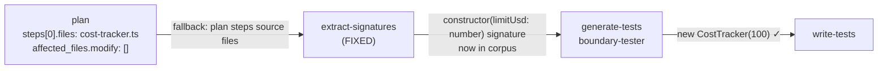

# Fix: extract-signatures falls back to plan steps on verification-only runs

## Root cause (confirmed from log)

On verification-only runs (`affected_files.modify: []`), the `extract-signatures` node returns
early with empty arrays (line 425–426 of `implement-feature.ts`):

```typescript
const files = getAffectedSourceFiles(ctx)
if (files.length === 0) {
  return { status: "ok", data: { filesExtracted: 0, signatures: [], types: [] } }
}
```

The boundary-tester agent then receives **no constructor signature** in its prompt. With no type
information, it guesses `new CostTracker()` with no argument. `CostTracker` requires `limitUsd:
number`, so every generated test throws `"Limit must be a non-negative finite number, got:
undefined"` before even reaching the method under test. All 14 adversarial tests fail.

Confirmed from the 2026-05-24 run log (`20260524-2344-run-794b98`):
- `extract-signatures` → `{ filesExtracted: 0, signatures: [], types: [] }`
- `generate-tests` received empty signatures corpus
- All 14 boundary tests failed with `BollardError: Limit must be a non-negative finite number`

The plan **did** contain the right file: `steps[0].files: ["packages/engine/src/cost-tracker.ts"]`.
That file was never extracted because the early return fired first.

## Fix

`extract-signatures` already runs before `generate-tests` — it can't use claim IDs yet. But it
can use `plan.steps[].files` directly, the same source the coder uses. This is always available
at this point in the pipeline (planner runs at node 2, extract-signatures at node 7).

The fallback must apply the same source-file filter as `getAffectedSourceFiles` (strip test
files, match source extensions) so it doesn't accidentally extract test files.

**This is a one-location change** — `extract-signatures` in `implement-feature.ts`. No new
helper needed; the logic is simple enough to inline.

---

## Architecture



---

## Exact change — `implement-feature.ts` (lines 416–442)

**Before:**
```typescript
{
  id: "extract-signatures",
  name: "Extract Type Signatures",
  type: "deterministic",
  execute: async (ctx: PipelineContext): Promise<NodeResult> => {
    const profile = ctx.toolchainProfile
    const lang = profile?.language ?? "typescript"

    const files = getAffectedSourceFiles(ctx)
    if (files.length === 0) {
      return { status: "ok", data: { filesExtracted: 0, signatures: [], types: [] } }
    }

    const fullPaths = files.map((f) => resolve(workDir, f))
    const extractor = getExtractor(lang, llmConfig?.provider, llmConfig?.model, ctx.log.warn)
    const result = await extractor.extract(fullPaths, profile, workDir)

    return {
      status: "ok",
      data: {
        filesExtracted: files.length,
        signatures: result.signatures,
        types: result.types,
      },
    }
  },
},
```

**After:**
```typescript
{
  id: "extract-signatures",
  name: "Extract Type Signatures",
  type: "deterministic",
  execute: async (ctx: PipelineContext): Promise<NodeResult> => {
    const profile = ctx.toolchainProfile
    const lang = profile?.language ?? "typescript"

    let files = getAffectedSourceFiles(ctx)

    // Verification-only fallback: plan listed no modified files but steps[].files
    // may name the target source files (e.g. for a re-verification run).
    // Extract signatures so the boundary-tester receives the correct type context.
    if (files.length === 0) {
      const plan = ctx.plan as { steps?: Array<{ files?: string[] }> } | undefined
      const stepFiles = (plan?.steps ?? []).flatMap((s) => s.files ?? [])
      // Apply same source-file filter as getAffectedSourceFiles
      files = getAffectedSourceFiles({
        ...ctx,
        plan: { affected_files: { modify: stepFiles, create: [] } },
      } as unknown as PipelineContext)
    }

    if (files.length === 0) {
      return { status: "ok", data: { filesExtracted: 0, signatures: [], types: [] } }
    }

    ctx.log.info("extract-signatures: extracting from files", {
      files,
      source: "plan-steps-fallback",
    })

    const fullPaths = files.map((f) => resolve(workDir, f))
    const extractor = getExtractor(lang, llmConfig?.provider, llmConfig?.model, ctx.log.warn)
    const result = await extractor.extract(fullPaths, profile, workDir)

    return {
      status: "ok",
      data: {
        filesExtracted: files.length,
        signatures: result.signatures,
        types: result.types,
      },
    }
  },
},
```

**Note on the fallback pattern:** Spreading `ctx` with a fake `plan` to re-use
`getAffectedSourceFiles` is a bit indirect. An alternative (and slightly cleaner) approach is to
inline the source-file filter directly:

```typescript
if (files.length === 0) {
  const plan = ctx.plan as { steps?: Array<{ files?: string[] }> } | undefined
  const stepFiles = (plan?.steps ?? []).flatMap((s) => s.files ?? [])
  // Filter to source files only (not test files)
  const srcExts = profile
    ? profile.sourcePatterns.filter((p) => p.startsWith("**/*.")).map((p) => p.replace("**/*", ""))
    : [".ts"]
  const testExts = profile
    ? profile.testPatterns.filter((p) => p.startsWith("**/*.")).map((p) => p.replace("**/*", ""))
    : [".test.ts"]
  files = stepFiles.filter((f) => {
    if (testExts.some((ext) => f.endsWith(ext))) return false
    if (f.includes(".test.") || f.includes(".spec.") || f.includes("test_")) return false
    return srcExts.length === 0 || srcExts.some((ext) => f.endsWith(ext))
  })
}
```

**Use whichever approach is cleaner** — the inlined filter avoids the ctx-spread hack and is
easier to read. Either is correct.

---

## Step 2 — Tests

**File:** `packages/blueprints/tests/implement-feature.test.ts`

Read the existing test file first. Add one test in the `extract-signatures` describe block (or
create one if it doesn't exist):

```typescript
it("falls back to plan steps files when affected_files.modify is empty", () => {
  // Verify that when plan has steps[].files but affected_files.modify=[],
  // extract-signatures produces non-empty output.
  // This is best tested as a unit test of the fallback logic or via
  // an integration test of the node itself.
  //
  // At minimum: confirm that the node result has filesExtracted > 0
  // when plan.steps[0].files = ["packages/engine/src/cost-tracker.ts"]
  // and plan.affected_files.modify = [].
})
```

If the node is hard to unit-test in isolation (it calls `getExtractor` + real file extraction),
a lighter-weight test is acceptable: just verify the fallback logic — that the step files filter
correctly strips test files and produces source files. This can be a pure logic test without
needing the full extractor pipeline.

---

## Self-check

```bash
docker compose run --rm dev run typecheck
docker compose run --rm dev run lint
docker compose run --rm dev run test
```

Expected:
1. `typecheck` — exit 0
2. `lint` — exit 0
3. `test` — **≥ 1151 passed / 6 skipped**

Also verify `git diff --stat` touches only:
- `packages/blueprints/src/implement-feature.ts`
- `packages/blueprints/tests/implement-feature.test.ts` (or `write-tests-helpers.test.ts` if
  the logic is extracted there)

No changes to any agent prompt files. No new LLM calls.

---

## When GREEN — commit and update docs

Commit:
```
fix: extract-signatures falls back to plan steps files on verification-only runs
```

**`CLAUDE.md`** — find the known limitations section. The `write-tests` / `write-contract-tests`
fallback bullet is already there. Add a new bullet immediately after it:

> **`extract-signatures` verification-only fallback:** When `affected_files.modify: []`,
> `extract-signatures` now falls back to `plan.steps[].files` (filtered to source files only)
> so the boundary-tester receives the correct constructor/method signatures even on re-verification
> runs. Without this, the tester has no type context and generates structurally invalid tests
> (e.g. `new CostTracker()` missing required `limitUsd` arg).

---

## Out of scope

- **DO NOT** change `generate-tests`, `boundary-tester.ts`, or any agent prompt
- **DO NOT** change `getAffectedSourceFiles` itself — it is correct for normal runs
- **DO NOT** add a network call or LLM call to this node
- **DO NOT** fix `write-behavioral-tests` or any other node in this prompt
- **DO NOT** run the self-test pipeline — that is the next step after merging

---

## Expected outcome after fix

Next re-run should show:
- `extract-signatures` → `{ filesExtracted: 1, signatures: [...], types: [...] }` with the
  `CostTracker` constructor and `multiply()` signatures present
- Boundary-tester emits `new CostTracker(100)` (or similar valid instantiation) in all test bodies
- `run-tests` passes (14/14) instead of failing with constructor error
- Signal 1 at `approve-pr` surfaces `cost-tracker.adversarial.test.ts` as a promotion candidate

---

## Baseline

| Field | Value |
|-------|-------|
| Baseline test count | 1151 passed / 6 skipped |
| Failing run | `20260524-2344-run-794b98` — `run-tests` 14/14 failed with `Limit must be a non-negative finite number, got: undefined` |
| Root cause | `extract-signatures` returned empty on verification-only run; boundary-tester had no constructor signature |
| Fix location | `packages/blueprints/src/implement-feature.ts`, `extract-signatures` node, ~line 424 |
