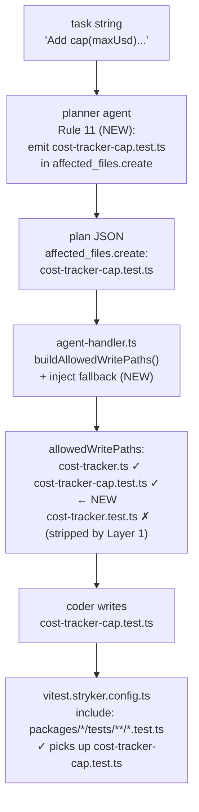

# Cursor Prompt — Fix: Stryker NoCoverage Gap on New Methods (Phase 17)

> **Context:** The cap() self-test (run `2a12d4`) failed node 22 `run-mutation-testing` with
> Stryker score 78.7% < 80% threshold. Root cause: `vitest.stryker.config.ts` excludes
> `*.adversarial.test.ts`, so when Phase 16's Layer 1 guard blocks the coder from editing
> `cost-tracker.test.ts`, the only test coverage for the new method comes from adversarial
> tests — which Stryker never sees. Result: `NoCoverage` mutants on the new method → threshold
> fail.
>
> **Fix (two parts that must work together):**
>
> **Part 1 — Planner prompt (Rule 11):** When the task adds a method to an existing class, the
> planner must include a new unit test file in `affected_files.create` named
> `<source-basename>-<method-name>.test.ts` in the same `tests/` directory. This name is
> deterministic and consistent: source `packages/engine/src/cost-tracker.ts`, method `cap` →
> `packages/engine/tests/cost-tracker-cap.test.ts`. Stryker picks it up via the
> `packages/*/tests/**/*.test.ts` glob. Layer 1 never blocks it (new file, `existsSync === false`).
>
> **Part 2 — `agent-handler.ts` enforcement (fallback):** After building `allowedWritePaths`,
> if the coder has source files being modified but no non-adversarial `.test.ts` in
> `affected_files.create`, synthesize one and inject it. This catches cases where the planner
> forgot Rule 11. The synthesized name uses the same convention: `<source-basename>-<slug>.test.ts`
> where slug is extracted from the task string.
>
> Both parts must produce the **same filename** for any given task — that's the consistency
> guarantee. If they disagree, the coder writes to a name the planner didn't emit, which breaks
> `allowedWritePaths` enforcement. The slug extraction logic must be shared or at minimum produce
> identical output for the same input.
>
> **Read CLAUDE.md fully before starting.** Then read:
> - `packages/agents/prompts/planner.md` — full file; Rules section at the bottom
> - `packages/cli/src/agent-handler.ts` lines 1–10 (imports) and 530–550 (allowedWritePaths block)
> - `vitest.stryker.config.ts` — confirm include glob `packages/*/tests/**/*.test.ts`
> - `packages/agents/tests/tools.test.ts` — where existing allowedWritePaths tests live

---

## Architecture



---

## Step 1 — Planner prompt: Rule 11

**File:** `packages/agents/prompts/planner.md`

The Rules section currently ends at Rule 10. Add Rule 11 immediately after:

```markdown
11. When the task adds one or more methods to an existing class or module, include a new unit
test file in `affected_files.create` for each new method. Name it
`<source-basename>-<method-name>.test.ts` in the same `tests/` directory as the existing test
suite. Example: source file `packages/engine/src/cost-tracker.ts`, method `cap` →
create `packages/engine/tests/cost-tracker-cap.test.ts`. This file is picked up by Stryker
(`packages/*/tests/**/*.test.ts` glob) and is not subject to the Layer 1 write guard (it is a
new file). Do NOT list the existing `cost-tracker.test.ts` in `affected_files.modify` — that
file is protected and edits will be blocked.
```

**Placement:** After the existing Rule 10 paragraph, before the closing of the Rules section.
Do not renumber existing rules.

---

## Step 2 — `agent-handler.ts`: inject fallback unit test path

**File:** `packages/cli/src/agent-handler.ts`

### 2a — Add `basename` and `dirname` to the path import

The existing import is:
```typescript
import { resolve } from "node:path"
```

Change to:
```typescript
import { basename, dirname, resolve } from "node:path"
```

### 2b — Add `deriveUnitTestPath` helper function

Add this pure function near the top of the file, after the imports block, before any other
exported or non-exported functions:

```typescript
/**
 * Derives a deterministic unit test file path for a new method being added to a source file.
 * Convention: packages/engine/src/cost-tracker.ts + task "Add cap(...)" →
 *             packages/engine/tests/cost-tracker-cap.test.ts
 *
 * The slug is extracted from the task string by matching the first `word()` pattern
 * (identifier immediately followed by an opening paren). Falls back to "new" if no match.
 * This must produce the same name as planner Rule 11 for any given task.
 */
export function deriveUnitTestPath(sourceFilePath: string, taskStr: string): string {
  const srcBase = basename(sourceFilePath, ".ts")  // e.g. "cost-tracker"
  const srcDir = dirname(sourceFilePath)            // e.g. "packages/engine/src"

  // Replace the last path segment "src" with "tests"
  const testsDir = srcDir.replace(/\bsrc$/, "tests")

  // Extract method slug: first word-chars immediately followed by "("
  const methodMatch = taskStr.match(/\b([a-z][a-zA-Z0-9]*)(?=\s*\()/)
  // Skip common non-method words that appear before the actual method name
  const SKIP_WORDS = new Set(["add", "run", "create", "build", "get", "set", "use", "make"])
  let slug = "new"
  if (methodMatch) {
    const candidates = [...taskStr.matchAll(/\b([a-z][a-zA-Z0-9]*)(?=\s*\()/g)]
    for (const m of candidates) {
      const word = m[1] ?? ""
      if (!SKIP_WORDS.has(word)) {
        slug = word
        break
      }
    }
  }

  return resolve(dirname(srcDir), "tests", `${srcBase}-${slug}.test.ts`)
}
```

**Important:** `deriveUnitTestPath` must produce the same output as what planner Rule 11 describes.
The key invariant: for source `packages/engine/src/cost-tracker.ts` and task containing `cap(`,
both Rule 11 and `deriveUnitTestPath` produce `packages/engine/tests/cost-tracker-cap.test.ts`.

### 2c — Inject the fallback in the `allowedWritePaths` block

Find the existing block (around line 532–548):

```typescript
if (agentRole === "coder" && ctx.plan) {
  const plan = ctx.plan as {
    affected_files?: { modify?: string[]; create?: string[] }
  }
  const affectedFiles = [
    ...(plan.affected_files?.modify ?? []),
    ...(plan.affected_files?.create ?? []),
  ]
  if (affectedFiles.length > 0) {
    const resolved = affectedFiles.map((f) => resolve(workDir, f))
    // Strip pre-existing test files — the coder must write a new test file,
    // never edit an existing test suite. Prevents test-surgery loops.
    agentCtx.allowedWritePaths = resolved.filter((p) => {
      const isTestFile = /\.test\.[jt]s$/.test(p)
      return !(isTestFile && existsSync(p))
    })
  }
}
```

Replace with:

```typescript
if (agentRole === "coder" && ctx.plan) {
  const plan = ctx.plan as {
    affected_files?: { modify?: string[]; create?: string[] }
  }
  const modifyFiles = plan.affected_files?.modify ?? []
  const createFiles = plan.affected_files?.create ?? []
  const affectedFiles = [...modifyFiles, ...createFiles]

  if (affectedFiles.length > 0) {
    const resolved = affectedFiles.map((f) => resolve(workDir, f))
    // Strip pre-existing test files — the coder must write a new test file,
    // never edit an existing test suite. Prevents test-surgery loops (Phase 16).
    const filtered = resolved.filter((p) => {
      const isTestFile = /\.test\.[jt]s$/.test(p)
      return !(isTestFile && existsSync(p))
    })

    // Phase 17: if the plan modifies a source file but includes no new non-adversarial
    // unit test file, inject one. This guarantees Stryker coverage even when the planner
    // forgot Rule 11. The injected path uses the same naming convention as Rule 11.
    const hasNewUnitTestFile = filtered.some(
      (p) => /\.test\.[jt]s$/.test(p) && !p.includes(".adversarial.") && !existsSync(p)
    )
    if (!hasNewUnitTestFile && modifyFiles.length > 0) {
      // Derive from the first modified TypeScript source file (skip test files)
      const firstSrc = modifyFiles
        .map((f) => resolve(workDir, f))
        .find((p) => /\.ts$/.test(p) && !/\.test\./.test(p))
      if (firstSrc) {
        const injected = deriveUnitTestPath(firstSrc, ctx.task)
        if (!existsSync(injected)) {
          filtered.push(injected)
          ctx.log.debug("phase17: injected unit test path", { injected })
        }
      }
    }

    agentCtx.allowedWritePaths = filtered
  }
}
```

---

## Step 3 — Tests

### 3a — `deriveUnitTestPath` unit tests

Add a new test file `packages/cli/tests/agent-handler.unit.test.ts` (new file — no existing
test file for agent-handler at this path):

```typescript
import { describe, it, expect } from "vitest"
import { resolve } from "node:path"
import { deriveUnitTestPath } from "../src/agent-handler.js"

describe("deriveUnitTestPath", () => {
  it("derives cap from cost-tracker source and task string", () => {
    const src = resolve("/app/packages/engine/src/cost-tracker.ts")
    const task = "Add a cap(maxUsd: number): CostTracker method..."
    const result = deriveUnitTestPath(src, task)
    expect(result).toBe(resolve("/app/packages/engine/tests/cost-tracker-cap.test.ts"))
  })

  it("derives percentUsed from task string", () => {
    const src = resolve("/app/packages/engine/src/cost-tracker.ts")
    const task = "Add a percentUsed(): number method..."
    const result = deriveUnitTestPath(src, task)
    expect(result).toBe(resolve("/app/packages/engine/tests/cost-tracker-percentUsed.test.ts"))
  })

  it("falls back to 'new' when no method name found", () => {
    const src = resolve("/app/packages/engine/src/cost-tracker.ts")
    const task = "Refactor the class internals"
    const result = deriveUnitTestPath(src, task)
    expect(result).toBe(resolve("/app/packages/engine/tests/cost-tracker-new.test.ts"))
  })

  it("skips common non-method words to find real method name", () => {
    const src = resolve("/app/packages/engine/src/cost-tracker.ts")
    const task = "Add a toJSON(): object method that returns serializable state"
    const result = deriveUnitTestPath(src, task)
    expect(result).toBe(resolve("/app/packages/engine/tests/cost-tracker-toJSON.test.ts"))
  })

  it("produces same name as planner Rule 11 convention for cap()", () => {
    // This is the critical consistency invariant
    const src = resolve("/app/packages/engine/src/cost-tracker.ts")
    const task = "Add a cap(maxUsd: number): CostTracker..."
    const derived = deriveUnitTestPath(src, task)
    // Rule 11 says: basename=cost-tracker, method=cap → cost-tracker-cap.test.ts in tests/
    expect(derived).toContain("cost-tracker-cap.test.ts")
    expect(derived).toContain(`tests${require("node:path").sep}cost-tracker-cap.test.ts`)
  })
})
```

### 3b — Injection logic test in `tools.test.ts`

Find the existing `allowedWritePaths` / Layer 1 tests in `packages/agents/tests/tools.test.ts`
and add a comment noting the injection is tested in `agent-handler.unit.test.ts`. No additional
test needed in tools.test.ts — the injection happens in agent-handler, not in a tool.

---

## Step 4 — Self-check

```bash
docker compose run --rm dev run typecheck   # exit 0
docker compose run --rm dev run lint        # exit 0
docker compose run --rm dev run test        # ≥ 1261 + 5 new = 1266 passed, 6 skipped

# Confirm planner prompt rule was added (not removed or renumbered)
grep -n "Rule 11\|11\." packages/agents/prompts/planner.md

# Confirm no agent prompt OTHER than planner.md was touched
git diff --name-only packages/agents/prompts/
# Must only show: planner.md
```

---

## Step 5 — Doc updates + commit

### CLAUDE.md

Update the test count line:
```
**Latest count:** `1266` passed, `6` skipped (+ 5 from Phase 17 Stryker coverage gap fix)
```

Add to known limitations after the Phase 16 bullet:

```
- **Stryker coverage gap fix (Phase 17):** Two-part fix ensuring Stryker sees unit tests for new methods. Part 1: planner Rule 11 — when adding a method to an existing class, `affected_files.create` must include `<source-basename>-<method-name>.test.ts` in the `tests/` directory (same glob Stryker scans). Part 2: `agent-handler.ts` `deriveUnitTestPath()` — if the plan's `create` list has no new non-adversarial unit test file, one is synthesized and injected into `allowedWritePaths`. Both parts use the same naming convention (`cost-tracker-cap.test.ts` for method `cap` on `cost-tracker.ts`) to guarantee the coder writes to a file Stryker will pick up. Prevents the `NoCoverage` failure observed in cap() forward run `2a12d4` (78.7% < 80% threshold).
```

### Commit

```bash
git add packages/agents/prompts/planner.md
git add packages/cli/src/agent-handler.ts
git add packages/cli/tests/agent-handler.unit.test.ts
git add CLAUDE.md
git commit -m "fix: Stryker coverage gap on new methods (Phase 17)

Planner Rule 11: new method on existing class → create <basename>-<method>.test.ts
in affected_files.create. Stryker picks it up via packages/*/tests/**/*.test.ts glob.

agent-handler.ts: deriveUnitTestPath() synthesizes and injects a unit test path
into allowedWritePaths when the plan omits one. Same naming convention as Rule 11
so planner + fallback always agree on the filename.

Root cause: cap() forward run 2a12d4 failed Stryker 78.7% < 80% because Layer 1
(Phase 16) blocked cost-tracker.test.ts edits, adversarial tests are excluded from
vitest.stryker.config.ts, leaving NoCoverage mutants on cap().
+5 tests in agent-handler.unit.test.ts."
git push origin main

git mv spec/prompts/fix-stryker-coverage-gap.md spec/archive/prompts/
git commit -m "archive: fix-stryker-coverage-gap (Phase 17 shipped)"
git push origin main
```

---

## Out of scope

- DO NOT change `vitest.stryker.config.ts` — the fix works within the existing glob
- DO NOT change `MAX_TEST_INVOCATIONS` or any Phase 16 constants
- DO NOT add `deriveUnitTestPath` to any package other than `@bollard/cli`
- DO NOT touch `coder.md`, `boundary-tester.md`, or any prompt other than `planner.md`
- DO NOT make the injection fire for non-coder agents — the guard is inside `agentRole === "coder"`
- DO NOT rename or renumber existing planner rules 1–10
