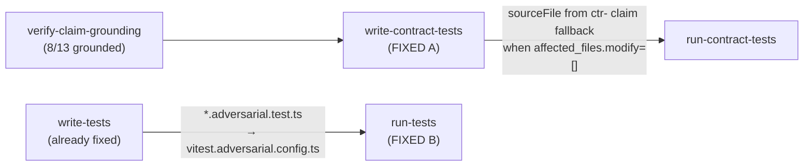

# Fix: write-contract-tests verification-only fallback + adversarial vitest routing

## Goal

Two targeted fixes found during the 2026-05-24 re-run of the `multiply()` self-test
(run `20260524-2255-run-c755fd`, reached 15/31 before halting):

**Fix A — `write-contract-tests` hard-fail:** The node at line 932 of
`packages/blueprints/src/implement-feature.ts` calls `getAffectedSourceFiles(ctx)` and returns
`status: "fail"` when the list is empty (verification-only run). The boundary scope already has
`inferSourceFileFromClaims` in `write-tests-helpers.ts` — that helper uses a `^bnd-` regex.
Contract claim IDs use prefix `ctr-`. Either (a) extend the helper to accept a scope prefix
parameter, or (b) add a thin wrapper. Wire it into `write-contract-tests` the same way it was
wired into `write-tests`.

**Fix B — `run-tests` adversarial vitest routing:** `runTests` in `packages/verify/src/dynamic.ts`
routes `.bollard/` test paths through `vitest.contract.config.ts`. Adversarial files land at
`packages/*/tests/*.adversarial.test.ts`, which the default `vitest.config.ts` explicitly
excludes (`"**/*.adversarial.test.ts"`). The helper `pathsTouchBollardGeneratedTests` only checks
for `.bollard/` — it misses adversarial files. Fix: extend the predicate and route
`*.adversarial.test.ts` paths through `vitest.adversarial.config.ts` (which already has the
correct `include: ["packages/*/tests/**/*.adversarial.test.ts"]` glob).

Both fixes are **purely deterministic** — no agent prompts, no LLM calls, no new dependencies.

Reference: `spec/self-test-multiply-results.md` re-run section (2026-05-24, run
`20260524-2255-run-c755fd`).

---

## Architecture



---

## Key facts (read before touching code)

### Existing `inferSourceFileFromClaims` in `write-tests-helpers.ts` (lines 48–115)

```typescript
// Current regex — boundary scope only:
const match = /^bnd-([A-Za-z][A-Za-z0-9_]*)/.exec(firstId)
```

Contract claim IDs look like `ctr-CostTracker-multiply-001` (prefix `ctr-`).
The fix: make the prefix configurable. **Simplest approach:** add an optional `idPrefix` parameter
defaulting to `"bnd"`:

```typescript
export async function inferSourceFileFromClaims(
  ctx: PipelineContext,
  workDir: string,
  claims: ClaimRecord[],
  idPrefix: string = "bnd",   // ← ADD THIS PARAMETER
): Promise<string | undefined> {
  // ...
  const match = new RegExp(`^${idPrefix}-([A-Za-z][A-Za-z0-9_]*)`).exec(firstId)
  // ... rest unchanged
```

All existing call sites pass no `idPrefix`, so they continue to get `"bnd"` behaviour — no
callers need updating.

### `write-contract-tests` hard-fail (implement-feature.ts, lines 931–941)

**Before:**
```typescript
const claims = verifyRes.claims
const files = getAffectedSourceFiles(ctx)
const firstFile = files[0]
if (!firstFile) {
  return {
    status: "fail",
    error: {
      code: "NODE_EXECUTION_FAILED",
      message: "No affected files for contract tests",
    },
  }
}
```

**After:**
```typescript
const claims = verifyRes.claims
let files = getAffectedSourceFiles(ctx)
if (files.length === 0) {
  const inferred = await inferSourceFileFromClaims(ctx, workDir, claims, "ctr")
  if (inferred) {
    ctx.log.info("write-contract-tests: inferred source file from claims (verification-only run)", {
      inferredFile: inferred,
      firstClaimId: claims[0]?.id,
    })
    files = [inferred]
  } else {
    return {
      status: "ok",
      data: {
        skipped: true,
        reason: "No affected files — could not infer source file from contract claim IDs",
      },
    }
  }
}
const firstFile = files[0]!
```

`inferSourceFileFromClaims` is already imported at the top of `implement-feature.ts` from
`./write-tests-helpers.js`. If it is not yet imported, add it to that import.

### `pathsTouchBollardGeneratedTests` + `runTests` routing (dynamic.ts, lines 136–203)

**Current predicate (line 136–139):**
```typescript
function pathsTouchBollardGeneratedTests(testFiles: string[] | undefined): boolean {
  if (!testFiles || testFiles.length === 0) return false
  return testFiles.some((f) => f.replace(/\\/g, "/").includes(".bollard/"))
}
```

**Vitest configs available at workspace root:**
- `vitest.config.ts` — default, excludes `**/*.adversarial.test.ts`
- `vitest.contract.config.ts` — includes `.bollard/tests/**/*.test.ts`
- `vitest.adversarial.config.ts` — includes `packages/*/tests/**/*.adversarial.test.ts`

**Required changes:**

1. Split `pathsTouchBollardGeneratedTests` into two predicates:

```typescript
function pathsTouchBollardContractTests(testFiles: string[] | undefined): boolean {
  if (!testFiles || testFiles.length === 0) return false
  return testFiles.some((f) => f.replace(/\\/g, "/").includes(".bollard/"))
}

function pathsTouchAdversarialTests(testFiles: string[] | undefined): boolean {
  if (!testFiles || testFiles.length === 0) return false
  return testFiles.some((f) => f.replace(/\\/g, "/").endsWith(".adversarial.test.ts"))
}
```

2. Update the routing in `runTests` (lines 191–204):

```typescript
if (pathsTouchBollardContractTests(testFiles)) {
  cmd = "pnpm"
  args = ["exec", "vitest", "run", "-c", "vitest.contract.config.ts", ...(testFiles ?? [])]
} else if (pathsTouchAdversarialTests(testFiles)) {
  cmd = "pnpm"
  args = ["exec", "vitest", "run", "-c", "vitest.adversarial.config.ts", ...(testFiles ?? [])]
} else if (profile?.checks.test) {
  cmd = profile.checks.test.cmd
  args = [...profile.checks.test.args]
  appendTestFileArgs(profile, args, testFiles)
} else {
  cmd = "pnpm"
  args = ["exec", "vitest", "run"]
  if (testFiles && testFiles.length > 0) {
    args.push(...testFiles)
  }
}
```

Do **not** rename `pathsTouchBollardGeneratedTests` if it is referenced in tests — check first.
If the old name is used in test files, keep it as an alias or update the tests too.

---

## Step 1 — Fix A: contract-scope source file fallback

**File:** `packages/blueprints/src/write-tests-helpers.ts`

Add `idPrefix: string = "bnd"` parameter to `inferSourceFileFromClaims` (exported function,
line 48). Change the regex on line 62 from:

```typescript
const match = /^bnd-([A-Za-z][A-Za-z0-9_]*)/.exec(firstId)
```

to:

```typescript
const match = new RegExp(`^${idPrefix}-([A-Za-z][A-Za-z0-9_]*)`).exec(firstId)
```

No other changes to the function body.

**File:** `packages/blueprints/src/implement-feature.ts`

Apply the `write-contract-tests` before/after diff from the "Key facts" section above (lines
931–941). The `execute` function is already `async` — no signature change needed.

Confirm `inferSourceFileFromClaims` is in the import from `./write-tests-helpers.js`. If not,
add it.

---

## Step 2 — Fix B: adversarial vitest routing

**File:** `packages/verify/src/dynamic.ts`

Apply the predicate split and routing update from the "Key facts" section above.

Check whether `pathsTouchBollardGeneratedTests` appears in any test file:

```bash
grep -r "pathsTouchBollardGeneratedTests" packages/
```

If it appears in tests, either:
- Keep the old name as a re-export alias: `export const pathsTouchBollardGeneratedTests = pathsTouchBollardContractTests`
- Or update the test references

The two new predicates (`pathsTouchBollardContractTests`, `pathsTouchAdversarialTests`) do **not**
need to be exported — they are module-private helpers. Only `runTests`, `appendTestFileArgs`, and
`parseSummary` are public exports.

---

## Step 3 — Tests

**File:** `packages/verify/tests/dynamic.test.ts`

Add or update tests for the new routing:

```typescript
describe("pathsTouchAdversarialTests routing", () => {
  it("routes *.adversarial.test.ts through vitest.adversarial.config.ts", () => {
    // Test that the runTests call with an adversarial path uses the adversarial config.
    // Since runTests calls execFile, you may need to spy or check the args via the
    // existing mock pattern already in dynamic.test.ts.
  })
})
```

Read the existing `dynamic.test.ts` first to understand how it mocks `execFile` or inspects
routing decisions — follow the same pattern.

**File:** `packages/blueprints/tests/write-tests-helpers.test.ts`

Add a test for the new `idPrefix` parameter:

```typescript
it("infers source file from contract claim ID (ctr- prefix)", async () => {
  const claims = [{ id: "ctr-CostTracker-add-001", description: "...", grounding: [], test: "" }]
  const ctx = makeFakeCtx({
    plan: { steps: [{ files: ["packages/engine/src/cost-tracker.ts"] }] },
  })
  const result = await inferSourceFileFromClaims(ctx, "/fake/workdir", claims, "ctr")
  expect(result).toBe("packages/engine/src/cost-tracker.ts")
})
```

Follow the existing test structure — read the file first.

---

## Self-check

Run sequentially inside Docker:

```bash
docker compose run --rm dev run typecheck
docker compose run --rm dev run lint
docker compose run --rm dev run test
```

Expected:
1. `typecheck` — exit 0
2. `lint` — exit 0 (Biome)
3. `test` — **≥ 1149 passed / 6 skipped** (new tests add to baseline of 1149)

Also verify:
- `git diff --stat` touches only:
  - `packages/blueprints/src/write-tests-helpers.ts`
  - `packages/blueprints/src/implement-feature.ts`
  - `packages/verify/src/dynamic.ts`
  - `packages/blueprints/tests/write-tests-helpers.test.ts`
  - `packages/verify/tests/dynamic.test.ts`
- No changes to `packages/agents/prompts/`
- No new LLM call introduced

---

## When GREEN — commit and doc update

Commit with:

```
fix: contract-scope write-tests fallback + adversarial vitest routing in runTests
```

**`CLAUDE.md`** — update the known limitations section entry added for `write-tests`
verification-only fallback. Extend it to also mention `write-contract-tests`:

> **`write-tests` / `write-contract-tests` verification-only fallback:** When
> `affected_files.modify: []` (re-verification of already-merged code), both `write-tests` and
> `write-contract-tests` now infer the source file from grounded claim IDs (`bnd-<ModuleName>-...`
> / `ctr-<ModuleName>-...`) rather than failing. Strategy: plan `steps[].files` →
> expand-affected-files result → workspace glob. Degrades to `skipped: true` (not `fail`) if no
> match found.

Also add a note for the vitest routing fix:

> **`runTests` adversarial config routing:** `*.adversarial.test.ts` paths are now routed through
> `vitest.adversarial.config.ts` (previously fell through to the default vitest config which
> excludes that glob). `.bollard/` paths continue to use `vitest.contract.config.ts`.

---

## Out of scope

- **DO NOT** change `vitest.adversarial.config.ts` or `vitest.contract.config.ts` glob patterns
- **DO NOT** change the `write-behavioral-tests` node — check if it has the same `getAffectedSourceFiles` hard-fail pattern; if it does, note it in the commit message as a follow-up but do **not** fix it in this prompt (it will be caught by the next re-run if it blocks)
- **DO NOT** change any agent prompt files
- **DO NOT** change `assembleTestFile` in `test-assembler.ts`
- **DO NOT** run the self-test pipeline — that is a separate step after this merges

---

## Baseline

| Field | Value |
|-------|-------|
| Baseline test count | 1149 passed / 6 skipped |
| Blocking run | `20260524-2255-run-c755fd` (15/31 — halted at `write-contract-tests`) |
| Fix A target | `write-contract-tests` returns `skipped: true` instead of `fail` when `affected_files.modify=[]` and contract claims exist |
| Fix B target | `run-tests` with `*.adversarial.test.ts` path uses `vitest.adversarial.config.ts`, finds the file, passes |
