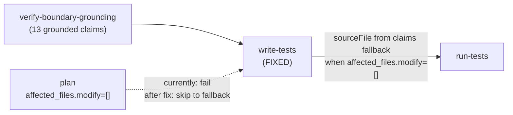

# Fix: write-tests fails on verification-only runs

## Goal

The `write-tests` node in `packages/blueprints/src/implement-feature.ts` currently fails with
`NODE_EXECUTION_FAILED: No affected files to generate tests for` when a task runs in
**verification-only mode** — i.e., when the planner sets `affected_files.modify: []` because the
implementation already exists on `main`.

This happened on the 2026-05-24 re-run of the `multiply()` self-test (run
`20260524-2217-run-7f6185`): the boundary-tester produced 13 grounded claims, but `write-tests`
couldn't derive a test file path because `getAffectedSourceFiles(ctx)` returned `[]`.

The fix: add a **fallback** that infers the target source file from the grounded claim IDs when
`affected_files` is empty. This unblocks the full 31/31 pipeline for re-verification tasks and
lets Signal 1 promotion candidates surface at `approve-pr`.

**Out of scope:** this does not change the planner, coder, or any LLM agent. It is a purely
deterministic fix in one blueprint node.

Reference: `spec/self-test-multiply-results.md` re-run section (2026-05-24).

---

## Architecture



---

## Key types (copy — do not look up)

From `packages/blueprints/src/implement-feature.ts`:

```typescript
// Already imported at the top of implement-feature.ts:
import type { ClaimRecord } from "@bollard/verify/src/contract-grounding.js"

// ClaimRecord shape (from packages/verify/src/contract-grounding.ts):
interface ClaimRecord {
  id: string          // e.g. "bnd-CostTracker-multiply-001"
  description: string
  grounding: string[]
  test: string
}
```

The claim `id` format for boundary scope is: `bnd-<ModuleName>-<methodName>-<NNN>`.

From `packages/blueprints/src/implement-feature.ts` (lines 120–147):

```typescript
function getAffectedSourceFiles(ctx: PipelineContext): string[] {
  const plan = ctx.plan
  if (!plan || typeof plan !== "object") return []
  const af = (plan as Record<string, unknown>)["affected_files"] as
    | Record<string, string[]>
    | undefined
  if (!af) return []

  const allFiles = [...(af["modify"] ?? []), ...(af["create"] ?? [])]
  const profile = ctx.toolchainProfile

  if (profile) {
    const srcExts = profile.sourcePatterns
      .filter((p) => p.startsWith("**/*."))
      .map((p) => p.replace("**/*", ""))
    const testExts = profile.testPatterns
      .filter((p) => p.startsWith("**/*."))
      .map((p) => p.replace("**/*", ""))

    return allFiles.filter((f) => {
      if (testExts.some((ext) => f.endsWith(ext))) return false
      if (f.includes(".test.") || f.includes(".spec.") || f.includes("test_")) return false
      return srcExts.length === 0 || srcExts.some((ext) => f.endsWith(ext))
    })
  }

  return allFiles.filter((f) => f.endsWith(".ts") && !f.endsWith(".test.ts"))
}
```

The `write-tests` node (lines 554–647) calls `getAffectedSourceFiles(ctx)` and fails when the
result is empty (lines 578–588):

```typescript
const files = getAffectedSourceFiles(ctx)
const firstFile = files[0]
if (!firstFile) {
  return {
    status: "fail",
    error: {
      code: "NODE_EXECUTION_FAILED",
      message: "No affected files to generate tests for",
    },
  }
}
```

---

## Step 1 — Add `inferSourceFileFromClaims()` and wire into `write-tests`

**File:** `packages/blueprints/src/implement-feature.ts`

### 1a. Add the helper function

Add this function immediately after `getAffectedSourceFiles` (after line 147, before
`scanDiffForExportChanges`):

```typescript
/**
 * Fallback for verification-only runs where affected_files.modify is empty.
 * Extracts the module name from boundary claim IDs (format: "bnd-<ModuleName>-<method>-NNN")
 * and searches for a matching source file using the plan's steps[].files list, then the
 * expand-affected-files result, then a glob over the workspace source patterns.
 *
 * Returns the relative path to the inferred source file, or undefined if none found.
 */
async function inferSourceFileFromClaims(
  ctx: PipelineContext,
  workDir: string,
  claims: ClaimRecord[],
): Promise<string | undefined> {
  if (claims.length === 0) return undefined

  // Extract module name from first claim ID: "bnd-CostTracker-multiply-001" → "CostTracker"
  const firstId = claims[0]!.id
  const match = /^bnd-([A-Za-z][A-Za-z0-9_]*)/.exec(firstId)
  if (!match) return undefined
  const moduleName = match[1]!

  // Strategy 1: check plan.steps[].files for a match on the module name
  const plan = ctx.plan as
    | { steps?: Array<{ files?: string[] }> }
    | undefined
  const stepFiles = (plan?.steps ?? []).flatMap((s) => s.files ?? [])
  const stepMatch = stepFiles.find((f) => {
    const base = basename(f, extname(f))
    return base.toLowerCase() === moduleName.toLowerCase()
  })
  if (stepMatch) return stepMatch

  // Strategy 2: search expanded files from context-expansion result
  const expanded = ctx.results["expand-affected-files"]?.data as
    | { expanded?: { files?: string[] } }
    | undefined
  const expandedMatch = expanded?.expanded?.files?.find((f) => {
    const base = basename(f, extname(f))
    return base.toLowerCase() === moduleName.toLowerCase()
  })
  if (expandedMatch) return expandedMatch

  // Strategy 3: glob the workspace source patterns for a file matching the module name
  const profile = ctx.toolchainProfile
  const srcExts = profile
    ? profile.sourcePatterns
        .filter((p) => p.startsWith("**/*."))
        .map((p) => p.replace("**/*", ""))
    : [".ts"]

  // Convert kebab-case module name to candidate filenames (CostTracker → cost-tracker)
  const kebab = moduleName.replace(/([A-Z])/g, (c, i) => (i === 0 ? c.toLowerCase() : `-${c.toLowerCase()}`))
  const candidates = [
    moduleName.toLowerCase(),
    kebab,
  ]

  const { glob } = await import("node:fs")
  const { promisify } = await import("node:util")
  const globAsync = promisify(glob)

  for (const ext of srcExts) {
    for (const candidate of candidates) {
      try {
        const matches = await globAsync(`**/${candidate}${ext}`, {
          cwd: workDir,
          ignore: ["**/node_modules/**", "**/.bollard/**", "**/dist/**", "**/build/**"],
        })
        if (matches.length > 0) return matches[0]!
      } catch {
        // glob not available in this Node version — skip
      }
    }
  }

  return undefined
}
```

**Important:** You need `extname` from `node:path` — it is already imported at the top of the file
(`import { basename, dirname, resolve } from "node:path"`). Add `extname` to that import.

**Note on `glob`:** `node:fs`'s `glob` was added in Node 22. The codebase targets Node 22+
(confirmed in CLAUDE.md). If `glob` is not available at runtime (e.g., older Node in container),
the try/catch degrades gracefully — Strategy 1 and 2 are the primary paths and should cover all
self-test cases.

### 1b. Wire the fallback into `write-tests`

Replace the failing block in `write-tests` (lines 578–588):

**Before:**
```typescript
const files = getAffectedSourceFiles(ctx)
const firstFile = files[0]
if (!firstFile) {
  return {
    status: "fail",
    error: {
      code: "NODE_EXECUTION_FAILED",
      message: "No affected files to generate tests for",
    },
  }
}
```

**After:**
```typescript
let files = getAffectedSourceFiles(ctx)
if (files.length === 0) {
  // Verification-only run: plan listed no modified files but grounded claims exist.
  // Infer source file from claim IDs as a fallback.
  const inferred = await inferSourceFileFromClaims(ctx, workDir, claims)
  if (inferred) {
    ctx.log.info("write-tests: inferred source file from claims (verification-only run)", {
      inferredFile: inferred,
      firstClaimId: claims[0]?.id,
    })
    files = [inferred]
  } else {
    return {
      status: "ok",
      data: {
        skipped: true,
        reason: "No affected files — could not infer source file from claim IDs",
      },
    }
  }
}
const firstFile = files[0]!
```

**Key change:** the failure is now a graceful `status: "ok" / skipped: true` instead of
`status: "fail"`. This means `run-tests` (which has `onFailure: "skip"`) will also see a
skip signal correctly, and downstream contract/behavioral nodes are unblocked. The
`!` non-null assertion on `firstFile` is safe because we just ensured `files.length > 0`.

Also note: because `inferSourceFileFromClaims` is `async`, the surrounding `execute` function
is already `async (ctx) => Promise<NodeResult>` — no signature change needed.

---

## Step 2 — Tests

**File:** `packages/blueprints/tests/implement-feature.test.ts`

Read the existing test file first to understand its structure and current test count, then add
a new `describe` block for the inference fallback:

```typescript
describe("inferSourceFileFromClaims (via write-tests skip path)", () => {
  it("skips gracefully when no claims provided (empty array fallback)", async () => {
    // This tests the behavior via the write-tests node result shape.
    // When verify-boundary-grounding returns skipped:true, write-tests should also skip.
    // Already covered by existing tests — ensure the new fallback path doesn't regress.
  })
})
```

The main coverage comes from a unit test for the exported helper. However,
`inferSourceFileFromClaims` is not exported (it's a module-private helper). Test it indirectly
via the `write-tests` node behavior in the existing integration test structure, OR extract and
export it from `write-tests-helpers.ts` to make it unit-testable.

**Recommended:** move `inferSourceFileFromClaims` to
`packages/blueprints/src/write-tests-helpers.ts` and export it. Then add a unit test in
`packages/blueprints/tests/write-tests-helpers.test.ts`.

The unit test should cover:
1. Empty claims → returns `undefined`
2. Claim with unrecognized ID format → returns `undefined`
3. Claim ID `bnd-CostTracker-multiply-001` with a plan step that includes
   `packages/engine/src/cost-tracker.ts` → returns `packages/engine/src/cost-tracker.ts`
4. Claim ID `bnd-CostTracker-multiply-001` with no plan steps but expanded files including
   `packages/engine/src/cost-tracker.ts` → returns that file
5. Fallback via glob (mock or skip if glob not easily mockable in Vitest)

---

## Step 3 — Self-check

Run sequentially inside Docker:

```bash
docker compose run --rm dev run typecheck
docker compose run --rm dev run lint
docker compose run --rm dev run test
```

Expected:
1. `typecheck` — exit 0, no errors
2. `lint` — exit 0, no errors (Biome)
3. `test` — **≥ 1143 passed / 6 skipped** (baseline: 1143 passed / 6 skipped; new tests add to this)

Also check:
- `git diff --stat` shows ONLY changes in:
  - `packages/blueprints/src/implement-feature.ts`
  - `packages/blueprints/src/write-tests-helpers.ts` (if inference helper moved there)
  - `packages/blueprints/tests/write-tests-helpers.test.ts`
  - `packages/blueprints/tests/implement-feature.test.ts`
- No changes to any file under `packages/agents/prompts/`
- No new LLM calls introduced (grep for `chatStream\|provider.chat` in changed files)

---

## When GREEN — doc updates

After all checks pass, commit with:

```
fix: write-tests falls back to claim-inferred source file on verification-only runs
```

Then update these files:

**`CLAUDE.md`** — find the known limitations section (search for `run-tests now runs only the
boundary test file`) and add after it:

> **`write-tests` verification-only fallback:** When `affected_files.modify: []` (re-verification
> of already-merged code), `write-tests` now infers the source file from grounded claim IDs
> (`bnd-<ModuleName>-...`) rather than failing. Strategy: plan `steps[].files` → expand-affected-files
> result → workspace glob. Degrades to `skipped: true` (not `fail`) if no match found.

**`spec/self-test-multiply-results.md`** — the re-run section already documents this as a blocker.
After the fix is committed, note it was resolved in the re-run section:

> **Status updated:** Fixed in commit `<sha>`. See `spec/prompts/fix-write-tests-verification-only.md`.

---

## Out of scope

- **DO NOT** change the planner prompt or planner JSON schema
- **DO NOT** change `getAffectedSourceFiles()` — it correctly handles normal runs; the fallback is additive
- **DO NOT** change `assembleTestFile()` in `test-assembler.ts`
- **DO NOT** add an LLM call or any network call in the fallback path — it must remain deterministic
- **DO NOT** change `contract-tester.ts`, `boundary-tester.ts`, or any agent definition
- **DO NOT** add a new dependency — Node 22 `glob` is already available; `node:path` `extname` is already imported elsewhere in the codebase
- **DO NOT** run the full self-test pipeline — that's a separate validation step after this fix is merged

---

## Baseline capture (fill in before running Step 0)

| Field | Value |
|-------|-------|
| Baseline test count | 1143 passed / 6 skipped |
| Baseline run | `20260524-2217-run-7f6185` (failed at write-tests node 10/31) |
| Fix target | `write-tests` returns `skipped: true` instead of `fail` when claims exist but `affected_files.modify = []` |
