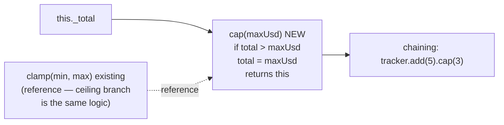

# Cursor Prompt — Self-Test: CostTracker.cap() + Baseline Retag

> **Context:** Third Phase 16-guarded Bollard-on-Bollard self-test. After percentUsed() ($1.90 / 22
> turns, Phase 16 GREEN) and toJSON() ($1.32 / 16 turns), we have two clean data points. A third
> clean run under $1.96 establishes enough history to retag the cost baseline from the current
> `stage5a-validated` ($1.633, anchored to pre-Phase-16 runs that include surgery-loop outliers
> dragging the repo average up +69%).
>
> **Read CLAUDE.md fully before starting.** Then read:
> - `packages/engine/src/cost-tracker.ts` — full file; especially `clamp()` (lines 88–120)
>   which is the closest sibling — `cap()` is a ceiling-only variant
> - `packages/engine/tests/cost-tracker.test.ts` — 195 `it()` blocks (DO NOT edit this file)
> - `.bollard/cost-baseline.json` — current baseline ($1.633, 20% threshold)

---

## Goal

Add `cap(maxUsd: number): CostTracker` to `CostTracker`. The method applies a ceiling to the
accumulated total in-place and returns `this` for chaining.

Exact semantics:
- If `this._total > maxUsd`, set `this._total = maxUsd`
- If `this._total <= maxUsd`, no change
- Returns `this` (mutates in place, same as `clamp()`)
- `maxUsd` must be a non-negative finite number; throw `BollardError` with code
  `CONTRACT_VIOLATION` if not
- `maxUsd` may be 0 (valid — caps total to zero)

Relationship to `clamp(min, max)`: `cap(maxUsd)` is equivalent to `clamp(0, maxUsd)` but with a
simpler signature for the common case where you only need an upper bound. It does NOT set a floor —
if `total` is already below `maxUsd`, it is unchanged.

The coder should use `clamp()` as the reference implementation — the validation and mutation pattern
are identical, just with the `min` branch removed.

---

## Architecture



---

## Step 0 — Capture baseline

```bash
git status
git rev-parse HEAD
docker compose run --rm dev run test 2>&1 | tail -5
# Expected: ~1252 passed, 6 skipped
```

### Baseline capture

- Git SHA: _______________
- Test count before: _______________ passed, ___ skipped

---

## Step 1 — Run the pipeline

```bash
docker compose run --rm \
  -e BOLLARD_AUTO_APPROVE=1 \
  dev sh -c 'pnpm --filter @bollard/cli run start -- run implement-feature \
    --task "Add a cap(maxUsd: number): CostTracker method to CostTracker that applies a ceiling to the accumulated total in-place and returns this for chaining. If total() > maxUsd, set total to maxUsd. If total() <= maxUsd, no change. maxUsd must be a non-negative finite number; throw BollardError with code CONTRACT_VIOLATION if not (same validation pattern as clamp()). maxUsd may be 0. Do not modify any other existing methods or tests." \
    --work-dir /app'
```

### Phase 16 watch points

**Layer 1 fired** — coder tried to edit `cost-tracker.test.ts`:
```
Error: "packages/engine/tests/cost-tracker.test.ts" is not in the plan's affected_files
```
Expected behavior: coder pivots to a new file.

**Layer 2 fired** — more than 5 test invocations:
```
Error: test suite invoked N times this session (max 5).
```
This should NOT fire on a clean run. If it fires with turns < 25, still acceptable.

**Contract grounding (node 13):** target ≤ 30% drop (Phase 14 baseline).

**Stryker (node 22):** totalMutants > 0 (Phase 15 baseline).

---

## Step 2 — Analyse

```bash
docker compose run --rm dev sh -c \
  'pnpm --filter @bollard/cli run start -- history show <RUN_ID>'

docker compose run --rm dev sh -c \
  'pnpm --filter @bollard/cli run start -- cost-baseline diff'
```

| Metric | Result | Target |
|--------|--------|--------|
| Total nodes | __ / 31 | 31 / 31 |
| Total cost | $_____ | < $1.96 |
| Coder turns | ___ | < 25 |
| Layer 1 fired? | yes / no | either |
| Layer 2 fired? | yes / no | no (ideal) |
| Boundary grounding | __ / __ | drop 0 |
| Contract grounding | __ / __ (drop __%) | ≤ 30% |
| Stryker totalMutants | ___ | > 0 |
| cost-tracker.test.ts edited | yes / no | **no** |

---

## Step 3 — Retag baseline (only if cost < $1.96)

If this run comes in under $1.96, retag the cost baseline using the average of the three
Phase-16-guarded clean runs:

| Run | Cost |
|-----|------|
| toJSON (20260525-2222-run-39f3e2) | $1.32 |
| percentUsed (20260527-0056-run-ace38a) | $1.90 |
| cap (this run) | $X.XX |
| **Average** | **$X.XX** |

```bash
docker compose run --rm dev sh -c \
  'pnpm --filter @bollard/cli run start -- cost-baseline tag phase16-validated'
```

Then update `.bollard/cost-baseline.json` notes to read:
```
Phase 16 validated baseline — avg of toJSON $1.32 + percentUsed $1.90 + cap $X.XX = $X.XX avg;
threshold 20% ($X.XX ceiling). Surgery-loop outliers (clamp $3.21, merge $4.75, limitUsd $5.02)
no longer in window — Phase 16 guard prevents recurrence.
Prior baseline: stage5a-validated $1.633.
```

If cost ≥ $1.96, skip the retag and document why.

---

## Step 4 — Doc updates

### CLAUDE.md

Add self-test entry after the percentUsed entry:

```
Self-test **2026-05-27** (run id `<RUN_ID>`, `CostTracker.cap()` — Phase 16 third validation + baseline retag) completed **31/31** nodes successfully. Total cost **$X.XX**; **implement** ~**Xs**, **$X.XX** (coder **N** turns). Boundary grounding **N/N** (drop 0), contract **N/N** (drop N%). Stryker: **totalMutants N**, score **X.XX%**. Phase 16 guard: Layer 1 **[fired/did not fire]**, Layer 2 **[did not fire]**. Baseline retagged `phase16-validated` at avg $X.XX (20% threshold, $X.XX ceiling). See [spec/self-test-cap-results.md](../spec/self-test-cap-results.md).
```

Update test count line with post-run totals.

### spec/ROADMAP.md

Add under the Phase 16 live validation section:

```
**Third validation (cap(), run `<RUN_ID>`):** N turns / $X.XX. Cost baseline retagged
`phase16-validated` — avg $X.XX across toJSON/percentUsed/cap. Surgery-loop
outliers retired from comparison window.
```

### spec/self-test-cap-results.md

New results file modeled on `spec/self-test-percent-used-results.md`. Include:
- Run metadata and task
- Phase 16 guard behavior (which layers fired, which turns)
- Metrics table
- Baseline retag section (new avg, old avg, delta)
- Notable findings

### Commit + archive

```bash
git add packages/engine/src/cost-tracker.ts
git add CLAUDE.md spec/ROADMAP.md spec/self-test-cap-results.md
git add .bollard/cost-baseline.json   # if retagged
git commit -m "feat: CostTracker.cap() + Phase 16 third validation + baseline retag

cap(maxUsd) applies ceiling to total in-place; returns this for chaining.
Throws CONTRACT_VIOLATION if maxUsd is not a non-negative finite number.
Bollard-on-Bollard run <RUN_ID>: 31/31, \$X.XX, N turns.
Phase 16: [Layer 1 fired N times / clean]. cost-baseline retagged phase16-validated."
git push origin main

git mv spec/prompts/self-test-cap.md spec/archive/prompts/
git commit -m "archive: self-test-cap prompt"
git push origin main
```

---

## Out of scope

- DO NOT implement `floor(minUsd)` — separate task if needed
- DO NOT change `clamp()`, `summary()`, or any existing method
- DO NOT edit `packages/engine/tests/cost-tracker.test.ts` — Layer 1 will block it
- DO NOT touch agent prompt files
- DO NOT retag the baseline if this run costs ≥ $1.96 — document and move on
