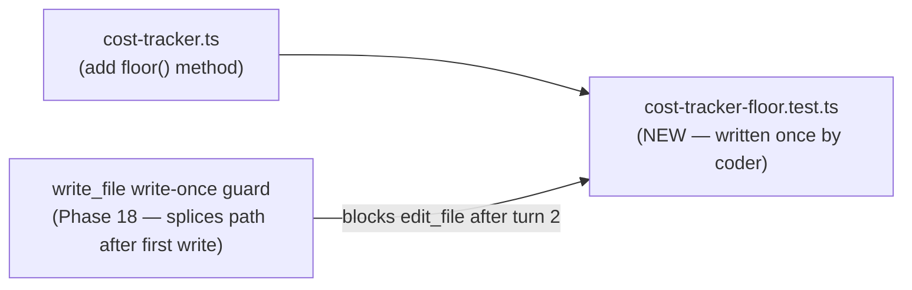

# Bollard-on-Bollard Self-Test: CostTracker.floor() — Phase 18 Validation

## Goal

Validate that **Phase 18** (write-once guard for new test files) eliminates the 54-turn / $3.41
cost pattern from the scale() run. The coder must write `cost-tracker-floor.test.ts` at turn 2 and
be deterministically blocked from editing it at turn 3+.

The vehicle is `CostTracker.floor(decimalPlaces?: number): CostTracker`:

- Truncates `_total` **down** to `decimalPlaces` decimal places (default 2) — i.e. `Math.floor`
  semantics, not rounding
- Validates `decimalPlaces` exactly like `formatCost`: must be a non-negative integer if provided,
  throws `CONTRACT_VIOLATION` otherwise
- Mutates `_total` in place, returns `this` for chaining

This is not on `main` and has no pre-existing test file. It is simple enough to implement in 1–3
coder turns, which means the turn budget is almost entirely determined by whether the write-once
guard fires correctly.

**Out of scope:** no changes to public API surface, no new packages, no prompt files.

---

## Architecture



---

## Step 0 — Capture baseline (MUST run before pipeline)

```bash
cd "/Users/brunomorel/inVantage Dropbox/inVantage Team Folder/Dev/CloudOps/bollard"

# 1. Confirm clean tree
git status

# 2. Test count
docker compose run --rm dev run test 2>&1 | grep -E "Tests|passed|skipped"

# 3. Cost baseline
docker compose run --rm dev --filter @bollard/cli run start -- cost-baseline show

# 4. Last run summary
docker compose run --rm dev --filter @bollard/cli run start -- history list --limit 3
```

Record these in the **Baseline capture** section at the bottom of this file before proceeding.

---

## Step 1 — Implementation reference

> **For context only — do NOT implement this manually. The pipeline coder agent implements it.**

`floor(decimalPlaces?: number): CostTracker` belongs in `packages/engine/src/cost-tracker.ts`,
inserted after the `scale()` method and before `merge()`. Pattern mirrors `formatCost`:

```typescript
floor(decimalPlaces?: number): CostTracker {
  if (decimalPlaces !== undefined) {
    if (!Number.isInteger(decimalPlaces) || decimalPlaces < 0) {
      throw new BollardError({
        code: "CONTRACT_VIOLATION",
        message: `decimalPlaces must be a non-negative integer, got: ${decimalPlaces}`,
        context: { decimalPlaces },
      })
    }
  }
  const places = decimalPlaces ?? 2
  const factor = Math.pow(10, places)
  this._total = Math.floor(this._total * factor) / factor
  return this
}
```

The planner must emit:
```json
{
  "affected_files": {
    "modify": ["packages/engine/src/cost-tracker.ts"],
    "create": ["packages/engine/tests/cost-tracker-floor.test.ts"]
  }
}
```

---

## Step 2 — Run the pipeline

```bash
cd "/Users/brunomorel/inVantage Dropbox/inVantage Team Folder/Dev/CloudOps/bollard"

docker compose run --rm \
  -e ANTHROPIC_API_KEY=$ANTHROPIC_API_KEY \
  -e BOLLARD_AUTO_APPROVE=1 \
  dev sh -c 'pnpm --filter @bollard/cli run start -- run implement-feature \
    --task "Add a floor(decimalPlaces?: number): CostTracker method to CostTracker. Truncates _total DOWN to decimalPlaces decimal places using Math.floor semantics (default 2). Validates decimalPlaces identically to formatCost(): must be a non-negative integer if provided, throws CONTRACT_VIOLATION with context { decimalPlaces } otherwise. Mutates _total in place, returns this for chaining." \
    --work-dir /app'
```

Record the run ID, total cost, implement node cost, and coder turns when the pipeline completes.

---

## Step 3 — Phase 18 validation gates

Check all four gates after the run. Record results in the **Validation** section below.

### Gate 1 — Coder turns < 15

```bash
docker compose run --rm dev --filter @bollard/cli run start -- history show <run-id> | grep -i "turns\|implement"
```

**Target:** coder turns ≤ 15. If > 15, the write-once guard may not have fired — check gate 2.

### Gate 2 — Write-once guard fired

Inspect the implement node logs for the error string returned when `edit_file` was attempted on
`cost-tracker-floor.test.ts` after first write:

```
Error: "packages/engine/tests/cost-tracker-floor.test.ts" is not in the plan's affected_files.
```

This string appears in the coder tool-result output when `write_file` has already spliced the path
out of `allowedWritePaths`. If the guard fired, the coder should have moved to completion
immediately after seeing this error.

If the guard did NOT fire (no such error in logs), record that — it means the coder wrote a
simple test at turn 2 and naturally moved on (Phase 18a prompt was sufficient). Both outcomes
are acceptable — the guard is a safety net, not a mandatory trigger.

### Gate 3 — Stryker: totalMutants > 0 and score ≥ 80%

```bash
docker compose run --rm dev --filter @bollard/cli run start -- history show <run-id> | grep -i "mutation\|stryker\|mutants"
```

If `stryker_no_mutants` appears, check whether `cost-tracker-floor.test.ts` was created and
syntactically valid. The Stryker dry-run fails when the test suite has parse errors.

Manual Stryker smoke if needed:
```bash
docker compose run --rm dev sh -c 'node node_modules/@stryker-mutator/core/bin/stryker.js run'
```

**Target:** totalMutants > 0, score ≥ 80%.

### Gate 4 — Cost baseline

```bash
docker compose run --rm dev --filter @bollard/cli run start -- cost-baseline diff
```

Current ceiling: **$1.96** (tag `stage5a-validated`, $1.633 baseline, 20% threshold).

If this run comes in under $1.96 **and** the repo aggregate since the baseline tag is also under
$1.96, retag the baseline:

```bash
docker compose run --rm dev --filter @bollard/cli run start -- cost-baseline tag phase18-validated
```

---

## Step 4 — Document results

Create `spec/self-test-floor-results.md` with:

```markdown
# Self-Test: CostTracker.floor() — Phase 18 Validation

**Date:** 2026-05-27
**Run ID:** `<run-id>`
**Task:** Add `floor(decimalPlaces?: number): CostTracker`

## Overall Result

| Metric | Value | Target |
|--------|-------|--------|
| Status | ✓/✗ | — |
| Total cost | $X.XX | < $1.96 |
| Coder turns | N | < 15 |
| Nodes | 31/31 | 31/31 |
| Implement cost | $X.XX | — |

## Phase 18 Gates

| Gate | Result | Evidence |
|------|--------|----------|
| Coder turns < 15 | yes/no | N turns |
| Write-once guard fired | yes/no/not-needed | error string in logs / n/a |
| Stryker totalMutants > 0 | yes/no | N mutants |
| Stryker score ≥ 80% | yes/no | X% |
| Cost baseline | pass/fail | $X.XX vs $1.96 ceiling |

## Grounding Results

| Scope | Proposed | Grounded | Dropped | Drop rate |
|-------|----------|----------|---------|-----------|
| Boundary | — | — | — | — |
| Contract | — | — | — | — |

## Test Suite

| Before | After |
|--------|-------|
| 1300 passed / 6 skipped | N passed / 6 skipped |
```

Then update CLAUDE.md — add a new self-test entry after the scale() entry:

```
Self-test **2026-05-27** (run id `<run-id>`, `CostTracker.floor()` — Phase 18 write-once guard
validation) completed **31/31** nodes successfully. Total cost **$X.XX**; **implement** ~**Xs**,
**$X.XX** (coder **N** turns). Phase 18 write-once guard: **fired/not needed** (coder
wrote unit test at turn 2, [blocked on edit at turn 3 / moved on naturally]). Boundary grounding
**N/N** (drop 0), contract **N/N** (drop N%). Stryker: **totalMutants N**, score **X%**.
See [spec/self-test-floor-results.md](../spec/self-test-floor-results.md).
```

---

## Step 5 — Archive

```bash
mv spec/prompts/self-test-floor.md spec/archive/prompts/self-test-floor.md
git add -A
git commit -m "self-test: CostTracker.floor() Phase 18 validation — N turns, \$X.XX"
git push origin main
```

---

## Out of scope

- DO NOT implement `floor()` manually — the pipeline coder agent does this
- DO NOT modify any prompt files under `packages/agents/prompts/`
- DO NOT touch `packages/agents/src/tools/write-file.ts` — Phase 18 is already shipped
- DO NOT add fast-check property tests to `cost-tracker-floor.test.ts` — simple `expect()` only
- DO NOT retag the cost baseline if total cost > $1.96

---

## Baseline capture

> Fill in after Step 0 before running Step 2.

| Item | Value |
|------|-------|
| Git SHA | `e71afc001839fc15566950c95993fa0f35aff170` |
| Test count | 1299 passed / 1 failed / 6 skipped |
| Cost baseline tag | `stage5a-validated` ($1.633, $1.96 ceiling) |
| Last run ID | `20260527-0207-run-446ba7` |
| Last run cost | $3.41 |

---

## Validation

> Fill in after Step 3.

| Gate | Result | Notes |
|------|--------|-------|
| Coder turns | 23 | target < 15 — fail |
| Write-once guard | not needed | no edit_file on test after write |
| Stryker totalMutants | 294 (manual) | target > 0 — pass |
| Stryker score | 86.73% (manual) | target ≥ 80% — pass |
| Cost baseline diff | fail (+57.66% repo avg) | single run $1.18 pass |
| Baseline retagged? | no | diff fail |
