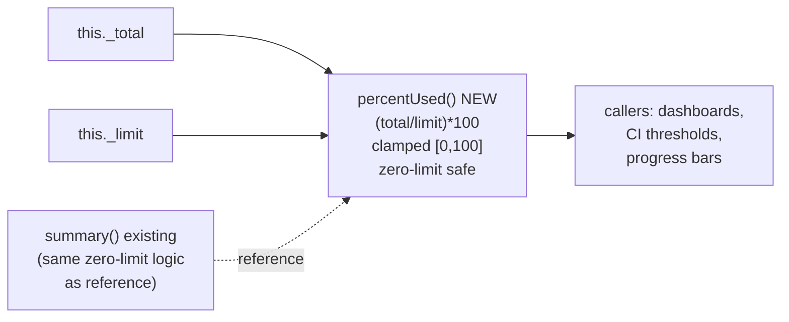

# Cursor Prompt — Self-Test: CostTracker.percentUsed() + Phase 16 Validation

> **Context:** This is a Bollard-on-Bollard self-test. Primary goal: validate that the Phase 16
> two-layer test-surgery-loop guard (shipped in commit `0843bc8`) actually reduces coder turns and
> cost on a bounded single-method task. The last three surgery-loop runs (clamp $3.21/54t, merge
> $4.75/51t, limitUsd $5.02/54t) all shared the same root cause: coder edited `cost-tracker.test.ts`
> repeatedly. Phase 16 blocks that at infrastructure level — Layer 1 strips pre-existing `*.test.ts`
> from `allowedWritePaths`, Layer 2 hard-stops after 5 `pnpm test` invocations.
>
> Secondary goal: continue Phase 14 contract grounding health monitoring (drop rate ≤ 30%).
>
> **Read CLAUDE.md fully before starting.** Then read:
> - `packages/engine/src/cost-tracker.ts` — the class; especially `summary()` lines 203–220
>   which contains the same zero-limit edge-case logic `percentUsed()` must match
> - `packages/engine/tests/cost-tracker.test.ts` — existing structure (195 `it()` blocks)
> - `packages/cli/src/agent-handler.ts` lines 531–545 — the Phase 16 Layer 1 guard
> - `packages/agents/src/tools/run-command.ts` — the Phase 16 Layer 2 counter
> - `.bollard/cost-baseline.json` — current baseline ($1.633, 20% threshold, $1.96 ceiling)

---

## Goal

Add `percentUsed(): number` to `CostTracker`. The method returns the accumulated total as a
percentage of the limit, clamped to `[0, 100]`.

Exact semantics:
- Normal case: `(total / limit) * 100`, clamped to `[0, 100]`
- `limit === 0` and `total === 0`: return `0`
- `limit === 0` and `total > 0`: return `100` (exceeded, can't express as real %)
- Result is always a number in `[0, 100]` — never negative, never above 100, never NaN, never Infinity

This is the scalar counterpart to the percentage string already embedded in `summary()`. The coder
should read `summary()` in `cost-tracker.ts` for the zero-limit logic — the semantics are identical,
just returned as a raw number instead of a formatted string.

Out of scope:
- No `percentRemaining()` companion (that's a separate task)
- No formatting, no string output
- No changes to `summary()`, `formatCost()`, or any existing method

---

## Architecture



---

## Step 0 — Capture baseline

```bash
git status          # confirm clean tree
git rev-parse HEAD  # record SHA

docker compose run --rm dev run test 2>&1 | tail -5
# Expected: ~1252 passed, 6 skipped
```

Record below before running the pipeline.

### Baseline capture

- Git SHA: _______________
- Test count before: _______________ passed, ___ skipped

---

## Step 1 — Run the pipeline

```bash
docker compose run --rm \
  -e BOLLARD_AUTO_APPROVE=1 \
  dev sh -c 'pnpm --filter @bollard/cli run start -- run implement-feature \
    --task "Add a percentUsed(): number method to CostTracker that returns the accumulated total as a percentage of the limit, clamped to [0, 100]. Normal case: (total() / limitUsd()) * 100, clamped. Edge cases: if limitUsd() is 0 and total() is 0, return 0; if limitUsd() is 0 and total() > 0, return 100. Result is always in [0, 100] — never NaN, never Infinity, never negative, never above 100. No parameters, no throws. Read the existing summary() method for the zero-limit logic to match." \
    --work-dir /app'
```

### What to watch for — Phase 16 validation signals

**Layer 1 (deny-list) fired** — look in the coder turn log for:
```
Error: "packages/engine/tests/cost-tracker.test.ts" is not in the plan's affected_files
```
If this appears, Layer 1 worked correctly. The coder should pivot to writing a new test file
(e.g. `cost-tracker.percentUsed.adversarial.test.ts` or similar).

**Layer 2 (invocation counter) fired** — look for:
```
Error: test suite invoked N times this session (max 5). Stop retrying.
```
If this appears AND coder turns < 30, Layer 2 did its job. If it fires but turns > 40, there's
still a loop happening — report it.

**Neither layer fired** — this is the ideal case: the coder wrote a new test file on its own,
ran `pnpm test` ≤ 5 times, and finished cleanly. Phase 16 prevented the problem before the
guardrails were needed.

**Contract grounding (node 13):** drop rate ≤ 30% (Phase 14 baseline).

---

## Step 2 — Analyse

```bash
docker compose run --rm dev sh -c \
  'pnpm --filter @bollard/cli run start -- history show <RUN_ID>'

docker compose run --rm dev sh -c \
  'pnpm --filter @bollard/cli run start -- cost-baseline diff'
```

Fill the validation table:

| Metric | Result | Target |
|--------|--------|--------|
| Total nodes | __ / 31 | 31 / 31 |
| Total cost | $_____ | < $1.96 |
| Coder turns | ___ | < 25 (Phase 16 target) |
| Layer 1 fired? | yes / no | either is ok |
| Layer 2 fired? | yes / no | no (ideal); yes+turns<30 (acceptable) |
| Boundary grounding | __ / __ | drop 0 |
| Contract grounding | __ / __ (drop __%) | ≤ 30% |
| Stryker totalMutants | ___ | > 0 |
| cost-baseline diff | pass / fail | informational |

**Phase 16 GREEN criterion:** coder turns < 25 AND no `cost-tracker.test.ts` edits in `git diff`.

If coder turns ≥ 40, inspect `git diff` to see whether `cost-tracker.test.ts` was modified. If it
was, Layer 1 failed to strip it — check whether the planner listed it in `affected_files.create`
(not `modify`) which would bypass the `existsSync` check.

---

## Step 3 — Doc updates (after GREEN)

### 3a — CLAUDE.md

Add a new self-test entry to the self-test log (after the toJSON entry):

```
Self-test **2026-05-25** (run id `<RUN_ID>`, `CostTracker.percentUsed()` — Phase 16 test-surgery-loop guard validation) completed **31/31** nodes successfully. Total cost **$X.XX**; **implement** ~**Xs**, **$X.XX** (coder **N** turns). Boundary grounding **N/N** (drop 0), contract **N/N** (drop N%). Stryker: **totalMutants N**, score **X.XX%**. Phase 16 guard: Layer 1 **[fired/did not fire]**, Layer 2 **[fired/did not fire]**. See [spec/self-test-percent-used-results.md](../spec/self-test-percent-used-results.md).
```

Update the test count line to reflect post-run totals.

### 3b — spec/ROADMAP.md

Find the Phase 16 entry and add the live validation note:

```
**Live validated (2026-05-25, run `<RUN_ID>`):** coder N turns / $X.XX.
Phase 16 guard [held / fired Layer 1 / fired Layer 2]. Surgery-loop pattern
[eliminated / reduced] vs clamp/merge/limitUsd ($3–5, 51–54 turns).
```

### 3c — spec/self-test-percent-used-results.md

Create a results file modeled on `spec/self-test-to-json-results.md`. Include:
- Run ID, date, task description
- Phase 16 validation section: which layers fired, coder turn count, git diff analysis
- Metrics table (cost, turns, grounding, Stryker)
- Cost regression result
- Notable findings

### 3d — Commit

```bash
git add packages/engine/src/cost-tracker.ts
git add packages/engine/tests/cost-tracker.test.ts   # only if pipeline wrote to it (shouldn't happen with Phase 16)
git add CLAUDE.md spec/ROADMAP.md
git add spec/self-test-percent-used-results.md
git commit -m "feat: CostTracker.percentUsed() + Phase 16 guard validation

percentUsed() returns (total/limit)*100 clamped to [0,100]; zero-limit safe.
Bollard-on-Bollard run <RUN_ID>: 31/31 nodes, \$X.XX, N coder turns.
Phase 16 test-surgery-loop guard: [Layer 1 fired / Layer 2 fired / neither].
Contract grounding N/N (drop N%). Stryker: N mutants, X.XX%."
git push origin main
```

### 3e — Archive this prompt

```bash
git mv spec/prompts/self-test-percent-used.md spec/archive/prompts/
git commit -m "archive: self-test-percent-used (Phase 16 validation complete)"
git push origin main
```

---

## Out of scope

- DO NOT add `percentRemaining()` — separate task
- DO NOT change `summary()`, `formatCost()`, `exceeded()`, `remaining()`, or any existing method
- DO NOT edit `packages/engine/tests/cost-tracker.test.ts` — the Phase 16 Layer 1 guard will
  block this and the coder should write a new file instead
- DO NOT touch agent prompt files under `packages/agents/prompts/`
- DO NOT rewrite or reformat the existing test suite
- DO NOT update cost baseline (`cost-baseline tag`) — that is a separate manual step after
  multiple validated runs establish the new floor

---

## Validation gate

Phase 16 is validated GREEN if:
1. **31/31 nodes completed**
2. **Coder turns < 25**
3. **`git diff` shows no edits to `packages/engine/tests/cost-tracker.test.ts`**
4. **Stryker totalMutants > 0** (Phase 15 continues to hold)

If condition 3 fails (the existing test file was edited), STOP. Do not write docs. Report:
- Which turn the coder edited `cost-tracker.test.ts`
- Whether the planner listed it in `affected_files.modify` or `affected_files.create`
- The exact path as it appeared in the plan JSON (retrieve via `history show <RUN_ID>`)

This distinction matters: Layer 1 only strips paths where `existsSync(p) === true` at the time
`allowedWritePaths` is built. If the planner used `create` instead of `modify` for an existing
file, the path would still be `existsSync === true` and should still be stripped — if it wasn't,
that's a bug in `agent-handler.ts` to fix.
