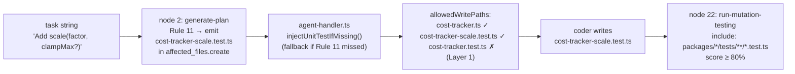

# Self-Test: CostTracker.scale() — Phase 17 Live Validation

> **Primary goal:** Validate Phase 17 end-to-end. The planner must emit
> `packages/engine/tests/cost-tracker-scale.test.ts` in `affected_files.create` (Rule 11), or the
> agent-handler fallback must inject it. Either way, the coder writes a Stryker-visible unit test
> for `scale()` so node 22 (`run-mutation-testing`) scores ≥ 80%.
>
> **Secondary goal:** Clean forward run with coder turns < 35 and total cost < $1.96 baseline ceiling.
>
> **Read CLAUDE.md fully before starting.** Current test count: **1274 passed / 6 skipped**.

---

## Architecture — Phase 17 signal flow



---

## Task

```
Add a scale(factor: number, clampMax?: number): CostTracker method to CostTracker.

Behaviour:
- Multiplies _total by factor (same validation as multiply(): factor must be a positive finite number; throw CONTRACT_VIOLATION for ≤ 0, NaN, Infinity).
- If clampMax is provided and is a non-negative finite number, caps _total at clampMax after multiplying (same as calling cap(clampMax)).
- If clampMax is provided but is invalid (negative, NaN, Infinity), throw CONTRACT_VIOLATION.
- Returns this for chaining.

Example: tracker.add(4).scale(3, 10) → total = 10 (12 capped at 10).
```

---

## Step 0 — Baseline capture (MUST run before pipeline)

```bash
docker compose run --rm dev --filter @bollard/cli run start -- history summary
# Note the last successful run cost and test count

docker compose run --rm dev run test
# Confirm: 1274 passed, 6 skipped
```

Record these in the "Baseline" section at the bottom of this file before proceeding.

---

## Step 1 — Run the pipeline

```bash
docker compose run --rm -e BOLLARD_AUTO_APPROVE=1 dev sh -c \
  'pnpm --filter @bollard/cli run start -- run implement-feature \
   --task "Add a scale(factor: number, clampMax?: number): CostTracker method to CostTracker. Multiplies _total by factor (positive finite, CONTRACT_VIOLATION otherwise). If clampMax is provided and valid (non-negative finite), caps _total at clampMax after multiplying. If clampMax provided but invalid, throw CONTRACT_VIOLATION. Returns this for chaining." \
   --work-dir /app'
```

---

## Step 2 — Phase 17 validation gates

### Gate 1 — Planner Rule 11 (node 2)

After the run, inspect the plan that was approved. Look for `affected_files.create` containing
`cost-tracker-scale.test.ts`:

```bash
# If the run recorded a plan JSON, check it:
docker compose run --rm dev --filter @bollard/cli run start -- history show <run-id>
```

Alternatively, the agent-handler debug log will show:
- **Rule 11 fired:** `cost-tracker-scale.test.ts` is in the plan's `create` list
- **Fallback fired:** `phase17: injected unit test path` appears in the coder session debug log

At least one of these must be true. If neither fired, Phase 17 has a bug.

### Gate 2 — Stryker score ≥ 80% with totalMutants > 0 (node 22)

```
run-mutation-testing: { totalMutants: <N>, score: <S>% }
```

- `totalMutants` must be > 0 (not `stryker_no_mutants`)
- `score` must be ≥ 80%

This is the gate that failed at 78.7% on cap() forward run `2a12d4`. If Phase 17 works, `scale()`
will have Stryker-visible unit tests and avoid NoCoverage mutants.

### Gate 3 — Cost and turns (secondary)

| Metric | Target |
|--------|--------|
| Coder turns | < 35 |
| Total cost | < $1.96 |
| Nodes completed | 31/31 |

---

## Step 3 — Record results

Create `spec/self-test-scale-results.md` with:

```markdown
# Self-Test: CostTracker.scale() — Validation Results

**Date:** <date>
**Run ID:** <run-id>
**Task:** Add scale(factor: number, clampMax?: number): CostTracker

## Overall Result

| Metric | Value |
|--------|-------|
| Status | ✓ success / ✗ failure |
| Total cost | $ |
| Duration | s |
| Nodes | /31 |
| Coder turns | |

## Phase 17 Gates

| Gate | Result | Evidence |
|------|--------|----------|
| Rule 11 fired (planner) | yes/no | `affected_files.create` contains cost-tracker-scale.test.ts |
| Fallback fired (injection) | yes/no | `phase17: injected unit test path` in log |
| Stryker totalMutants > 0 | yes/no | totalMutants: N |
| Stryker score ≥ 80% | yes/no | score: X% |

## Grounding Results

| Scope | Proposed | Grounded | Dropped | Drop rate |
|-------|----------|----------|---------|-----------|
| Boundary | | | | |
| Contract | | | | |
| Behavioral | | | | |

## Test Suite

| Before | After |
|--------|-------|
| 1274 passed / 6 skipped | ? passed / 6 skipped |

## Cost Regression

| Metric | Value |
|--------|-------|
| Baseline ceiling | $1.96 |
| This run cost | $ |
| `cost-baseline diff` | pass/fail/insufficient_data |
```

### Update CLAUDE.md

After a clean run, update the test count line:
```
**Latest count (authoritative, <date>, post Phase 17 scale() validation):** `<N>` passed, `6` skipped
```

### Commit

```bash
git add spec/self-test-scale-results.md CLAUDE.md
git commit -m "docs: Phase 17 live validation results — scale() self-test"
git push origin main

git mv spec/prompts/self-test-scale.md spec/archive/prompts/
git commit -m "archive: self-test-scale (Phase 17 validated)"
git push origin main
```

---

## Out of scope

- DO NOT change `vitest.stryker.config.ts`
- DO NOT touch Phase 16 constants (`MAX_TEST_INVOCATIONS`, Layer 1 filter)
- DO NOT add `scale()` to `packages/engine/src/types.ts` public interface unless the planner
  proposes it — follow the plan exactly
- DO NOT manually create `cost-tracker-scale.test.ts` — that must come from the coder agent
  following `allowedWritePaths`

---

## Implementation reference (for context only — do NOT implement manually)

The coder agent will implement this. The expected implementation matches `multiply()` + `cap()`:

```typescript
scale(factor: number, clampMax?: number): CostTracker {
  if (!Number.isFinite(factor) || factor <= 0) {
    throw new BollardError({
      code: "CONTRACT_VIOLATION",
      message: `Factor must be a positive finite number, got: ${factor}`,
      context: { factor },
    })
  }
  this._total = this._total * factor
  if (clampMax !== undefined) {
    if (!Number.isFinite(clampMax) || clampMax < 0) {
      throw new BollardError({
        code: "CONTRACT_VIOLATION",
        message: `clampMax must be a non-negative finite number, got: ${clampMax}`,
        context: { clampMax },
      })
    }
    if (this._total > clampMax) {
      this._total = clampMax
    }
  }
  return this
}
```

Expected acceptance criteria (planner should produce ≤ 5):
1. Multiplies total by a positive finite factor
2. Caps total at clampMax when provided and valid
3. Throws CONTRACT_VIOLATION for invalid factor (≤ 0, NaN, Infinity)
4. Throws CONTRACT_VIOLATION for invalid clampMax (negative, NaN, Infinity)
5. Returns this for chaining

---

## Baseline (fill in before running)

- Last run cost: $
- Last run ID:
- Test count pre-run: 1274 passed / 6 skipped
