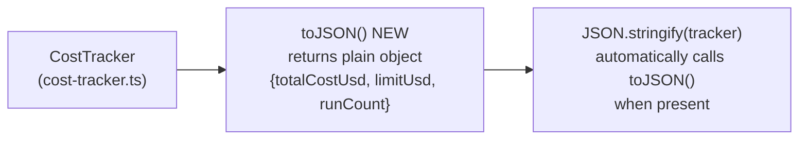

# Cursor Prompt — Self-Test: CostTracker.toJSON() + Stryker Live Validation

> **Context:** This is a Bollard-on-Bollard self-test. Primary goal: confirm that Stryker produces
> `totalMutants > 0` in a **live `implement-feature` pipeline run** (node 22 `run-mutation-testing`),
> not just in a Docker smoke test. The Phase 15b/c fix (node+stryker.js + plugins:[vitest-runner])
> was validated by Docker smoke (202 mutants, 90.10%) but not yet through the full 31-node pipeline.
>
> Secondary goal: validate continued Phase 14 contract grounding health (drop rate should stay ≤ 30%).
>
> **Read CLAUDE.md fully before starting.** Then read:
> - `packages/engine/src/cost-tracker.ts` — class you will be adding a method to
> - `packages/engine/tests/cost-tracker.test.ts` — existing test structure (157 `it()` blocks)
> - `packages/verify/src/mutation.ts` — confirm `StrykerProvider.run()` uses `node + stryker.js`
>   and generated config includes `plugins: ["@stryker-mutator/vitest-runner"]`
> - `.bollard/cost-baseline.json` — current baseline ($1.633, 20% threshold, $1.96 ceiling)
> - `spec/ROADMAP.md` — what this self-test validates

---

## Goal

Add `toJSON(): { totalCostUsd: number; limitUsd: number; runCount: number }` to `CostTracker`.
The method returns a plain serializable snapshot of the tracker's current state — suitable for
`JSON.stringify`, logging, and structured output. It does NOT modify any internal state.

This is intentionally a narrow, pure-read method:
- No input validation required (no parameters)
- No side effects
- Strong mutation targets for Stryker: wrong field names, wrong field values, swapped fields

Out of scope for this task:
- `fromJSON()` / deserialization
- `toJSON()` on `snapshot()` result
- Any change to `summary()` or `formatCost()`

---

## Architecture



The method participates in JavaScript's native serialization protocol — when an object has a `toJSON`
method, `JSON.stringify` calls it automatically. This is a useful property to test explicitly.

---

## Step 0 — Capture baseline (MUST run before the pipeline)

```bash
# Confirm clean working tree
git status

# Check current test count
docker compose run --rm dev run test 2>&1 | tail -5

# Record the output. Expected: ~1235 passed, 6 skipped.
```

Record below before running the pipeline.

### Baseline capture

- Git SHA: _______________
- Test count before: _______________ passed, ___ skipped
- Cost baseline: $1.633 (stage5a-validated, threshold 20%, ceiling $1.96)

---

## Step 1 — Run the full implement-feature pipeline

Use `BOLLARD_AUTO_APPROVE=1` to skip human gates (plan approval + PR approval):

```bash
docker compose run --rm \
  -e BOLLARD_AUTO_APPROVE=1 \
  dev sh -c 'pnpm --filter @bollard/cli run start -- run implement-feature \
    --task "Add a toJSON(): { totalCostUsd: number; limitUsd: number; runCount: number } method to CostTracker that returns a plain serializable snapshot of the tracker state. totalCostUsd must equal total(), limitUsd must equal limitUsd(), runCount must equal runCount(). The method must not modify any internal state. No parameters, no throws. The returned object participates in JSON.stringify serialization automatically (test this explicitly)." \
    --work-dir /app'
```

### What to watch for during the run

**Node 22 (`run-mutation-testing`):** This is the primary validation signal. Look for:
```
mutation_testing_result  totalMutants=N  score=X.XX%
```
`totalMutants` **must be > 0**. If you see `stryker_no_mutants` warning, STOP and report — do not
continue to docs updates. The Phase 15b/c fix is not fully working.

**Node 13 (`verify-claim-grounding`):** Look for `contract_grounding_result`. Drop rate should be
≤ 30% (Phase 14 fix). If > 50%, flag it.

**Node 7 (`generate-tests`) + Node 10 (`verify-boundary-grounding`):** Confirm boundary grounding
fires — look for `boundary_grounding_result`.

---

## Step 2 — Analyse the run

After the pipeline completes, retrieve the full run record:

```bash
docker compose run --rm dev sh -c \
  'pnpm --filter @bollard/cli run start -- history show <RUN_ID>'
```

Capture these metrics:

| Metric | Value | Target |
|--------|-------|--------|
| Total nodes | __ / 31 | 31 / 31 |
| Total cost | $_____ | < $1.96 |
| Coder turns | ___ | < 40 |
| Boundary grounding | __ / __ (drop __) | drop 0 |
| Contract grounding | __ / __ (drop __%) | ≤ 30% drop |
| Stryker totalMutants | ___ | > 0 |
| Stryker score | ___% | > 60% |
| `stryker_no_mutants` warning | present / absent | **absent** |

Then run the cost regression check:

```bash
docker compose run --rm dev sh -c \
  'pnpm --filter @bollard/cli run start -- cost-baseline diff'
```

If `cost-baseline diff` exits 1 (regression), record the delta but do not revert — document it.

---

## Step 3 — Doc updates (only after GREEN on Stryker)

### 3a — CLAUDE.md

Update the self-test history entry. Add a new bullet under the self-test log (near the other
`Self-test 2026-05-25` entries):

```
Self-test **2026-05-25** (run id `<RUN_ID>`, `CostTracker.toJSON()` — Stryker live pipeline validation) completed **31/31** nodes successfully. Total cost **$X.XX**; **implement** ~**Xs**, **$X.XX** (coder **N** turns). Boundary grounding **N/N** (drop 0), contract **N/N** (drop N%). Stryker: **totalMutants N**, score **X.XX%**. See [spec/self-test-to-json-results.md](../spec/self-test-to-json-results.md).
```

Update the test count line:
```
**Latest count (authoritative, 2026-05-25, post toJSON() self-test):** `XXXX` passed, `6` skipped
```

Update the Stryker known limitation bullet — add the live pipeline validation line:
```
**Live validated (2026-05-25, live pipeline):** `run-mutation-testing` on `cost-tracker.ts` → N mutants, X.XX% score (node 22/31). See [spec/self-test-to-json-results.md].
```

### 3b — spec/ROADMAP.md

Find the Phase 15 section and add the live pipeline validation note:

```
**Live pipeline validated (2026-05-25, run `<RUN_ID>`):** node 22 `run-mutation-testing` →
totalMutants N, score X.XX%. Stryker Phase 15 fully closed (Docker smoke + live pipeline both GREEN).
```

### 3c — Write results file

Create `spec/self-test-to-json-results.md` with a structured summary matching the pattern of
`spec/self-test-limit-accessor-results.md`. Include:
- Run ID, date, task description
- Node-by-node status table (31 rows)
- Key metrics table (cost, turns, grounding rates, Stryker)
- Phase 15 validation conclusion
- Cost regression result
- Any notable findings

### 3d — Commit

```bash
git add packages/engine/src/cost-tracker.ts
git add packages/engine/tests/cost-tracker.test.ts
git add CLAUDE.md spec/ROADMAP.md
git add spec/self-test-to-json-results.md
git commit -m "feat: CostTracker.toJSON() + Stryker live pipeline validation (Phase 15 closed)

toJSON() returns {totalCostUsd, limitUsd, runCount} — pure read, no side effects.
Participates in JSON.stringify serialization protocol automatically.
Bollard-on-Bollard self-test <RUN_ID>: 31/31 nodes, $X.XX, N coder turns.
Stryker: N mutants, X.XX% score (Phase 15 live pipeline validation GREEN).
Contract grounding: N/N (drop N%). Phase 14 + 15 both validated end-to-end."
git push origin main
```

### 3e — Archive this prompt

```bash
git mv spec/prompts/self-test-to-json.md spec/archive/prompts/self-test-to-json.md
git commit -m "archive: self-test-to-json prompt (Phase 15 live pipeline validation complete)"
git push origin main
```

---

## Out of scope

- DO NOT implement `fromJSON()` or any deserialization logic
- DO NOT change `summary()`, `formatCost()`, `snapshot()`, or any existing method
- DO NOT touch agent prompt files under `packages/agents/prompts/`
- DO NOT add any LLM call or external dependency
- DO NOT modify `vitest.stryker.config.ts`, `stryker.config.json`, or any Stryker config
- DO NOT update cost baseline (`cost-baseline tag`) — that is a separate manual step
- DO NOT run mutation testing manually — it runs as node 22 of the pipeline

---

## Validation gate

The run is GREEN if and only if **all three** are true:

1. **31/31 nodes completed** (no `status: fail` on non-skippable nodes)
2. **`stryker_no_mutants` warning is ABSENT** from the run log (i.e., `totalMutants > 0`)
3. **Contract grounding drop rate ≤ 30%** (Phase 14 holding)

If condition 2 fails, STOP. Do not write docs. Report:
- The exact `stryker_no_mutants` log line
- Contents of the generated `stryker.config.json` from inside the Docker container (check `/tmp/bollard-*/stryker.config.json` or similar)
- The Stryker stdout/stderr from the mutation node
