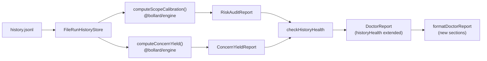

# Cursor Prompt — Stage 5b Phase 3: Meta-Verification + Adaptive Concern Weights

> **Purpose:** Stage 5b Phases 1 and 2 added prompt regression gating and eval CI. The two remaining
> items are (a) **meta-verification** — a calibration audit that measures how well scope outcomes
> actually correlate with test failures, surfaced as `bollard doctor --risk-audit`; and (b)
> **adaptive concern weights** — analysis of which concern lenses (correctness, security, performance,
> resilience) have the highest yield per project, surfaced as suggestions in `bollard doctor` output.
> Both features are fully deterministic (no LLM calls) and build entirely on the existing
> `RunRecord`/`ScopeResult` data already stored in `.bollard/runs/history.jsonl`.

Read `CLAUDE.md` fully before writing any code. Then read:
- `packages/engine/src/run-history.ts` — `RunRecord`, `ScopeResult`, `NodeSummary`, `FileRunHistoryStore`
- `packages/cli/src/doctor.ts` — `DoctorReport`, `HistoryHealth`, `runDoctor`, `formatDoctorReport`, `checkHistoryHealth`
- `packages/detect/src/types.ts` — `ConcernConfig`, `ConcernWeight`, `AdversarialScopeConfig`
- `packages/engine/tests/run-history.test.ts` — existing tests to understand test style
- `packages/cli/tests/doctor.test.ts` (if it exists) — existing doctor tests

---

## Goal

Add two new doctor sub-sections, both computed deterministically from `RunRecord` history:

1. **`--risk-audit`** — scope calibration metrics: for each scope (boundary, contract, behavioral),
   what fraction of runs where that scope found test failures also produced a `status: "success"` run
   overall? This tells you whether the scope is adding real signal vs. noise. Output as a table in
   `bollard doctor --risk-audit`.

2. **Adaptive concern weight suggestions** — across all runs with scope data, which concern lenses
   correlate with more grounded claims (higher `claimsGrounded / claimsProposed` ratio)? Surface
   suggestions in `bollard doctor --history` when ≥ 5 runs with scope data exist.

Neither feature makes configuration changes automatically. Both are advisory only.

---

## Architecture



---

## Step 1 — New types in `packages/engine/src/run-history.ts`

Add these exported interfaces after the existing `HistoryRecord` type. Do NOT change any existing
types — only add.

```typescript
/** Per-scope calibration: how often scope test failures correlated with overall run failures. */
export interface ScopeCalibrationEntry {
  scope: "boundary" | "contract" | "behavioral"
  /** Number of runs where this scope was enabled and had ≥ 1 test failure */
  runsWithFailures: number
  /** Of those, how many also had overall run status: "failure" */
  runsAlsoFailed: number
  /** runsAlsoFailed / runsWithFailures — undefined when runsWithFailures === 0 */
  correlationRate?: number
  /** Number of runs where scope was enabled */
  totalEnabledRuns: number
  /** Average grounding rate across enabled runs: claimsGrounded / claimsProposed */
  avgGroundingRate?: number
}

export interface RiskAuditReport {
  /** Minimum runs needed before producing calibration data */
  minRunsRequired: number
  /** Actual run count used */
  runCount: number
  /** Insufficient data when runCount < minRunsRequired */
  hasData: boolean
  scopes: ScopeCalibrationEntry[]
}

/** Per-concern yield: how often each concern lens produces grounded claims */
export interface ConcernYieldEntry {
  concern: "correctness" | "security" | "performance" | "resilience"
  /** Number of runs where this concern was weighed (not "off") */
  activeRuns: number
  /** Average grounding rate on runs where concern was active */
  avgGroundingRate?: number
  /** Suggested weight adjustment: "increase" | "decrease" | "keep" */
  suggestion: "increase" | "decrease" | "keep"
}

export interface ConcernYieldReport {
  hasData: boolean
  runCount: number
  concerns: ConcernYieldEntry[]
}
```

---

## Step 2 — Pure computation functions in `packages/engine/src/run-history.ts`

Add two exported pure functions after the new types. Both accept `RunRecord[]` (already filtered
from the JSONL store) and return the new report types.

### `computeScopeCalibration(runs: RunRecord[], minRuns = 5): RiskAuditReport`

```
For each scope in ["boundary", "contract", "behavioral"]:
  - enabledRuns = runs where scopes[] has an entry with scope === X and enabled === true
  - runsWithFailures = enabledRuns where testsFailed > 0 (from ScopeResult.testsFailed)
  - runsAlsoFailed = runsWithFailures where run.status === "failure"
  - correlationRate = runsAlsoFailed / runsWithFailures (undefined when 0)
  - avgGroundingRate = mean of (claimsGrounded / claimsProposed) for runs where both are defined and > 0

Return RiskAuditReport with hasData = (runs.length >= minRuns)
```

### `computeConcernYield(runs: RunRecord[], minRuns = 5): ConcernYieldReport`

The concern lens data is NOT stored on `RunRecord` today (concern weights live on
`ToolchainProfile`, not in run history). So this function works from grounding rates only:

```
For each scope result across all runs:
  - Use claimsGrounded / claimsProposed as a proxy for "yield"
  - Group by scope, not by concern (concern weights not stored)
  - Compute per-scope average grounding rate

Suggestion logic (per scope's avgGroundingRate):
  - < 30%: "decrease" (scope finds little signal — reduce weight or disable)
  - 30–70%: "keep"
  - > 70%: "increase" (scope consistently finds grounded claims — worth enabling more broadly)

Map scope → concern as advisory only:
  boundary → correctness
  contract → security + performance
  behavioral → resilience

Return ConcernYieldReport with hasData = (runs with scope data >= minRuns)
```

> **Note:** This is an intentional simplification. Full concern-level tracking would require storing
> `ConcernConfig` on `RunRecord`, which is a schema change deferred to a future phase. The
> scope-level proxy is sufficient for advisory suggestions.

---

## Step 3 — Extend `HistoryHealth` in `packages/cli/src/doctor.ts`

Add two optional fields to the existing `HistoryHealth` interface:

```typescript
export interface HistoryHealth {
  // ...existing fields...
  riskAudit?: RiskAuditReport        // populated when --risk-audit flag is set
  concernYield?: ConcernYieldReport  // populated when history has ≥ 5 runs with scope data
}
```

Import `computeScopeCalibration`, `computeConcernYield`, `RiskAuditReport`, `ConcernYieldReport`
from `@bollard/engine/src/run-history.js`.

---

## Step 4 — Update `checkHistoryHealth` in `packages/cli/src/doctor.ts`

Add an `options?: { riskAudit?: boolean }` parameter to `checkHistoryHealth`. When `riskAudit` is
true, compute and attach the `RiskAuditReport`.

Always compute `ConcernYieldReport` when `runs.length >= 5` (it's cheap, advisory-only, and
useful alongside `--history`).

```typescript
export async function checkHistoryHealth(
  workDir: string,
  options?: { riskAudit?: boolean },
): Promise<HistoryHealth> {
  // ...existing logic...
  const runs = recent.filter((r): r is RunRecord => r.type === "run")

  // Always compute concern yield when enough data
  const concernYield = computeConcernYield(runs)

  // Only compute risk audit when flag is set
  const riskAudit = options?.riskAudit ? computeScopeCalibration(runs) : undefined

  return {
    ...existingFields,
    ...(concernYield.hasData ? { concernYield } : {}),
    ...(riskAudit !== undefined ? { riskAudit } : {}),
  }
}
```

---

## Step 5 — Update `runDoctor` in `packages/cli/src/doctor.ts`

Thread the `riskAudit` flag through:

```typescript
export async function runDoctor(
  workDir: string,
  env: NodeJS.ProcessEnv = process.env,
  options?: { history?: boolean; riskAudit?: boolean },
): Promise<DoctorReport> {
  // ...existing...
  if (options?.history === true || options?.riskAudit === true) {
    const historyHealth = await checkHistoryHealth(workDir, { riskAudit: options?.riskAudit })
    return { ...base, historyHealth }
  }
  return base
}
```

---

## Step 6 — Render the new sections in `formatDoctorReport` / `formatHistorySection`

Add two new rendering blocks inside `formatHistorySection` (which is called when
`report.historyHealth` is present).

### Concern yield block (always shown when `concernYield` is present)

```
  Concern yield (last N runs):
    ✓ boundary (correctness proxy): 72% avg grounding — keep
    ⚠ contract (security proxy):    28% avg grounding — consider reducing weight
    ○ behavioral: not enough data
```

Use `GREEN ✓` for "increase" or "keep" (≥ 30%), `YELLOW ⚠` for "decrease" (< 30%), `DIM ○` for
no data. Show the scope name and the concern it proxies parenthetically.

### Risk audit block (shown only when `riskAudit` is present)

```
  Scope calibration (risk audit):
    boundary:  8 runs with test failures / 10 enabled — 80% correlated with run failure  ✓ high signal
    contract:  2 runs with test failures /  6 enabled — 33% correlation                  ⚠ moderate
    behavioral: insufficient data (< 5 enabled runs)
```

Thresholds: ≥ 70% correlation = high signal (GREEN ✓), 40–70% = moderate (YELLOW ⚠), < 40% = low
signal (RED ✗). Fewer than 5 enabled runs = "insufficient data" (DIM ○).

---

## Step 7 — Wire `--risk-audit` CLI flag in `packages/cli/src/index.ts`

Find the `doctor` command handler (around line 897) and add `--risk-audit` flag parsing:

```typescript
if (command === "doctor") {
  const historyFlag = args.includes("--history") || args.includes("--risk-audit")
  const riskAuditFlag = args.includes("--risk-audit")
  const jsonFlag = args.includes("--json")
  const report = await runDoctor(workDir, process.env, {
    history: historyFlag,
    riskAudit: riskAuditFlag,
  })
  // ...existing output logic...
}
```

Also update the help text line:
```
doctor [--json] [--history] [--risk-audit]   Check environment health; --history adds run stats; --risk-audit adds scope calibration
```

---

## Test updates

### New test file: `packages/engine/tests/risk-audit.test.ts`

Write unit tests for `computeScopeCalibration` and `computeConcernYield`. Use inline `RunRecord`
fixtures — no file I/O.

Cover:
- `computeScopeCalibration`: hasData=false when < 5 runs; correlationRate computed correctly;
  undefined correlationRate when runsWithFailures = 0; avgGroundingRate computed correctly
- `computeConcernYield`: hasData=false when < 5 runs with scope data; suggestion thresholds
  (< 30% → "decrease", > 70% → "increase", else "keep"); scopes with no data produce no entry

Aim for ≥ 8 tests covering edge cases (all scopes disabled, zero claims, mixed enabled/disabled).

### New test file: `packages/cli/tests/doctor-risk-audit.test.ts`

Write unit tests for the rendering functions and the `checkHistoryHealth` extension. Mock
`FileRunHistoryStore` with fixture records.

Cover:
- `formatHistorySection` includes concern yield block when `concernYield` present
- `formatHistorySection` includes risk audit block when `riskAudit` present
- `runDoctor` with `{ riskAudit: true }` populates `historyHealth.riskAudit`
- `runDoctor` without `--risk-audit` does NOT populate `historyHealth.riskAudit`

Aim for ≥ 6 tests.

---

## Self-check

Run sequentially. Do NOT declare done until all pass.

1. `docker compose run --rm dev run typecheck` — exit 0
2. `docker compose run --rm dev run lint` — exit 0
3. `docker compose run --rm dev run test` — all tests pass; count ≥ 1361 (1347 baseline + ≥ 14 new)
4. `docker compose run --rm dev --filter @bollard/cli run start -- doctor --history` — runs without error, no crash
5. `docker compose run --rm dev --filter @bollard/cli run start -- doctor --risk-audit` — runs without error, shows risk audit section (may show "insufficient data" if history is sparse — that is correct)
6. `git diff --stat HEAD -- packages/blueprints/src packages/agents/prompts` — empty (no blueprint or prompt files changed)
7. No LLM calls were added anywhere — grep for `provider.chat\|chatStream\|AnthropicProvider\|OpenAIProvider` in the new files and confirm 0 matches

---

## When GREEN — doc updates

- In `CLAUDE.md`: add to the Stage 5b section — "**Stage 5b Phase 3 (DONE):** `computeScopeCalibration` + `computeConcernYield` pure functions in `@bollard/engine`; `RiskAuditReport` + `ConcernYieldReport` types; `--risk-audit` flag on `bollard doctor`; concern yield suggestions in `--history` output. N tests."
- In `spec/ROADMAP.md`: strike through both "Meta-verification" and "Adaptive concern weights" bullet points under Stage 5b.
- Move this prompt file to `spec/archive/prompts/stage5b-phase3-meta-verification.md`

---

## Out of scope

- DO NOT store `ConcernConfig` or concern weights on `RunRecord` — that's a future schema change
- DO NOT add any LLM calls — this is entirely deterministic
- DO NOT change `RunRecord`, `ScopeResult`, or `NodeSummary` shape — only add new types alongside
- DO NOT auto-apply weight adjustments to `.bollard.yml` — suggestions are advisory only
- DO NOT change the `bollard history` or `bollard cost-baseline` commands
- DO NOT add a new CI workflow — this is a local dev feature surfaced in `doctor`
