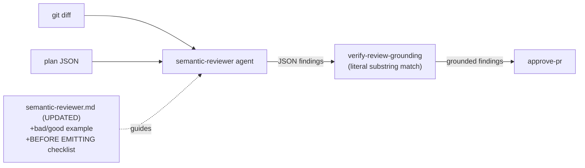

## Goal

Two things before Stage 6 Phase 1:

1. **Semantic reviewer prompt fix** — apply the same ADR-0003 self-check pattern that fixed
   contract-tester grounding (Phase 1b) to `semantic-reviewer.md`. The `available()` self-test
   showed 1/11 findings grounded — the reviewer was paraphrasing diff lines instead of quoting
   them verbatim. No infrastructure change needed; prompt-only.

2. **Bollard-on-Bollard self-test + baseline retag** — validate the overwrite guard (Phase 5e) and
   the contract-tester self-check (Phase 1b) in a live pipeline run before Stage 6 adds significant
   new infrastructure. If the run is clean and under budget, retag `cost-baseline` to establish a
   post-5e anchor. Current baseline (`stage5a-validated`, $1.633) predates all Phase 5e improvements.

**Do NOT** touch `contract-tester.md`, `boundary-tester.md`, `coder.md`, or any non-prompt file
except CLAUDE.md/ROADMAP.md in the docs step.

---

## Architecture



---

## Step 1 — Fix semantic-reviewer.md

File: `packages/agents/prompts/semantic-reviewer.md`

Replace the current **Grounding rules** section (the block starting with `**Grounding rules**`
through "Paraphrases are invalid.") with the expanded version below. Everything else in the
file stays exactly as-is.

**Current text to replace:**

```
**Grounding rules**

- Every finding must have at least one grounding object.
- Each `quote` must be copied **verbatim** from the diff or plan text you received (substring match). Paraphrases are invalid.
- `source` is either `"diff"` or `"plan"` and must match where the quote was copied from.
```

**Replacement:**

```markdown
**Grounding rules**

- Every finding must have at least one grounding object.
- Each `quote` must be copied **verbatim** from the diff or plan text you received. The verifier
  runs a literal substring match — no fuzzy matching, no synonym expansion.
- `source` is either `"diff"` or `"plan"` and must match where the quote was copied from.

**DO NOT paraphrase grounding quotes.**

Bad (paraphrase — will be rejected):
```json
{ "quote": "the method doesn't handle negative inputs", "source": "diff" }
```

Good (verbatim — exact characters from the diff hunk):
```json
{ "quote": "+  if (factor <= 0) throw new BollardError(", "source": "diff" }
```

If you cannot find a verbatim substring that supports a finding, **do not emit that finding**.
`{ "findings": [] }` is a valid and correct output — prefer it over ungrounded findings.

## BEFORE EMITTING — Self-check (run this for every finding)

1. **Locate the quote:** For each `grounding[].quote`, find it as a literal substring in the
   received text — diff lines for `source: "diff"`, plan JSON text for `source: "plan"`. If you
   cannot locate it character-for-character, replace it with a quote you CAN locate — or drop
   the finding entirely.
2. **No paraphrase:** The quote must be copy-pasted. "doesn't handle negative inputs" is a
   paraphrase — find the actual `+` line from the diff hunk instead.
3. **Source matches location:** Every `source: "diff"` quote must appear in a diff hunk line
   (starting with `+`, `-`, or context). Every `source: "plan"` quote must appear in the plan
   JSON fields you received.
4. **Severity is warranted:** `error` for correctness regressions only; `warning` for real risks;
   `info` for style notes. Do not inflate severity to make a finding seem more important.

Only emit after this check passes for every finding.
```

---

## Step 2 — Validate

```bash
docker compose run --rm dev run typecheck
docker compose run --rm dev run lint
docker compose run --rm dev run test
```

Expected: **1420 passed / 6 skipped** (prompt-only change, +0 tests). If the count differs,
something else changed — diagnose before committing.

---

## Step 3 — Commit prompt fix

Files: `packages/agents/prompts/semantic-reviewer.md` only.

```
Stage 5e: semantic-reviewer grounding self-check (ADR-0003 pattern)

Apply the same self-check pattern as contract-tester Phase 1b:
- Explicit bad/good example (paraphrase vs verbatim diff line quote)
- BEFORE EMITTING 4-point checklist: locate quote, no paraphrase,
  source matches location, severity is warranted
- Root cause: available() self-test 1/11 findings grounded (r1 only);
  reviewer was paraphrasing diff lines instead of copy-pasting them
- Prompt-only; +0 tests; 1420/6
```

---

## Step 4 — Bollard-on-Bollard self-test

This validates the overwrite guard (write_file blocks rewrites) and contract-tester Phase 1b
(grounding self-check) in a live pipeline run. Use `BOLLARD_AUTO_APPROVE=1` to skip human gates.

**Task:** `Add CostTracker.humanReadable(): string method`

The method should return a formatted string summarising current cost state, e.g.
`"$1.23 / $10.00 (12.3%)"` — total used, limit, and percentage. Simple, bounded, not yet
on main.

```bash
docker compose run --rm -e BOLLARD_AUTO_APPROVE=1 dev sh -c \
  'pnpm --filter @bollard/cli run start -- run implement-feature \
   --task "Add CostTracker.humanReadable(): string method that returns a human-readable summary of cost state, e.g. \$1.23 / \$10.00 (12.3%)" \
   --work-dir /app'
```

Record:
- Run ID
- Total cost ($)
- Coder turns
- Contract grounding rate (proposed / grounded / dropped)
- Semantic review grounding rate (findings / grounded)
- `static-checks` and `run-tests` node statuses
- Mutation score (if reached)

---

## Step 5 — Assess results

Compare against previous self-tests to check for improvement:

| Metric | Target | Previous best |
|--------|--------|---------------|
| Total cost | < $1.96 (baseline ceiling) | $0.88 (runCount) |
| Coder turns | < 40 | 19 (runCount) |
| Contract drop rate | < 20% | 0% (runCount, formatCost) |
| Semantic review grounded | > 50% | 1/11 (available — pre-fix) |

If `static-checks` fails, check whether it's the overwrite guard working (coder tried to
`write_file` an existing file and was redirected) or a real regression.

If coder turns > 40, note the cause — it's either scope creep (planner listed too many files)
or the overwrite guard redirecting to `edit_file` adding extra turns. Both are expected and
non-critical for this assessment.

---

## Step 6 — Retag cost baseline (conditional)

**Condition:** Self-test completed 31/31 (or 17/17 top-level) steps AND total cost is under $3.00.

```bash
docker compose run --rm dev sh -c \
  'pnpm --filter @bollard/cli run start -- cost-baseline tag post-5e-hardening'
```

Then run the diff check to confirm the new baseline anchors correctly:

```bash
docker compose run --rm dev sh -c \
  'pnpm --filter @bollard/cli run start -- cost-baseline diff'
```

If cost > $3.00 or nodes failed (not skipped), do NOT retag — report the result and defer
the retag.

---

## Step 7 — Docs and archive

### CLAUDE.md

1. Add self-test entry to the self-test log at the bottom of the self-test section:
   ```
   Self-test **2026-06-XX** (run id `<run-id>`, `CostTracker.humanReadable()` — post-5e
   hardening validation) completed **17/17** top-level steps (CLI success). Total cost
   **$X.XX**; **implement** ~**XXs**, **$X.XX** (coder **XX** turns). Contract grounding
   **X/X** (drop X%). Semantic review grounding **X/X** (drop X%). Overwrite guard: [fired /
   did not fire] on existing files. See [spec/self-test-humanreadable-results.md](...).
   ```

2. Update test count if any new tests were added by the self-test pipeline.

3. In the Stage 5e section, add after the Phase 1b DONE bullet:
   ```
   - ~~**Semantic reviewer grounding self-check:**~~ **DONE (2026-06-XX).** Applied ADR-0003 pattern
     to `semantic-reviewer.md`: bad/good diff-quote example + BEFORE EMITTING checklist. Root cause:
     `available()` self-test 1/11 findings grounded (reviewer paraphrasing diff lines). +0 tests. 1420/6.
   ```

### ROADMAP.md

No specific line — add to Stage 5e section if one exists, otherwise note in Stage 5b Protocol
Behavioral Audit entry that reviewer grounding is now structurally enforced.

### Archive

```bash
mv spec/prompts/semantic-reviewer-grounding-selftest.md spec/archive/
git add CLAUDE.md spec/ROADMAP.md spec/archive/semantic-reviewer-grounding-selftest.md
git rm spec/prompts/semantic-reviewer-grounding-selftest.md
git commit -m "docs: semantic-reviewer grounding fix + self-test results + baseline retag"
```

---

## Self-check (final gate)

1. `docker compose run --rm dev run typecheck` — exit 0
2. `docker compose run --rm dev run lint` — exit 0
3. `docker compose run --rm dev run test` — **1420 passed / 6 skipped** (or +N if self-test added promoted tests)
4. `git log --oneline -3` — semantic-reviewer commit + docs commit visible
5. `bollard cost-baseline show` — `post-5e-hardening` tag visible with cost < $3.00
6. `ls spec/prompts/` — this prompt absent (archived)
7. `git diff main -- packages/agents/prompts/contract-tester.md packages/agents/prompts/coder.md packages/agents/prompts/boundary-tester.md` — empty

---

## Out of scope

- DO NOT touch `contract-tester.md`, `boundary-tester.md`, `coder.md`, `edit-file.ts`
- DO NOT change pipeline node ordering or blueprint structure
- DO NOT start Stage 6 Phase 1 (`FileOwnershipStore`, `bollard ownership` CLI) — that is the next prompt after this one passes
- DO NOT promote the self-test's adversarial tests unless Signal 1 is detected at `approve-pr`
