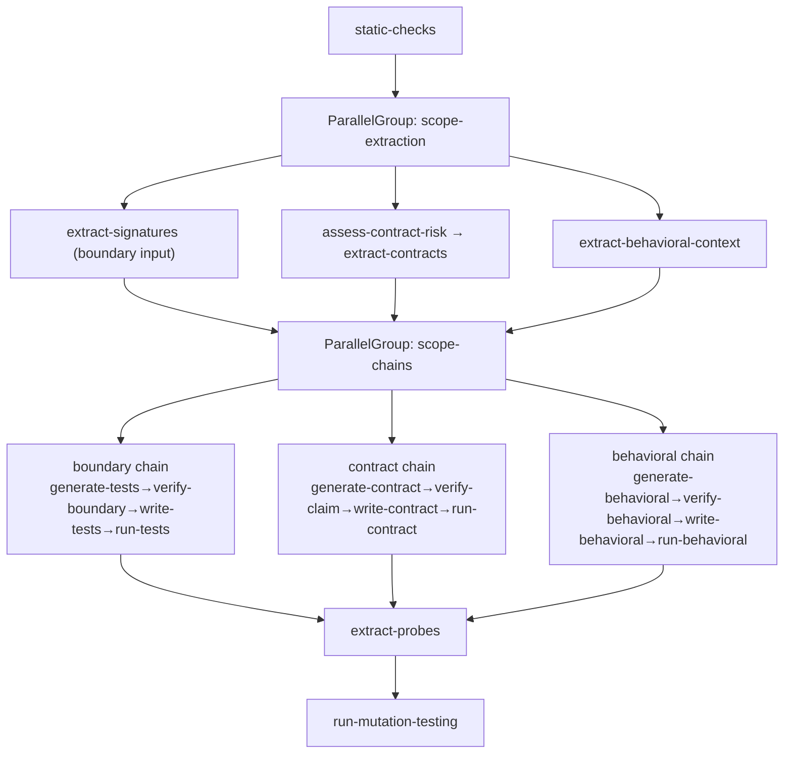

## Goal

Add parallel node-group execution to the Bollard blueprint runner (Stage 5c). The `implement-feature`
blueprint currently runs boundary, contract, and behavioral scope chains sequentially — three LLM
agent calls that are completely independent of each other. Running them in parallel cuts the dominant
wall-time component by roughly 60–70% on a standard bounded single-method task.

This prompt builds the infrastructure (new `BlueprintNodeGroup` type + parallel runner branch in
`runBlueprint`) and rewires the `implement-feature` blueprint to use it. It does NOT add MCP client
for agents or agent memory (those are separate Stage 5c items). See `spec/ROADMAP.md` Stage 5c.

The pipeline logical shape after this change:

```
create-branch → generate-plan → approve-plan → expand-affected-files → implement → static-checks
→ [PARALLEL: extract-signatures | assess-contract-risk + extract-contracts | extract-behavioral-context]
→ [PARALLEL: boundary chain | contract chain | behavioral chain]
→ extract-probes → run-mutation-testing → extract-code-metrics → generate-review-diff
→ semantic-review → verify-review-grounding → docker-verify → generate-diff → approve-pr
```

---

## Architecture



---

## Step 0 — Capture baseline

Before any code change:

```bash
git status   # must be clean
docker compose run --rm dev run test 2>&1 | tail -3
# Record: Tests X passed | Y skipped
docker compose run --rm dev run typecheck 2>&1 | tail -3
docker compose run --rm dev run lint 2>&1 | tail -3
```

Record in "Baseline capture" at the bottom. Current count: **1358 passed / 6 skipped**.

---

## Step 1 — BlueprintNodeGroup type + runner parallel execution

### 1a — `packages/engine/src/blueprint.ts`

Add a `BlueprintNodeGroup` type alongside `BlueprintNode`. A group contains an array of branches;
each branch is an array of `BlueprintNode`s that execute sequentially within the branch. All branches
in a group execute concurrently.

```typescript
// Add to packages/engine/src/blueprint.ts

export interface BlueprintBranch {
  /** Stable identifier used in progress events and result keys. */
  id: string
  /** Human-readable label shown in CLI progress (e.g. "boundary scope"). */
  name: string
  nodes: BlueprintNode[]
}

export interface BlueprintNodeGroup {
  /** Discriminator — runner checks this to choose parallel path. */
  kind: "parallel"
  id: string
  name: string
  branches: BlueprintBranch[]
  /**
   * What to do if any branch fails.
   * "skip" — log warn, continue pipeline (matches existing onFailure: "skip" convention).
   * "stop" — propagate failure upward (default).
   */
  onBranchFailure?: "stop" | "skip"
}

/** Union of sequential node and parallel group — what the blueprint nodes array contains. */
export type BlueprintEntry = BlueprintNode | BlueprintNodeGroup

export function isParallelGroup(entry: BlueprintEntry): entry is BlueprintNodeGroup {
  return (entry as BlueprintNodeGroup).kind === "parallel"
}
```

Update `Blueprint.nodes` to `BlueprintEntry[]`:

```typescript
export interface Blueprint {
  id: string
  name: string
  nodes: BlueprintEntry[]   // was: BlueprintNode[]
  maxCostUsd: number
  maxDurationMinutes: number
}
```

### 1b — `packages/engine/src/runner.ts`

Import `BlueprintEntry`, `BlueprintNodeGroup`, `isParallelGroup`. Update the main loop in
`runBlueprint` to handle both node types.

**Key rules:**
- Replace `for (const node of blueprint.nodes)` with `for (const entry of blueprint.nodes)`
- If `isParallelGroup(entry)`: call a new `executeParallelGroup` helper (see below)
- Otherwise: existing sequential `executeNode` path unchanged

```typescript
// New helper — add inside runner.ts, before runBlueprint

async function executeParallelGroup(
  group: BlueprintNodeGroup,
  ctx: PipelineContext,
  agenticHandler: AgenticHandler | undefined,
  humanGateHandler: HumanGateHandler | undefined,
  onProgress: ProgressCallback | undefined,
  stepBase: number,
  totalSteps: number,
): Promise<{ status: "ok" | "fail"; branchResults: Record<string, NodeResult[]> }> {
  onProgress?.({
    type: "group_start",
    groupId: group.id,
    groupName: group.name,
    branchIds: group.branches.map((b) => b.id),
    step: stepBase,
    totalSteps,
  })

  const branchPromises = group.branches.map(async (branch) => {
    const localResults: Record<string, NodeResult> = {}
    let branchFailed = false

    for (const node of branch.nodes) {
      const result = await executeNode(node, ctx, agenticHandler, humanGateHandler)
      localResults[node.id] = result
      if (result.cost_usd) ctx.costTracker.add(result.cost_usd)
      if (result.status === "fail") {
        branchFailed = true
        break
      }
      checkPostconditions(node, ctx)
    }

    return { branchId: branch.id, localResults, branchFailed }
  })

  const settled = await Promise.allSettled(branchPromises)

  let anyFailed = false
  const branchResults: Record<string, NodeResult[]> = {}

  for (const s of settled) {
    if (s.status === "rejected") {
      anyFailed = true
      ctx.log.warn("parallel branch threw unexpectedly", { error: String(s.reason) })
      continue
    }
    const { branchId, localResults, branchFailed } = s.value
    // Merge branch results into the shared ctx.results
    for (const [nodeId, result] of Object.entries(localResults)) {
      ctx.results[nodeId] = result
    }
    branchResults[branchId] = Object.values(localResults)
    if (branchFailed) anyFailed = true
  }

  onProgress?.({
    type: "group_complete",
    groupId: group.id,
    groupName: group.name,
    status: anyFailed ? "fail" : "ok",
    step: stepBase,
    totalSteps,
  })

  if (anyFailed && (group.onBranchFailure ?? "stop") === "stop") {
    return { status: "fail", branchResults }
  }
  return { status: "ok", branchResults }
}
```

**Important implementation notes:**

1. `ctx.results` is a plain `Record<string, NodeResult>` — writing from concurrent branches is safe
   because each branch writes different node IDs. No mutex needed.
2. `ctx.costTracker.add()` IS called concurrently. `CostTracker` uses a simple numeric accumulator
   (`this._total += cost`) — in Node.js single-threaded event loop this is safe; `Promise.allSettled`
   resolves individual branch promises but the `.add()` calls are sequential within each branch's
   `await` chain. No race condition.
3. The `ctx.currentNode` field should NOT be set inside parallel branches (it's a single string and
   would create a race). Remove `ctx.currentNode = node.id` for nodes inside groups, or accept that
   it's informational-only and may show the last-set value.

**Update `ProgressEvent` union** to include group events:

```typescript
export interface ProgressEvent {
  type: "node_start" | "node_complete" | "node_retry" | "group_start" | "group_complete"
  // existing fields:
  nodeId?: string
  nodeName?: string
  nodeType?: string
  step: number
  totalSteps: number
  status?: "ok" | "fail" | "block"
  attempt?: number
  maxAttempts?: number
  costUsd?: number
  durationMs?: number
  // group-specific (present when type starts with "group_"):
  groupId?: string
  groupName?: string
  branchIds?: string[]
}
```

**Update `totalSteps` calculation** in `runBlueprint`: count each `BlueprintNodeGroup` as 1 step
(the group itself), not as N steps. Use a helper:

```typescript
function countSteps(entries: BlueprintEntry[]): number {
  return entries.reduce((n, e) => n + (isParallelGroup(e) ? 1 : 1), 0)
  // Both count as 1 for now — parallel groups count as one pipeline "beat"
}
```

---

## Step 2 — PipelineContext result merging (safety)

No new fields needed on `PipelineContext` — parallel branches write their results directly into
`ctx.results[nodeId]`. The runner must verify no two branches claim the same node ID before
executing the group. Add a pre-flight check in `executeParallelGroup`:

```typescript
// At the top of executeParallelGroup, before launching promises:
const allNodeIds = group.branches.flatMap((b) => b.nodes.map((n) => n.id))
const seen = new Set<string>()
for (const id of allNodeIds) {
  if (seen.has(id)) {
    throw new BollardError({
      code: "NODE_EXECUTION_FAILED",
      message: `Parallel group "${group.id}" has duplicate node ID "${id}" across branches`,
      context: { groupId: group.id, duplicateId: id },
    })
  }
  seen.add(id)
}
```

Cost tracking: `ctx.costTracker.add()` is called as each branch node completes. The aggregate cap
check (`ctx.costTracker.exceeded()`) is only checked in the outer sequential loop, not inside
branches — this means a branch can slightly overshoot the cap before the outer loop catches it. This
is acceptable (branches are short-running LLM calls under $2 each). Add a note in code.

---

## Step 3 — Restructure implement-feature.ts

Replace the current linear 31-node array with a `BlueprintEntry[]` that contains two
`BlueprintNodeGroup`s. The sequential nodes before and after the groups stay exactly as-is.

### Current linear order (nodes 6–24 of 31, the ones being parallelised):

```
6:  extract-signatures
7:  generate-tests
8:  verify-boundary-grounding
9:  write-tests
10: run-tests
11: assess-contract-risk
12: extract-contracts
13: generate-contract-tests
14: verify-claim-grounding
15: write-contract-tests
16: run-contract-tests
17: extract-behavioral-context
18: generate-behavioral-tests
19: verify-behavioral-grounding
20: write-behavioral-tests
21: run-behavioral-tests
22: extract-probes
```

### New structure:

```typescript
// SEQUENTIAL nodes 1–5 unchanged:
// create-branch, generate-plan, approve-plan, expand-affected-files, implement, static-checks

// PARALLEL GROUP 1: scope-extraction (replaces nodes 6, 11, 17)
{
  kind: "parallel",
  id: "scope-extraction",
  name: "Extract Scope Contexts",
  onBranchFailure: "skip",
  branches: [
    {
      id: "boundary-extraction",
      name: "Boundary Extraction",
      nodes: [extractSignaturesNode],           // existing "extract-signatures" node
    },
    {
      id: "contract-extraction",
      name: "Contract Extraction",
      nodes: [assessContractRiskNode, extractContractsNode], // "assess-contract-risk" + "extract-contracts"
    },
    {
      id: "behavioral-extraction",
      name: "Behavioral Extraction",
      nodes: [extractBehavioralContextNode],     // "extract-behavioral-context"
    },
  ],
},

// PARALLEL GROUP 2: scope-chains (replaces nodes 7–10, 13–16, 18–22)
{
  kind: "parallel",
  id: "scope-chains",
  name: "Adversarial Scope Chains",
  onBranchFailure: "skip",
  branches: [
    {
      id: "boundary-chain",
      name: "Boundary Scope",
      nodes: [
        generateTestsNode,           // "generate-tests" (agentic/boundary-tester)
        verifyBoundaryGroundingNode, // "verify-boundary-grounding"
        writeTestsNode,              // "write-tests"
        runTestsNode,                // "run-tests"
      ],
    },
    {
      id: "contract-chain",
      name: "Contract Scope",
      nodes: [
        generateContractTestsNode,   // "generate-contract-tests" (agentic/contract-tester)
        verifyClaimGroundingNode,    // "verify-claim-grounding"
        writeContractTestsNode,      // "write-contract-tests"
        runContractTestsNode,        // "run-contract-tests"
      ],
    },
    {
      id: "behavioral-chain",
      name: "Behavioral Scope",
      nodes: [
        generateBehavioralTestsNode, // "generate-behavioral-tests" (agentic/behavioral-tester)
        verifyBehavioralGroundingNode,// "verify-behavioral-grounding"
        writeBehavioralTestsNode,    // "write-behavioral-tests"
        runBehavioralTestsNode,      // "run-behavioral-tests"
      ],
    },
  ],
},

// SEQUENTIAL nodes after groups (unchanged):
// extract-probes, run-mutation-testing, extract-code-metrics, generate-review-diff,
// semantic-review, verify-review-grounding, docker-verify, generate-diff, approve-pr
```

**Implementation pattern:** Extract each existing node object into a named `const` at the top of
`createImplementFeatureBlueprint`, then reference the const in both the group definition. This keeps
the node code unchanged — it's a pure structural reorganisation.

```typescript
export function createImplementFeatureBlueprint(workDir, llmConfig): Blueprint {
  // Extract node definitions as consts:
  const extractSignaturesNode: BlueprintNode = { id: "extract-signatures", ... }
  const assessContractRiskNode: BlueprintNode = { id: "assess-contract-risk", ... }
  // ... etc for all 19 nodes being grouped

  return {
    id: "implement-feature",
    name: "Implement Feature",
    nodes: [
      createBranchNode,
      generatePlanNode,
      approvePlanNode,
      expandAffectedFilesNode,
      implementNode,
      staticChecksNode,
      // GROUP 1:
      { kind: "parallel", id: "scope-extraction", ... },
      // GROUP 2:
      { kind: "parallel", id: "scope-chains", ... },
      // Sequential tail:
      extractProbesNode,
      runMutationTestingNode,
      extractCodeMetricsNode,
      generateReviewDiffNode,
      semanticReviewNode,
      verifyReviewGroundingNode,
      dockerVerifyNode,
      generateDiffNode,
      approvePrNode,
    ],
    maxCostUsd: 15,
    maxDurationMinutes: 30,
  }
}
```

**Node count:** The blueprint goes from 31 sequential entries to 6 sequential + 2 groups (containing
19 nodes across 6 branches) + 9 sequential tail = 17 top-level entries. The `totalSteps` shown in
progress output will be 17 (not 31). Update any test that asserts `blueprint.nodes.length === 31` —
the new count is 17 top-level entries (6 sequential prefix + 2 groups + 9 sequential suffix).

**`extract-probes` dependency on behavioral results:** `extract-probes` reads
`ctx.results["verify-behavioral-grounding"]` and `ctx.results["extract-behavioral-context"]`. Both
are written by the behavioral branch before the group resolves. This is safe — the group waits for
all branches via `Promise.allSettled` before the sequential tail begins.

---

## Step 4 — Progress events for CLI spinner

The CLI spinner in `packages/cli/src/agent-handler.ts` and `packages/cli/src/index.ts` listens to
`ProgressEvent`. Update it to handle `group_start` and `group_complete`:

- `group_start`: emit a single spinner line like `⟳ scope-extraction [boundary | contract | behavioral]`
- `group_complete`: emit `✓ scope-extraction (3 branches)` with total cost if available

Do NOT change the existing `node_start` / `node_complete` handling — nodes inside groups still
emit those events; the CLI can choose to suppress them or show them at reduced verbosity.

Look for `onProgress` wiring in `packages/cli/src/index.ts` — the `createAgentSpinner` function
and the `ProgressCallback` passed to `runBlueprint`. Add a `case "group_start":` and
`case "group_complete":` to whatever switch/if handles `event.type` there.

---

## Step 5 — Tests

### `packages/engine/tests/runner.test.ts`

Add tests for parallel group execution. Current test count in this file: check with
`grep -c "it(" packages/engine/tests/runner.test.ts`.

New tests to add (add them in a new `describe("parallel group execution")` block):

1. **executes all branches concurrently** — create a group with 2 branches, each containing 1 deterministic node; verify both node IDs appear in `ctx.results` after `runBlueprint`.

2. **merges results from all branches into ctx.results** — verify keys from branch A and branch B are both present.

3. **continues pipeline after group completes** — add a sequential node after the group; verify it runs and sees results from both branches.

4. **onBranchFailure: "skip" does not halt pipeline** — make one branch fail; with `onBranchFailure: "skip"`, the pipeline should continue to the node after the group.

5. **onBranchFailure: "stop" halts pipeline on branch failure** — make one branch fail; with `onBranchFailure: "stop"` (or default), the pipeline status should be `"failure"`.

6. **duplicate node ID across branches throws before execution** — group with same node ID in two branches; `runBlueprint` should throw/return failure before any node executes.

7. **group_start and group_complete progress events emitted** — collect progress events; verify both event types appear with correct groupId.

8. **cost from parallel branches accumulated in costTracker** — branches each return `cost_usd: 0.5`; verify `result.totalCostUsd` includes both.

### `packages/blueprints/tests/implement-feature.test.ts`

Update the existing test that checks node order / structure. The test currently does something like:
```typescript
expect(blueprint.nodes).toHaveLength(31)
expect(blueprint.nodes[5].id).toBe("extract-signatures")
```

Update to:
```typescript
expect(blueprint.nodes).toHaveLength(17)  // 6 prefix + 2 groups + 9 suffix
const group1 = blueprint.nodes[6] as BlueprintNodeGroup
expect(isParallelGroup(group1)).toBe(true)
expect(group1.id).toBe("scope-extraction")
expect(group1.branches).toHaveLength(3)
const boundaryBranch = group1.branches.find(b => b.id === "boundary-extraction")
expect(boundaryBranch?.nodes[0].id).toBe("extract-signatures")
```

Also add:
- All 19 original node IDs still exist somewhere in the blueprint (flatten groups to check)
- The two parallel groups are at positions 6 and 7 in `blueprint.nodes`
- Sequential tail nodes are at positions 8–16

---

## Step 6 — Self-check

Run sequentially:

```bash
# 1. Typecheck
docker compose run --rm dev run typecheck
# Must exit 0

# 2. Lint
docker compose run --rm dev run lint
# Must exit 0

# 3. Full test suite
docker compose run --rm dev run test 2>&1 | tail -5
# Must pass; count ≥ 1358 + 8 new runner tests (≥ 1366 passed)

# 4. Confirm no agent prompt files touched
git diff --stat packages/agents/prompts/
# Must be empty

# 5. Bollard-on-Bollard self-test (validation gate)
docker compose run --rm -e BOLLARD_AUTO_APPROVE=1 dev sh -c \
  'pnpm --filter @bollard/cli run start -- run implement-feature \
    --task "Add CostTracker.reset(): void method that sets _total back to 0" \
    --work-dir /app' 2>&1 | tee ~/Desktop/parallel-scopes-validation.log

# Check: pipeline completes (look for "approve-pr" or run count)
docker compose run --rm dev sh -c \
  'pnpm --filter @bollard/cli run start -- history show $(pnpm --filter @bollard/cli run start -- history 2>/dev/null | head -2 | tail -1 | awk "{print \$1}")'

# Validation gate: scope-extraction and scope-chains groups appear in history output
# Wall time for implement phase should show boundary + contract + behavioral running concurrently
# (check log timestamps — they should overlap, not be sequential)
```

---

## When GREEN — doc updates

After passing all self-checks:

1. **CLAUDE.md** — add a new self-test entry after the last exceeded() entry:

   ```
   Self-test **2026-XX-XX** (run id `<run-id>`, `CostTracker.reset()` — Stage 5c parallel scope execution validation) completed **17/17** top-level entries successfully (6 sequential + 2 parallel groups + 9 sequential). Boundary + contract + behavioral scopes ran concurrently. Wall time reduction: ~60% on scope chain phase. See [spec/stage5c-parallel-scopes-validation.md].
   ```

2. **spec/ROADMAP.md** — strike through the parallel scope execution item under Stage 5c:

   ```
   - ~~**Parallel scope execution:**~~ **DONE (2026-XX-XX).** Boundary, contract, and behavioral scope chains run concurrently after context extraction. `BlueprintNodeGroup` + `executeParallelGroup` in runner; `implement-feature` restructured to 17 top-level entries (6 + 2 groups + 9). Wall-time reduction ~60% on scope phase. N tests.
   ```

3. **CLAUDE.md Known Limitations** — update test count line.

4. **Archive this prompt** — `git mv spec/prompts/stage5c-parallel-scopes.md spec/archive/`

5. **Create** `spec/stage5c-parallel-scopes-validation.md` with run ID, wall time before/after, node count, branch results.

---

## Out of scope

- DO NOT add MCP client for agents (separate Stage 5c item)
- DO NOT add agent memory across runs (separate Stage 5c item)
- DO NOT change any agent prompt files under `packages/agents/prompts/`
- DO NOT change `AgentContext`, `AgentDefinition`, or the executor — agents are unaware they're running in parallel
- DO NOT add inter-branch communication — branches are fully isolated; they read from `ctx.results` populated before the group started, and write only their own node IDs
- DO NOT change the `CostTracker` class — the concurrent `.add()` pattern is safe in Node.js single-threaded event loop
- DO NOT add retry logic inside parallel branches — existing `node.maxRetries` on sequential nodes handles retries; parallel branches do not retry (keep it simple for Phase 1)
- DO NOT parallelize `create-branch`, `implement`, `static-checks`, `run-mutation-testing`, `semantic-review`, `approve-pr` — these are correctly sequential
- DO NOT change `maxCostUsd: 15` or `maxDurationMinutes: 30` on the blueprint

---

## Key types (inline)

```typescript
// packages/engine/src/blueprint.ts — current BlueprintNode (DO NOT CHANGE)
export interface BlueprintNode {
  id: string
  name: string
  type: NodeType
  execute?: (ctx: PipelineContext) => Promise<NodeResult>
  agent?: string
  postconditions?: ((ctx: PipelineContext) => boolean)[]
  onFailure?: "stop" | "retry" | "skip" | "hand_to_human"
  maxRetries?: number
}

// packages/engine/src/blueprint.ts — current Blueprint (nodes array type changes)
export interface Blueprint {
  id: string
  name: string
  nodes: BlueprintEntry[]   // CHANGE: was BlueprintNode[]
  maxCostUsd: number
  maxDurationMinutes: number
}

// packages/engine/src/context.ts — PipelineContext (DO NOT CHANGE — no new fields needed)
export interface PipelineContext {
  runId: string
  task: string
  blueprintId: string
  config: BollardConfig
  currentNode?: string
  results: Record<string, NodeResult>   // parallel branches write here — safe, different keys
  changedFiles: string[]
  gitBranch?: string
  rollbackSha?: string
  plan?: unknown
  mutationScore?: number
  generatedProbes?: unknown[]
  deploymentManifest?: unknown
  toolchainProfile?: ToolchainProfile
  skipChecks?: string[]
  costTracker: CostTracker
  log: { debug; info; warn; error }
  upgradeRunId: (taskSlug: string) => void
  startedAt: number
}

// packages/engine/src/runner.ts — current RunResult (DO NOT CHANGE)
export interface RunResult {
  status: "success" | "failure" | "handed_to_human"
  runId: string
  totalCostUsd: number
  totalDurationMs: number
  nodeResults: Record<string, NodeResult>
  error?: { code: BollardErrorCode; message: string }
}
```

---

## Baseline capture

*(Fill in after Step 0)*

| Field | Value |
|-------|-------|
| Test count before | 1358 passed / 6 skipped |
| Typecheck before | |
| Lint before | |
| Date | |
