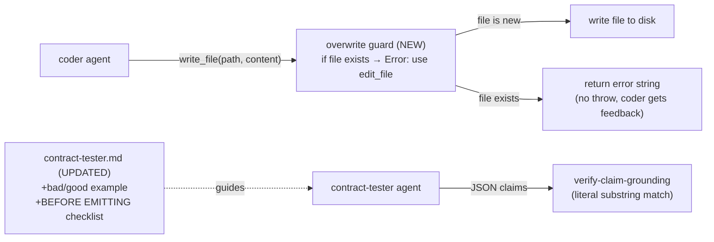

## Goal

Two hardening changes were written directly into the working tree. This prompt validates them,
runs the test suite, and commits them in logical groups. No new code is written — only verification
and documentation updates.

- **Stage 5e Phase 1b:** `packages/agents/prompts/contract-tester.md` — applied the ADR-0003
  self-check pattern: bad/good paraphrase example + BEFORE EMITTING checklist. Closes the gap where
  the tester generates verbally plausible but non-verbatim `grounding[].quote` strings that the
  deterministic verifier rejects.

- **write_file overwrite guard:** `packages/agents/src/tools/write-file.ts` — when `allowedWritePaths`
  is set (coder context only), `write_file` now reads the target path before writing. If the file
  already exists and has content, it returns an error directing the coder to `edit_file`. Root cause of
  the turn-18 full-rewrite regression in the `available()` self-test 2026-06-02 where the coder
  overwrote `cost-tracker.ts` entirely, introducing a typecheck error that triggered `static-checks fail`.

**Do NOT** touch any file not listed in the commit groups below.

---

## Architecture



---

## Step 1 — Verify the three changed files

Read each file and confirm it matches the spec below.

### `packages/agents/prompts/contract-tester.md`

The section after the `grounding` field description (around line 72) must contain:

```
**DO NOT paraphrase grounding quotes.** The verifier runs a literal substring match — no fuzzy matching, no synonym expansion.

Bad (paraphrase — will be rejected):
{ "quote": "returns limit minus total clamped to zero", "source": "signature:CostTracker.remaining" }

Good (verbatim — exact characters from the source):
{ "quote": "return Math.max(0, this._limit - this._total)", "source": "source:cost-tracker.ts" }

If you cannot find a verbatim substring... [existing line]

## BEFORE EMITTING — Self-check (run this for every claim)

For each claim in your `claims` array, verify:
1. Locate the quote...
2. No paraphrase...
3. Source preference...
4. Claim survives without the test framework...

Only emit after this check passes for every claim.
```

### `packages/agents/src/tools/write-file.ts`

1. Import line must be:
   ```ts
   import { mkdir, readFile, writeFile } from "node:fs/promises"
   ```

2. Tool description must say:
   ```ts
   "Write content to a NEW file. Creates parent directories if needed. For existing files, use edit_file instead — write_file on an existing file will be rejected."
   ```

3. After the `allowedWritePaths` block and before the `const content = ...` line, there must be a guard:
   ```ts
   if (ctx.allowedWritePaths !== undefined) {
     try {
       const existing = await readFile(filePath, "utf-8")
       if (existing.length > 0) {
         return `Error: "${String(input["path"])}" already exists. Use edit_file to modify existing files — write_file is only for creating new files. Overwriting with write_file discards all existing content and breaks line-range edits in subsequent turns.`
       }
     } catch {
       // File does not exist yet — allow write_file to create it normally
     }
   }
   ```

### `packages/agents/tests/tools.test.ts`

Inside the `describe("write_file", ...)` block, after the last existing test, there must be two new tests:

```ts
it("blocks write_file on existing non-empty file when allowedWritePaths is set (overwrite guard)", async () => {
  const srcFile = join(tempDir, "src/cost-tracker.ts")
  mkdirSync(join(tempDir, "src"), { recursive: true })
  writeFileSync(srcFile, "export const existing = true")
  const ctxWithScope = { ...ctx, allowedWritePaths: [srcFile] }

  const result = await writeFileTool.execute(
    { path: "src/cost-tracker.ts", content: "export const overwritten = true" },
    ctxWithScope,
  )
  expect(result).toContain("Error:")
  expect(result).toContain("already exists")
  expect(result).toContain("edit_file")
  expect(readFileSync(srcFile, "utf-8")).toBe("export const existing = true")
})

it("allows write_file on non-existent file in allowedWritePaths (overwrite guard passthrough)", async () => {
  const newFile = join(tempDir, "src/new-module.ts")
  const ctxWithScope = { ...ctx, allowedWritePaths: [newFile] }

  const result = await writeFileTool.execute(
    { path: "src/new-module.ts", content: "export const fresh = true" },
    ctxWithScope,
  )
  expect(result).toContain("bytes")
  expect(result).not.toContain("Error:")
  expect(readFileSync(newFile, "utf-8")).toBe("export const fresh = true")
})
```

If any of the above is missing or wrong, fix it before proceeding.

---

## Step 2 — Run the full test suite

```bash
docker compose run --rm dev run test
```

Expected: **1416 passed / 6 skipped** (1414 baseline + 2 new overwrite guard tests).

If the count is wrong or any test fails, fix the issue before committing.

---

## Step 3 — Typecheck and lint

```bash
docker compose run --rm dev run typecheck
docker compose run --rm dev run lint
```

Both must exit 0.

---

## Step 4 — Commit Phase 1b (prompt only)

Files in this commit:
- `packages/agents/prompts/contract-tester.md`

```
Stage 5e Phase 1b: contract-tester self-check for verbatim grounding

Apply ADR-0003 self-check pattern to contract-tester.md:
- Bad/good paraphrase vs verbatim example in the DO NOT section
- BEFORE EMITTING numbered checklist: locate quote, no paraphrase,
  source preference, claim independence from test framework
- Root cause: tester was generating plausible but paraphrased quotes
  that failed the deterministic substring verifier; prompt-level
  advisory language was insufficient without a structured self-check
```

---

## Step 5 — Commit write_file overwrite guard

Files in this commit:
- `packages/agents/src/tools/write-file.ts`
- `packages/agents/tests/tools.test.ts`

```
Stage 5e: write_file overwrite guard for coder context

When allowedWritePaths is set, write_file now checks if the target
file already exists before writing. If it does (and has content),
returns an error directing the coder to edit_file instead.

- Adds readFile to imports
- Updates tool description: "Write content to a NEW file"
- Guard fires only in coder context (allowedWritePaths !== undefined)
- Backward-compatible: no allowedWritePaths → guard never runs
- +2 tests: blocked overwrite, new-file passthrough

Root cause: available() self-test 2026-06-02 (run d0c256), coder
did a full write_file rewrite of cost-tracker.ts at turn 18,
corrupting line numbers and triggering static-checks fail.
```

---

## Step 6 — Docs and archive

### CLAUDE.md updates

1. Update test count line to: `**Latest count: 1416 passed / 6 skipped**`

2. Add to the Known Limitations section (after the Phase 18c degenerate-run fix entry):

```
- **`write_file` overwrite guard (Stage 5e):** When `allowedWritePaths` is set (coder context),
  `write_file` reads the target path before writing. If the file already exists and has content,
  returns an error directing the coder to `edit_file`. Prevents the full-file rewrite pattern
  that caused a typecheck error at turn 18 in the `available()` self-test (run `20260602-0343-run-d0c256`).
  Backward-compatible: without `allowedWritePaths`, guard never fires.
```

3. In the Stage 5e section, change:
```
- **Contract-tester prompt tightening (Phase 1b):** ... **NEXT.**
```
to:
```
- ~~**Contract-tester prompt tightening (Phase 1b):**~~ **DONE (2026-06-03).** Applied ADR-0003 self-check pattern to `contract-tester.md`: bad/good paraphrase example + BEFORE EMITTING numbered checklist. +0 tests (prompt-only). `write_file` overwrite guard also shipped in this pass (+2 tests in `tools.test.ts`). 1416 pass / 6 skip.
```

### ROADMAP.md update

In the Stage 5e section, strike through Phase 1b:
```
- ~~**Contract-tester prompt tightening (Phase 1b):**~~ **DONE (2026-06-03).** ...
```

### Archive this prompt

```bash
mv spec/prompts/stage5e-phase1b-overwrite-guard.md spec/archive/
```

Commit all doc changes together:
```
docs: Stage 5e Phase 1b + overwrite guard — update CLAUDE.md, ROADMAP.md, archive prompt
```

---

## Self-check

Run in order before declaring done:

1. `docker compose run --rm dev run typecheck` — exit 0
2. `docker compose run --rm dev run lint` — exit 0
3. `docker compose run --rm dev run test` — **1416 passed / 6 skipped**
4. `git log --oneline -5` — three commits visible: Phase 1b prompt, overwrite guard, docs
5. `ls spec/prompts/` — `stage5e-phase1b-overwrite-guard.md` is gone (archived)
6. `git diff main -- packages/agents/prompts/boundary-tester.md packages/agents/prompts/coder.md` — empty (only contract-tester.md changed)

---

## Out of scope

- DO NOT change `boundary-tester.md`, `coder.md`, or any other prompt file
- DO NOT modify `edit-file.ts` — the overwrite guard lives only in `write-file.ts`
- DO NOT add an LLM call or new agent role
- DO NOT run a Bollard-on-Bollard self-test — these are prompt/guard hardening changes, not pipeline node changes; unit tests are the validation gate
