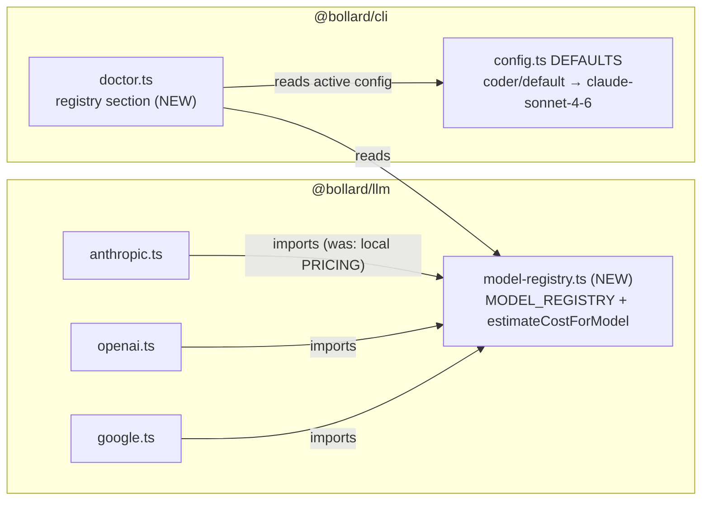

# Stage 5e Phase 4 — Model Registry + Pricing Unification + Coder Migration

## Goal

Implement **Phase 1 of [spec/09-model-selection.md](../09-model-selection.md) §8** (decision record: [ADR-0005](../adr/0005-capability-based-model-selection.md)). Three things, all deterministic, no behavior change except the model swap:

1. A typed, versioned **`MODEL_REGISTRY`** in `@bollard/llm` that becomes the single pricing source — replacing the three duplicated, partly stale per-provider `PRICING` maps.
2. **Migrate the coder and `llm.default` defaults** off `claude-sonnet-4-20250514` (deprecated upstream — will break every run when retired) to `claude-sonnet-4-6`.
3. An **unknown-model pricing warning** (one per model id per process) so cost tracking never silently uses fallback prices, plus a **`bollard doctor` registry section** (deprecated models in active config, stale `verifiedOn` entries) pulled forward from Phase 5 because it is cheap and the deprecation tripwire is the point of this phase.

What this phase does **NOT** build: the capability resolver (`role-requirements.ts`, `resolveModelForRole`), deletion of `DEFAULTS.llm.agents`, config-time deprecation warnings in `resolveConfig`, retired-model hard errors. All of that is Phase 5. The registry's `capabilities` fields are recorded now (per the design doc) but consumed by nothing until Phase 5 — only `pricing`, `status`, and `verifiedOn` are load-bearing in this phase.

## Architecture



## Step 0 — Capture baseline (MUST run before any code change)

1. `git status` — confirm clean tree on `main`, in sync with origin.
2. Confirm the eval baseline exists: `docker compose run --rm dev sh -c 'pnpm --filter @bollard/cli run start -- eval show'` — expect the `stage5b-quality` table (all agents 100%). If missing, STOP and report.
3. Record current cost baseline: `docker compose run --rm dev sh -c 'pnpm --filter @bollard/cli run start -- cost-baseline show'` — expect tag `post-determinism-fixes` ≈ $1.3809. Record it in the "Baseline capture" section at the bottom of this file.
4. Run `docker compose run --rm dev run test` — record the count. Expected: **1489 passed / 6 skipped**. This is the floor for the gate in Step 6.

## Step 1 — `packages/llm/src/model-registry.ts` (NEW)

Named exports only, no semicolons, no classes. Exact types from the design doc §3 (omit `ModelRequirements` — that is Phase 5):

```ts
export type CapabilityLevel = "frontier" | "standard" | "light"

export interface ModelCapabilities {
  reasoning: CapabilityLevel
  codegen: CapabilityLevel
  toolUse: boolean
  streaming: boolean
  contextWindow: number
  maxOutput: number
}

export interface ModelPricing {
  /** USD per 1M tokens. */
  input: number
  output: number
  cacheRead?: number
  cacheWrite5m?: number
}

export type ModelStatus = "current" | "deprecated" | "retired"

export interface ModelRegistryEntry {
  id: string
  provider: "anthropic" | "openai" | "google" | "local"
  status: ModelStatus
  capabilities: ModelCapabilities
  pricing: ModelPricing
  /** ISO date this entry was last checked against vendor docs. */
  verifiedOn: string
  notes?: string
}
```

`MODEL_REGISTRY: ModelRegistryEntry[]` — all entries `verifiedOn: "2026-06-04"` (the date the design doc verified vendor docs), per §4 of the design doc:

| id | provider | status | reasoning/codegen | context / maxOutput | pricing (in/out, cacheRead, cacheWrite5m) | notes |
|----|----------|--------|-------------------|---------------------|---------------------------------------|-------|
| `claude-opus-4-8` | anthropic | current | frontier/frontier | 1_000_000 / 32_000 | 5 / 25 / 0.5 / 6.25 | "88.6% SWE-bench Verified; tokenizer emits up to ~35% more tokens" |
| `claude-opus-4-6` | anthropic | current | frontier/frontier | 1_000_000 / 32_000 | 5 / 25 / 0.5 / 6.25 | |
| `claude-sonnet-4-6` | anthropic | current | frontier/frontier | 1_000_000 / 64_000 | 3 / 15 / 0.3 / 3.75 | "79.6% SWE-bench Verified; best $/quality for agentic coding" |
| `claude-sonnet-4-5-20250929` | anthropic | current | standard/standard | 200_000 / 64_000 | 3 / 15 / 0.3 / 3.75 | |
| `claude-haiku-4-5-20251001` | anthropic | current | standard/standard | 200_000 / 64_000 | 1 / 5 / 0.1 / 1.25 | |
| `claude-sonnet-4-20250514` | anthropic | **deprecated** | standard/standard | 200_000 / 64_000 | 3 / 15 | "deprecated upstream; replaced by claude-sonnet-4-6" |
| `claude-opus-4-20250514` | anthropic | deprecated | frontier/standard | 200_000 / 32_000 | 15 / 75 | |
| `gpt-4o` | openai | current | standard/standard | 128_000 / 16_384 | 2.5 / 10 | |
| `gpt-4o-mini` | openai | current | light/light | 128_000 / 16_384 | 0.15 / 0.6 | |
| `o3-mini` | openai | current | standard/light | 200_000 / 100_000 | 1.1 / 4.4 | |
| `gemini-2.0-flash` | google | current | light/light | 1_000_000 / 8_192 | 0.1 / 0.4 | |
| `gemini-2.5-pro-preview-05-06` | google | current | standard/standard | 1_000_000 / 65_536 | 1.25 / 10 | |
| `qwen2.5-coder-1.5b-q4` | local | current | light/light | 32_000 / 4_096 | 0 / 0 | "local tier-2 (ADR-0004), patcher only" |

All entries `toolUse: true, streaming: true` except `qwen2.5-coder-1.5b-q4` (`toolUse: false`). Capability levels are curation judgements per ADR-0005 — the eval CI arbitrates, not the label. Do not agonize over them; they are inert until Phase 5.

Functions:

```ts
export function findModelEntry(id: string): ModelRegistryEntry | undefined

/**
 * Single cost estimator for all providers. Unknown model: uses the provided
 * fallback pricing (never zero) and emits ONE stderr warning per model id per
 * process: `[bollard] unknown model "<id>" — cost estimates use fallback
 * pricing; add it to model-registry.ts`
 */
export function estimateCostForModel(
  model: string,
  inputTokens: number,
  outputTokens: number,
  fallback: ModelPricing,
): number
```

- One-time warning: module-level `const warnedUnknownModels = new Set<string>()`. Write to `process.stderr` directly (this is library code below the pipeline context — there is no `ctx.log` here; same pattern as the `[patcher]` stderr lines).
- Cost formula identical to today: `(inputTokens * pricing.input + outputTokens * pricing.output) / 1_000_000`. Ignore cache fields in the math for now — they exist so the cost model *can* represent caching later (design doc §8 follow-up).
- Export a `registryEntriesForProvider(provider: string): ModelRegistryEntry[]` helper — doctor (Step 4) and Phase 5 both need it.

## Step 2 — Pricing unification in the three providers

In `packages/llm/src/providers/anthropic.ts`, `openai.ts`, `google.ts`:

- Delete the local `PRICING` and `DEFAULT_PRICING` constants and the local `estimateCost` function.
- Import `estimateCostForModel` from `"../model-registry.js"` (relative import inside the package — matches existing style).
- Replace each call site (anthropic.ts lines ~109 and ~212; openai.ts ~245 and ~318; google.ts ~238 and ~296) with `estimateCostForModel(model, inputTokens, outputTokens, FALLBACK_PRICING)` where each provider keeps its own conservative fallback constant, exactly today's values:
  - anthropic: `{ input: 3, output: 15 }`
  - openai: `{ input: 2.5, output: 10 }`
  - google: `{ input: 0.1, output: 0.4 }`
- `local.ts` is untouched (no pricing — local inference is $0).

This **corrects the stale Opus price** automatically: `claude-opus-4-20250514` keeps its true 15/75 in the registry, while current Opus models get 5/25 — previously any 4.6+ Opus id silently fell back to 3/15.

## Step 3 — Default swap in `@bollard/cli`

`packages/cli/src/config.ts` (lines ~255–263):

- `DEFAULTS.llm.default.model`: `"claude-sonnet-4-20250514"` → `"claude-sonnet-4-6"`
- `DEFAULTS.llm.agents.coder.model`: same swap.
- All other agent defaults (planner, testers, reviewer, test-curator) stay `claude-haiku-4-5-20251001` — do not touch them.

`packages/cli/src/index.ts` (init template, lines ~813 and ~820): update both commented `model: claude-sonnet-4-20250514` lines to `claude-sonnet-4-6`.

Do NOT add deprecation warnings to `resolveConfig` — that is Phase 5.

## Step 4 — `bollard doctor` registry section

Read `packages/cli/src/doctor.ts` first and follow its existing section pattern (`HistoryHealth` is the model: typed interface, `check*` function, optional field on the report, rendered in `formatDoctorReport`).

Add:

```ts
export interface RegistryHealth {
  /** Models referenced by the active config (llm.default + llm.agents) that are deprecated/retired in the registry. */
  deprecatedInUse: { role: string; model: string; status: ModelStatus; replacement?: string }[]
  /** Registry entries for the default provider whose verifiedOn is older than 90 days. */
  staleEntries: { id: string; verifiedOn: string }[]
  /** Models referenced by the active config that have no registry entry at all. */
  unknownInUse: { role: string; model: string }[]
}

export function checkModelRegistry(config: BollardConfig, now?: Date): RegistryHealth
```

- Pure function, no I/O — reads `config.llm.default` + `config.llm.agents` against `MODEL_REGISTRY` (import from `"@bollard/llm/src/model-registry.js"` — matches the existing cross-package import style, see `anthropic.ts` importing from `@bollard/engine/src/errors.js`).
- `replacement`: hardcode the suggestion from the entry's `notes` when present (the `claude-sonnet-4-20250514` entry names `claude-sonnet-4-6`); otherwise omit the field (`exactOptionalPropertyTypes` — use conditional spread).
- Staleness: `now` parameter defaults to `new Date()`; injectable for tests. 90-day threshold as a named constant `REGISTRY_STALENESS_DAYS = 90`.
- Wire into `runDoctor`/`formatDoctorReport`: always included (it is cheap and pure — no flag needed), rendered as a `registry` section. Yellow warning lines for deprecated-in-use and stale entries; green "registry healthy" otherwise. Match the existing color/format conventions in `formatDoctorReport`.

## Step 5 — Tests

**New: `packages/llm/tests/model-registry.test.ts`** (~10 tests):

- `findModelEntry("claude-sonnet-4-6")` returns entry with status `current`, pricing 3/15
- `findModelEntry("claude-sonnet-4-20250514")` returns status `deprecated`
- `findModelEntry("nope")` returns undefined
- `estimateCostForModel` known model: exact arithmetic (e.g. 1M in + 1M out on sonnet-4-6 = $18)
- `estimateCostForModel` unknown model: uses fallback, emits stderr warning once (spy on `process.stderr.write`), second call same id emits nothing
- every registry entry has a non-empty `verifiedOn` parseable as a date
- current Anthropic Opus entries price at 5/25 (the stale-price regression)
- `registryEntriesForProvider("anthropic")` returns only anthropic entries

**New: doctor registry tests** (in the existing doctor test file, ~5 tests):

- config referencing `claude-sonnet-4-20250514` → `deprecatedInUse` contains it with replacement `claude-sonnet-4-6`
- all-current config → empty `deprecatedInUse`
- `now` far in the future → all default-provider entries in `staleEntries`
- unknown model in config → `unknownInUse`

**Migrations — replace every remaining `claude-sonnet-4-20250514` reference outside the registry entry itself** (16 refs found; re-run the search to be sure):

- `packages/cli/tests/config.test.ts:25` — default assertion → `claude-sonnet-4-6`
- `packages/cli/tests/config.test.ts:276–291` — YAML-override fixtures → `claude-sonnet-4-6` (the string is a mock label; migrate anyway so the deprecated id survives only in the registry)
- `packages/llm/tests/client.test.ts:107–129` — mock fixtures → `claude-sonnet-4-6`
- `packages/blueprints/tests/curate-tests.test.ts:7` → `claude-sonnet-4-6`
- `packages/verify/tests/test-lifecycle.test.ts:146` → `claude-sonnet-4-6`
- Provider tests: if `anthropic-stream.test.ts` / `openai.test.ts` / `google.test.ts` assert against the old local `PRICING` maps, update them to import from the registry instead.

After this step the ONLY occurrence of `claude-sonnet-4-20250514` in the repo is its `MODEL_REGISTRY` entry (status deprecated) and historical spec/docs.

## Step 6 — Validation gate (run sequentially; STOP and report on any failure)

1. `docker compose run --rm dev run typecheck` — exit 0
2. `docker compose run --rm dev run lint` — exit 0
3. `docker compose run --rm dev run test` — pass; count ≥ **1489 + ~15 new** (≈ 1504+), 6 skipped
4. `git diff --stat packages/agents/prompts/` — empty (no agent prompt files touched)
5. Eval regression (requires `ANTHROPIC_API_KEY`, cost < $0.10): `docker compose run --rm dev sh -c 'pnpm --filter @bollard/cli run start -- eval diff'` — exit 0 (no agent drops > 10 pp vs `stage5b-quality`)
6. Doctor smoke: `docker compose run --rm dev sh -c 'pnpm --filter @bollard/cli run start -- doctor'` — registry section renders, reports healthy (active config no longer references deprecated models)
7. **Live self-test on the new coder model** (cost ≈ $1–2):
   ```bash
   docker compose run --rm -e BOLLARD_AUTO_APPROVE=1 dev sh -c \
     'pnpm --filter @bollard/cli run start -- run implement-feature --task "Add a budgetStatus(): \"ok\" | \"warning\" | \"exceeded\" method to CostTracker in packages/engine/src/cost-tracker.ts — returns exceeded when totalUsd >= limitUsd, warning when totalUsd >= 80% of limitUsd, ok otherwise; unlimited trackers always return ok" --work-dir /app'
   ```
   Gate: CLI exit success, 17/17 top-level steps, coder turns < 30, run cost within ±25% of the $1.3809 baseline. Check with `... history show <run-id>`. If the coder fails on a plan-conformant task, that is ADR-0005's "revisit" trigger — STOP and report, do not tune prompts.
8. `... cost-baseline diff` — `insufficient_data` is acceptable (needs ≥ 3 runs since baseline); `fail` is not.

## Step 7 — When GREEN: docs + cleanup

1. Roll back the self-test branch/artifacts the same way previous self-tests did (reset to main, keep the run history).
2. **CLAUDE.md**: add a Stage 5e Phase 4 entry (model registry + pricing unification + coder→`claude-sonnet-4-6`, doctor registry section, new test count) and update the "Latest test count" line.
3. **spec/ROADMAP.md**: mark 5e Phase 4 done.
4. **spec/09-model-selection.md §8**: mark Phase 1 shipped with the date.
5. If the self-test cost is within ±20% of baseline, retag: `... cost-baseline tag post-model-registry --run <run-id>` (check `cost-baseline --help` for exact flag shape first).
6. Move this file to `spec/archive/`.
7. Commit in two logical commits: `Stage 5e Phase 4: model registry + pricing unification + coder → claude-sonnet-4-6` (code+tests) and `docs: Stage 5e Phase 4 + archive prompt`.

## Out of scope — DO NOT

- DO NOT create `role-requirements.ts` or `resolveModelForRole` — Phase 5.
- DO NOT delete or restructure `DEFAULTS.llm.agents` — Phase 5 makes it derived; this phase only swaps two string values.
- DO NOT add deprecation warnings to `resolveConfig` or retired-model hard errors — Phase 5 (doctor section is the only guardrail shipping now).
- DO NOT touch agent prompt files under `packages/agents/prompts/`.
- DO NOT implement prompt caching / `cache_control` — separate backlog item; the `cacheRead`/`cacheWrite5m` fields are data only.
- DO NOT add a `models:` YAML block or any new config surface — `.bollard.yml` shape is unchanged.
- DO NOT add cross-provider routing or change `LLMClient.forAgent` resolution order.
- DO NOT change `agent.max_cost_usd`, per-attempt caps, or any Phase 7–10 token-economy constants.
- DO NOT modify `local.ts` (no pricing there) or the `LocalProvider` model lock-file logic.

## Baseline capture (fill in during Step 0)

- Date/branch:
- `cost-baseline show`:
- Test count:
- `eval show` baseline:
