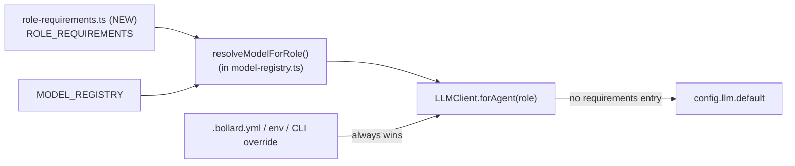

# Stage 5e Phase 5 — Capability-Based Model Resolution

## Goal

Implement **Phase 2 of [spec/09-model-selection.md](../09-model-selection.md) §8** (decision: [ADR-0005](../adr/0005-capability-based-model-selection.md)). Make per-agent model defaults **derived, not hardcoded**: a role declares the capability profile its work needs, the registry declares what each model offers, and a pure resolver picks the cheapest *current* model that satisfies the role within the default provider. Explicit `.bollard.yml` / env / CLI overrides still win, unchanged.

Phase 4 (registry + pricing) and Phase 4b (per-agent eval resolution) are shipped. This phase deletes `DEFAULTS.llm.agents` and replaces it with derivation.

**The single most important property of this phase: zero behavior change for existing roles.** Deleting the hardcoded map and deriving must produce *exactly* the same model for every role that exists today. The golden test (Step 5) is the gate; if it can't be made to pass without changing a model string, the resolver design is wrong — STOP and report, do not "fix" by editing the expected values.

## The reproduction target (verified against current `main`)

`DEFAULTS.llm.agents` in [`packages/cli/src/config.ts`](packages/cli/src/config.ts) today, all provider `anthropic`:

| role | current model | required capability (this phase) | resolves to (must match) |
|------|---------------|----------------------------------|--------------------------|
| `planner` | `claude-haiku-4-5-20251001` | reasoning standard, codegen light, toolUse | `claude-haiku-4-5-20251001` |
| `coder` | `claude-sonnet-4-6` | reasoning frontier, codegen frontier, toolUse | `claude-sonnet-4-6` |
| `boundary-tester` | `claude-haiku-4-5-20251001` | standard / light, no toolUse | `claude-haiku-4-5-20251001` |
| `contract-tester` | `claude-haiku-4-5-20251001` | standard / light, no toolUse | `claude-haiku-4-5-20251001` |
| `behavioral-tester` | `claude-haiku-4-5-20251001` | standard / light, no toolUse | `claude-haiku-4-5-20251001` |
| `semantic-reviewer` | `claude-haiku-4-5-20251001` | standard / light, no toolUse | `claude-haiku-4-5-20251001` |
| `test-curator` | `claude-haiku-4-5-20251001` | standard / light, no toolUse | `claude-haiku-4-5-20251001` |
| `default` (unknown roles) | `claude-sonnet-4-6` (via `llm.default`) | — see decision below | `claude-sonnet-4-6` |

**Two corrections to the design doc §5 table — the doc is stale, the code above is ground truth:**

1. The doc lists `llm-fallback-extractor` but NOT `test-curator`. Reality is the reverse: `test-curator` is a real role (Stage 6 Phase 2) in the defaults map; `llm-fallback-extractor` is **not** resolved through `forAgent` at all (`getExtractor` receives an explicit provider+model). Add a `ROLE_REQUIREMENTS` entry for `test-curator` (light/light → Haiku). You MAY add `llm-fallback-extractor` (light/light) for forward use, but it is NOT part of the reproduction assertion since nothing resolves it today.

2. **Unknown-role fallback — DO NOT follow the doc's "standard/standard default requirements profile" wording.** The doc claims that resolves "to the same model as `llm.default` today" — it does not. standard/standard resolves to Haiku ($1/$5); `llm.default` is Sonnet 4.6 (frontier). Following the doc verbatim silently downgrades every unknown/custom blueprint role from Sonnet 4.6 to Haiku. **Decision for this phase: a role with no `ROLE_REQUIREMENTS` entry falls straight through to `config.llm.default` (resolver returns nothing for it).** This reproduces today's behavior exactly. The resolver only governs roles that explicitly declare requirements.

## Architecture



## Step 0 — Baseline capture (record the reproduction target)

Before any change, dump what every role resolves to today, so the golden test asserts against observed reality, not assumption:

```bash
docker compose run --rm dev sh -c \
  'pnpm --filter @bollard/cli run start -- config show --sources --work-dir /app'
```

Record the `llm.agents.<role>.model` value for all 7 roles + `llm.default.model` in the Baseline section at the bottom. Confirm a clean tree and the **1513 passed / 6 skipped** floor (`docker compose run --rm dev run test`).

## Step 1 — `packages/llm/src/role-requirements.ts` (NEW)

```ts
import type { CapabilityLevel } from "./model-registry.js"

export interface ModelRequirements {
  reasoning: CapabilityLevel
  codegen: CapabilityLevel
  needsToolUse: boolean
  minContext: number
  minOutput: number
}

/** Per-role capability profile. Roles absent here fall through to config.llm.default (see forAgent). */
export const ROLE_REQUIREMENTS: Record<string, ModelRequirements>
```

Entries (named exports only, no semicolons), matching the reproduction table:

- `planner`: reasoning `standard`, codegen `light`, needsToolUse `true`, minContext 100_000, minOutput 8_000
- `coder`: reasoning `frontier`, codegen `frontier`, needsToolUse `true`, minContext 200_000, minOutput 16_000
- `boundary-tester` / `contract-tester` / `behavioral-tester`: reasoning `standard`, codegen `light`, needsToolUse `false`, minContext 100_000, minOutput 16_000
- `semantic-reviewer`: reasoning `standard`, codegen `light`, needsToolUse `false`, minContext 100_000, minOutput 8_000
- `test-curator`: reasoning `standard`, codegen `light`, needsToolUse `false`, minContext 100_000, minOutput 8_000
- (optional) `llm-fallback-extractor`: reasoning `light`, codegen `light`, needsToolUse `false`, minContext 32_000, minOutput 8_000

Do NOT export a `DEFAULT_REQUIREMENTS` that the resolver applies to unknown roles — unknown roles are handled by `forAgent` falling to `llm.default`, not by the resolver. (You may keep the type around but it must not be wired into resolution.)

**Sanity-check minContext/minOutput against the registry before finalizing:** Haiku is 200K context / 64K output, Sonnet 4.6 is 1M / 64K. The `minContext` values above must all be ≤ the model you expect each role to resolve to, or the role won't satisfy and the golden test fails. The tester `minOutput: 16_000` encodes the 2026-05-23 truncation fix (`maxTokens: 16384`).

## Step 2 — `resolveModelForRole` in `model-registry.ts`

```ts
import { ROLE_REQUIREMENTS, type ModelRequirements } from "./role-requirements.js"

/**
 * Cheapest current model of `provider` satisfying the role's requirements.
 * Returns undefined when the role has no requirements entry (caller falls back to llm.default).
 * Throws MODEL_NOT_AVAILABLE when the role HAS requirements but no current model satisfies them.
 */
export function resolveModelForRole(
  role: string,
  provider: string,
  registry?: ModelRegistryEntry[],
): ModelRegistryEntry | undefined
```

Capability ordering: `light < standard < frontier`. A model satisfies when, on every dimension, its level ≥ required AND `toolUse >= needsToolUse` AND `contextWindow >= minContext` AND `maxOutput >= minOutput`.

Algorithm:

1. `const req = ROLE_REQUIREMENTS[role]`; if `req === undefined` → return `undefined` (no requirements → caller uses `llm.default`).
2. Filter registry: `entry.provider === provider`, `entry.status === "current"`, all requirements satisfied.
3. Empty filtered set → throw `BollardError` `MODEL_NOT_AVAILABLE` with `{ role, provider, requirements: req }` in context.
4. Pick cheapest by **output price** (`pricing.output`), tie-break by input price, then newest `verifiedOn`. (Output dominates: it's 5× input on every current Anthropic model and bounded per call by maxTokens.)

Add a small exported helper `capabilityRank(level: CapabilityLevel): number` (light=0, standard=1, frontier=2) used by the comparison — keep the ordering in one place.

**Verify the coder tie-break before trusting it:** coder requires frontier/frontier. Three current Anthropic models qualify — `claude-opus-4-8` (5/25), `claude-opus-4-6` (5/25), `claude-sonnet-4-6` (3/15). Cheapest by output price is Sonnet 4.6 ($15 < $25). That is the reproduction. If your registry pricing makes an Opus cheaper, the golden test will catch it — do not adjust the test, fix the data or the comparison.

## Step 3 — Wire into `LLMClient.forAgent`

[`packages/llm/src/client.ts`](packages/llm/src/client.ts), `forAgent` (~line 18). Current:

```ts
const override = this.config.llm.agents?.[agentRole]
const resolved = override ?? this.config.llm.default
```

New resolution order (only step 2 is new):

1. `this.config.llm.agents?.[agentRole]` — explicit override, **always wins** (unchanged).
2. If no override: `resolveModelForRole(agentRole, this.config.llm.default.provider)`. If it returns an entry, use `{ provider: that entry's provider, model: entry.id }`.
3. If the resolver returns `undefined` (no requirements for this role) OR throws is NOT caught here — let `MODEL_NOT_AVAILABLE` propagate — fall to `this.config.llm.default`.

Be careful with the throw vs undefined distinction: `undefined` means "no requirements, use default" (swallow → fallback); a thrown `MODEL_NOT_AVAILABLE` means "has requirements but unsatisfiable" (propagate — this is a real misconfiguration, not a fallback case). Do not catch-and-fallback the throw.

Resolve the provider via the existing `resolveProvider`, keyed on the resolved entry's provider (which equals `llm.default.provider` in step 2, since the resolver filters by it).

## Step 4 — Delete the hardcoded map + source annotation

[`packages/cli/src/config.ts`](packages/cli/src/config.ts):

- Delete the `agents: { ... }` block from `DEFAULTS.llm` (lines ~256–263). Keep `DEFAULTS.llm.default` = `{ provider: "anthropic", model: "claude-sonnet-4-6" }`. Update the doc comment above it.
- `config.llm.agents` is now `undefined` by default; user `.bollard.yml` overrides still populate it. The annotation loop at ~line 349 (`for (const [role, assignment] of Object.entries(config.llm.agents ?? {}))`) now only iterates user-overridden roles — that's correct, leave it.
- Add a new `ConfigSource` value `"capability-resolved"` to the union (~line 23).
- For `config show --sources` to show derived models: after the override loop, iterate `Object.keys(ROLE_REQUIREMENTS)`; for any role NOT already in `sources` (i.e. not user-overridden), call `resolveModelForRole(role, config.llm.default.provider)` and annotate `sources["llm.agents.<role>.model"]` / `.provider` with `source: "capability-resolved"`. Guard with try/catch so a `MODEL_NOT_AVAILABLE` during `config show` prints a warning rather than crashing the command. (This is display-only; `forAgent` is the runtime path.)

## Step 5 — Tests (the golden test is the gate)

**`packages/llm/tests/role-resolution.test.ts`** (NEW):

- **Golden reproduction test** — a table of `[role, expectedModel]` for all 7 current roles (exactly the reproduction table above) plus a parametrized assertion that `resolveModelForRole(role, "anthropic").id === expectedModel`. This is the load-bearing test. Hard-code the expected strings; do not compute them from the registry (that would let a registry change silently move them).
- `resolveModelForRole("nonexistent-role", "anthropic")` returns `undefined`.
- `MODEL_NOT_AVAILABLE`: a role whose requirements no current model satisfies (e.g. construct a requirement with `minContext: 99_000_000`) throws with the requirements in context.
- Coder tie-break: explicitly assert coder resolves to `claude-sonnet-4-6` and NOT an Opus, with a comment that this is the output-price tie-break.
- Provider filter: `resolveModelForRole("coder", "openai")` resolves within openai (or throws MODEL_NOT_AVAILABLE if no openai model is frontier/frontier — assert whichever is true against the registry; document it).
- `capabilityRank` ordering.

**`packages/llm/tests/client.test.ts`** (extend):

- `forAgent("coder")` with default config (no overrides) → model `claude-sonnet-4-6` via resolution.
- `forAgent("boundary-tester")` → `claude-haiku-4-5-20251001` via resolution.
- Override precedence: a config with `llm.agents.coder = { provider, model: "X" }` → `forAgent("coder").model === "X"` (override wins over resolver).
- Unknown role: `forAgent("some-custom-role")` → falls to `llm.default` model `claude-sonnet-4-6` (NOT Haiku — this is the regression guard for the doc's trap).

**`packages/cli/tests/config.test.ts`** (extend / fix):

- The existing "defaults coder to Sonnet" assertion (~line 279) now passes through resolution — keep it, it should still read `claude-sonnet-4-6`.
- `config show --sources` for a default (un-overridden) coder annotates `source: "capability-resolved"`.
- A user `.bollard.yml` override still annotates `source: "file"` and wins.

Expected: +12–16 tests.

## Step 6 — Validation gate (sequential; STOP on failure)

1. `docker compose run --rm dev run typecheck` — exit 0
2. `docker compose run --rm dev run lint` — exit 0
3. `docker compose run --rm dev run test` — ≥ 1525 passed / 6 skipped, **golden test green**. If the golden test fails on any role, the resolver or requirements are wrong — fix those, never the expected strings.
4. `git diff --stat packages/agents/prompts/` — empty
5. `config show --sources` — un-overridden roles show `capability-resolved`; `llm.default` unchanged
6. `docker compose run --rm dev sh -c 'pnpm --filter @bollard/cli run start -- doctor'` — registry section still healthy (no deprecated models in resolved config)
7. Eval still green against the Phase 4b baseline: `eval diff` — exit 0 (resolution must produce the same per-agent models the baseline recorded: Haiku testers, Sonnet 4.6 coder)
8. One self-test (~$1–1.5) on a not-yet-on-main task, e.g. `CostTracker.headroom()`:
   ```bash
   docker compose run --rm -e BOLLARD_AUTO_APPROVE=1 dev sh -c \
     'pnpm --filter @bollard/cli run start -- run implement-feature --task "Add a headroom(): number method to CostTracker returning limitUsd - totalUsd, or Infinity when unlimited" --work-dir /app'
   ```
   Gate: 17/17 steps; `history show <run-id>` shows the coder node on `claude-sonnet-4-6` and tester nodes on Haiku (confirms resolution flows through `forAgent` end to end); cost within ±25% of the `post-model-registry` baseline ($1.1451).

## Step 7 — When GREEN: docs + cleanup

1. **CLAUDE.md**: Stage 5e Phase 5 entry — model defaults now derived via `role-requirements.ts` + `resolveModelForRole`; hardcoded `DEFAULTS.llm.agents` deleted; unknown roles fall to `llm.default`; `capability-resolved` source; new test count.
2. **spec/ROADMAP.md** + **spec/09-model-selection.md §8**: mark Phase 2 / Phase 5 done. **Correct the §5 table** (test-curator present, llm-fallback-extractor not a forAgent role) and **correct §6 step 1** (unknown roles fall to `llm.default`, not a standard/standard default profile).
3. Move this file to `spec/archive/`.
4. Two commits: `Stage 5e Phase 5: capability-based model resolution + delete hardcoded agent map` then `docs: Stage 5e Phase 5 + correct 09-model-selection role table`.

## Out of scope — DO NOT

- DO NOT change any expected model string in the golden test to make it pass — the test encodes the contract; fix the resolver/requirements/registry instead.
- DO NOT apply a default requirements profile to unknown roles — they fall to `llm.default` (the doc's §6 step-1 wording is wrong; this prompt overrides it).
- DO NOT move the semantic-reviewer to `frontier` — that's the Phase 6 A/B outcome, not a Phase 5 change.
- DO NOT add config-time deprecation hard-errors or cross-provider auto-routing — out of scope per ADR-0005 §9.
- DO NOT touch agent prompt files, `MODEL_REGISTRY` entry data (resolution reads it; this phase doesn't reprice), or the eval baseline.
- DO NOT add a `models:` YAML block or any new config surface.

## Baseline capture (fill during Step 0)

- Date/branch:
- `config show --sources` per-role models:
- Test count:
