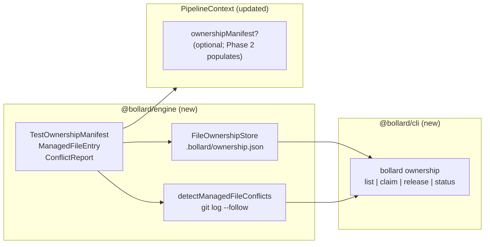

## Goal

Stage 6 Phase 1 — Takeover Foundation. Deterministic infrastructure only; no LLM calls,
no blueprint changes, no runtime enforcement yet. Builds the plumbing that all Stage 6
curation phases (2–6) share.

**What ships in Phase 1:**
- `TestOwnershipManifest` type — the ownership ledger (`.bollard/ownership.json`)
- `FileOwnershipStore` — read/write/claim/release with `proper-lockfile`
- `detectManagedFileConflicts` — git-blame-aware conflict detection
- `PipelineContext.ownershipManifest?` — field for Phase 2+ curation nodes to populate
- `bollard ownership` CLI — `list`, `claim`, `release`, `status`

**What does NOT ship in Phase 1:**
- `curate-tests`, `curate-ci`, `curate-deps`, `curate-docs`, `curate-monitoring` blueprints
- Runtime `takeover.enabled` guard in pipeline nodes
- Any curation agent or LLM call
- Automatic conflict enforcement (`TAKEOVER_CONFLICT` is defined; Phase 2 raises it)

**Current state:**
- Error codes (`TAKEOVER_CONFLICT`, `OWNERSHIP_MANIFEST_INVALID`, `CURATION_NO_PROGRESS`,
  `TAKEOVER_TRUST_GATE`) — already in `packages/engine/src/errors.ts` (commit `780d151`)
- `TakeoverModeConfig` and 5 domain configs — already in `packages/engine/src/context.ts`
- `takeoverYamlSchema` + `applyTakeoverConfig` — already in `packages/cli/src/config.ts`
- Tests: **1461 passed / 6 skipped**



---

## Step 1 — Create `packages/engine/src/ownership.ts`

This is the only substantially new file in the engine package. Follow the same style as
`run-history.ts` — named exports, no default exports, no `any`, strict types.

### Imports needed

```typescript
import { execFile } from "node:child_process"
import { mkdir, readFile, writeFile } from "node:fs/promises"
import { join, relative, resolve } from "node:path"
import { promisify } from "node:util"
import * as lockfile from "proper-lockfile"
import { BollardError } from "./errors.js"
```

### Types

```typescript
export const OWNERSHIP_SCHEMA_VERSION = 1 as const

/** A single file managed by Bollard under a takeover domain. */
export interface ManagedFileEntry {
  /** Path relative to workDir (the project root). */
  path: string
  /** Which curate-* domain last claimed this file. */
  domain: "tests" | "ci" | "deps" | "docs" | "monitoring"
  /** Run ID of the last Bollard curation pass that touched this file. */
  lastCuratedRunId: string
  /**
   * The git commit SHA at the time Bollard last wrote this file.
   * Used by detectManagedFileConflicts to identify human edits since
   * Bollard's last commit.
   */
  lastCommitSha: string
  /** Most recent Stryker/mutmut mutation score for this file, if known. */
  mutationScore?: number
}

/**
 * Ownership ledger — stored at `.bollard/ownership.json`.
 * Records which files Bollard manages, which files the user owns, and
 * per-file metadata for conflict detection and curation decisions.
 */
export interface TestOwnershipManifest {
  schemaVersion: typeof OWNERSHIP_SCHEMA_VERSION
  /** Files Bollard currently owns. */
  bollardManaged: ManagedFileEntry[]
  /** Paths explicitly released to human ownership. Bollard will not touch these. */
  userOwned: string[]
  /** Unix timestamp (ms) of the last manifest write. */
  lastUpdated: number
}

/** A conflict detected when a human has edited a Bollard-managed file. */
export interface ConflictReport {
  /** Relative path from workDir. */
  filePath: string
  /** `low` = test file only; `medium` = source file; `high` = config/infra file. */
  severity: "low" | "medium" | "high"
  /** SHA Bollard last wrote at. */
  lastBollardSha: string
  /** Current HEAD SHA for the file (from git log). */
  currentSha: string
  detail: string
}
```

### `FileOwnershipStore` class

```typescript
const MANIFEST_FILENAME = "ownership.json"
const BOLLARD_DIR = ".bollard"

const DEFAULT_MANIFEST: TestOwnershipManifest = {
  schemaVersion: OWNERSHIP_SCHEMA_VERSION,
  bollardManaged: [],
  userOwned: [],
  lastUpdated: 0,
}

export class FileOwnershipStore {
  readonly manifestPath: string

  constructor(private readonly workDir: string) {
    this.manifestPath = join(resolve(workDir), BOLLARD_DIR, MANIFEST_FILENAME)
  }

  async read(): Promise<TestOwnershipManifest> {
    try {
      const raw = await readFile(this.manifestPath, "utf-8")
      const parsed: unknown = JSON.parse(raw)
      return this.validate(parsed)
    } catch (err: unknown) {
      if ((err as NodeJS.ErrnoException).code === "ENOENT") {
        return { ...DEFAULT_MANIFEST }
      }
      if (err instanceof BollardError) throw err
      throw new BollardError({
        code: "OWNERSHIP_MANIFEST_INVALID",
        message: `Failed to parse ownership manifest: ${err instanceof Error ? err.message : String(err)}`,
      })
    }
  }

  async write(manifest: TestOwnershipManifest): Promise<void> {
    await mkdir(join(resolve(this.workDir), BOLLARD_DIR), { recursive: true })
    // Ensure the file exists before locking (proper-lockfile requires it)
    try {
      await readFile(this.manifestPath, "utf-8")
    } catch {
      await writeFile(this.manifestPath, JSON.stringify({ ...DEFAULT_MANIFEST }), "utf-8")
    }
    const release = await lockfile.lock(this.manifestPath, { retries: 3 })
    try {
      await writeFile(
        this.manifestPath,
        JSON.stringify({ ...manifest, lastUpdated: Date.now() }, null, 2),
        "utf-8",
      )
    } finally {
      await release()
    }
  }

  async claim(
    filePath: string,
    domain: ManagedFileEntry["domain"],
    runId: string,
    commitSha: string,
    mutationScore?: number,
  ): Promise<void> {
    const manifest = await this.read()
    const rel = relative(resolve(this.workDir), resolve(filePath))
    // Remove from userOwned if present
    manifest.userOwned = manifest.userOwned.filter((p) => p !== rel)
    // Upsert in bollardManaged
    const existing = manifest.bollardManaged.findIndex((e) => e.path === rel)
    const entry: ManagedFileEntry = {
      path: rel,
      domain,
      lastCuratedRunId: runId,
      lastCommitSha: commitSha,
      ...(mutationScore !== undefined && { mutationScore }),
    }
    if (existing !== -1) {
      manifest.bollardManaged[existing] = entry
    } else {
      manifest.bollardManaged.push(entry)
    }
    await this.write(manifest)
  }

  async release(filePath: string): Promise<void> {
    const manifest = await this.read()
    const rel = relative(resolve(this.workDir), resolve(filePath))
    manifest.bollardManaged = manifest.bollardManaged.filter((e) => e.path !== rel)
    if (!manifest.userOwned.includes(rel)) {
      manifest.userOwned.push(rel)
    }
    await this.write(manifest)
  }

  private validate(raw: unknown): TestOwnershipManifest {
    if (
      raw === null ||
      typeof raw !== "object" ||
      Array.isArray(raw)
    ) {
      throw new BollardError({
        code: "OWNERSHIP_MANIFEST_INVALID",
        message: "ownership.json must be a JSON object",
      })
    }
    const obj = raw as Record<string, unknown>
    if (obj["schemaVersion"] !== OWNERSHIP_SCHEMA_VERSION) {
      throw new BollardError({
        code: "OWNERSHIP_MANIFEST_INVALID",
        message: `Unsupported ownership manifest schema version: ${String(obj["schemaVersion"])}`,
      })
    }
    if (!Array.isArray(obj["bollardManaged"]) || !Array.isArray(obj["userOwned"])) {
      throw new BollardError({
        code: "OWNERSHIP_MANIFEST_INVALID",
        message: "ownership.json must have bollardManaged[] and userOwned[] arrays",
      })
    }
    return raw as TestOwnershipManifest
  }
}
```

### `detectManagedFileConflicts` function

```typescript
const execFileAsync = promisify(execFile)

/**
 * For each Bollard-managed file, compare the stored lastCommitSha against
 * the most recent git commit that touched the file. A mismatch means a human
 * (or another tool) has committed changes since Bollard last wrote the file.
 *
 * Returns an empty array when no managed files exist or git is unavailable.
 * Never throws — git errors are silently skipped per file (defensive).
 */
export async function detectManagedFileConflicts(
  manifest: TestOwnershipManifest,
  workDir: string,
): Promise<ConflictReport[]> {
  const reports: ConflictReport[] = []
  for (const entry of manifest.bollardManaged) {
    try {
      const { stdout } = await execFileAsync(
        "git",
        ["log", "--follow", "--format=%H", "-n", "1", "--", entry.path],
        { cwd: workDir, timeout: 10_000 },
      )
      const currentSha = stdout.trim()
      if (currentSha.length === 0) continue // file not tracked
      if (currentSha === entry.lastCommitSha) continue // no conflict

      const severity = conflictSeverity(entry.path)
      reports.push({
        filePath: entry.path,
        severity,
        lastBollardSha: entry.lastCommitSha,
        currentSha,
        detail: `Human commit ${currentSha.slice(0, 8)} detected after Bollard commit ${entry.lastCommitSha.slice(0, 8)}`,
      })
    } catch {
      // git unavailable or file not in repo — skip silently
    }
  }
  return reports
}

function conflictSeverity(filePath: string): ConflictReport["severity"] {
  if (filePath.includes("test") || filePath.includes("spec")) return "low"
  if (
    filePath.endsWith(".yml") ||
    filePath.endsWith(".yaml") ||
    filePath.endsWith(".json") ||
    filePath.includes("config")
  ) {
    return "high"
  }
  return "medium"
}
```

---

## Step 2 — Update `packages/engine/src/context.ts`

Add import and field. Find the `PipelineContext` interface and add one optional field:

**Import** (add at top with other engine imports):
```typescript
import type { TestOwnershipManifest } from "./ownership.js"
```

**Field** (add inside `PipelineContext` interface, near the bottom with other optional fields):
```typescript
  /**
   * Loaded by `read-ownership-manifest` in `curate-*` blueprints (Stage 6 Phase 2+).
   * Undefined outside curation runs.
   */
  ownershipManifest?: TestOwnershipManifest
```

---

## Step 3 — Create `packages/engine/tests/ownership.test.ts`

Test the store and conflict detection. Use the same temp-dir pattern as other engine tests.
Write **~10 tests** covering:

1. `read()` returns `DEFAULT_MANIFEST` when file doesn't exist
2. `write()` + `read()` round-trips correctly
3. `claim()` adds entry to `bollardManaged`; calling twice upserts (not duplicates)
4. `claim()` removes path from `userOwned` if present
5. `release()` moves from `bollardManaged` to `userOwned`
6. `release()` on unknown path adds to `userOwned` only (no error)
7. `validate()` throws `OWNERSHIP_MANIFEST_INVALID` on missing `bollardManaged` array
8. `validate()` throws `OWNERSHIP_MANIFEST_INVALID` on wrong `schemaVersion`
9. `detectManagedFileConflicts()` returns empty array when `bollardManaged` is empty
10. `detectManagedFileConflicts()` returns empty array when SHA matches (same SHA in manifest and git)

For test 10, you'll need a real git repo. Use `REPO_ROOT` from `import.meta.url` (same
pattern as `behavioral-extractor.test.ts`) and pick a file that definitely exists in
the bollard repo. Claim it with the current HEAD SHA, then run conflict detection — expect
0 conflicts. If git is unavailable, the test should degrade gracefully (the function
never throws).

---

## Step 4 — Create `packages/cli/src/ownership.ts`

Follow `history.ts` structure: one exported `runOwnershipCommand` function, one `log`
helper, table formatting with `terminal-styles`.

```typescript
import { FileOwnershipStore, detectManagedFileConflicts } from "@bollard/engine/src/ownership.js"
import { BOLD, CYAN, DIM, GREEN, RED, RESET, YELLOW } from "./terminal-styles.js"

function log(msg: string): void {
  process.stderr.write(`${msg}\n`)
}

export async function runOwnershipCommand(args: string[], workDir: string): Promise<void> {
  const [subcommand, ...rest] = args
  const store = new FileOwnershipStore(workDir)

  if (subcommand === "list") {
    // Print bollardManaged and userOwned tables
    const manifest = await store.read()
    // ... table output (see format below)
    return
  }

  if (subcommand === "claim") {
    // claim <path> --domain <domain> --run-id <id> --sha <sha>
    // ... parse args, call store.claim(...)
    return
  }

  if (subcommand === "release") {
    // release <path>
    // ... parse path, call store.release(...)
    return
  }

  if (subcommand === "status") {
    // Run detectManagedFileConflicts, print conflicts table
    const manifest = await store.read()
    const conflicts = await detectManagedFileConflicts(manifest, workDir)
    // ... table output
    return
  }

  // Help text
  log(`\n${BOLD}${CYAN}bollard ownership${RESET}\n`)
  log("Subcommands:\n")
  log(`  ${BOLD}list${RESET}                              List all managed and user-owned files`)
  log(
    `  ${BOLD}claim${RESET} <path> --domain <domain>   Claim a file for a takeover domain`,
  )
  log(`                                    ${DIM}domains: tests ci deps docs monitoring${RESET}`)
  log(`  ${BOLD}release${RESET} <path>                   Release a file to human ownership`)
  log(`  ${BOLD}status${RESET}                            Show conflict summary with mutation scores`)
}
```

**Output format for `list`:**
```
bollard ownership
──────────────────────────────────────────────────
Bollard-managed (2 files):
  tests  packages/engine/tests/cost-tracker.test.ts  score=86%  run=20260604-…
  ci     .github/workflows/bollard-verify.yml         score=—    run=20260603-…

User-owned (1 file):
  packages/engine/tests/runner.test.ts
```

**Output format for `status`:**
```
bollard ownership status
──────────────────────────────────────────────────
No conflicts detected. (2 managed files checked)
```
or
```
CONFLICT  medium  packages/engine/src/cost-tracker.ts
  Last Bollard SHA: a1b2c3d4
  Current SHA:      e5f6a7b8
  Detail: Human commit e5f6a7b8 detected after Bollard commit a1b2c3d4
```

**Arg parsing for `claim`:**
```
bollard ownership claim packages/engine/tests/cost-tracker.test.ts \
  --domain tests --run-id 20260604-0406-run-fa5c2b --sha a1b2c3d4
```
Parse with a simple loop over `rest` (same pattern as other CLI commands — no external
arg parser).

---

## Step 5 — Wire into `packages/cli/src/index.ts`

**Import** (add with other command imports, alphabetically near `history`):
```typescript
import { runOwnershipCommand } from "./ownership.js"
```

**Route** (add after the `drift` block, before the help text fallthrough):
```typescript
  if (command === "ownership") {
    const workDir = resolveWorkspaceDirFromArgs(rest)
    await runOwnershipCommand(rest, workDir)
    return
  }
```

**Help text** (add after the `drift` line in the help block):
```typescript
  log(
    `  ${BOLD}ownership${RESET} list|claim|release|status  Lifecycle ownership management (Stage 6)`,
  )
```

---

## Step 6 — Validate

```bash
docker compose run --rm dev run typecheck
docker compose run --rm dev run lint
docker compose run --rm dev run test
```

Gate: **≥ 1469 passed / 6 skipped** (1461 + ~10 new ownership tests - some may be 8
or 12 depending on exact count). Zero failures.

---

## Step 7 — Smoke test the CLI

```bash
# list on clean repo (no manifest yet)
docker compose run --rm dev sh -c \
  'pnpm --filter @bollard/cli run start -- ownership list --work-dir /app'

# claim a file
docker compose run --rm dev sh -c \
  'pnpm --filter @bollard/cli run start -- ownership claim \
   packages/engine/src/cost-tracker.ts \
   --domain tests --run-id smoke-test --sha abc123 \
   --work-dir /app'

# list again — shows the claimed file
docker compose run --rm dev sh -c \
  'pnpm --filter @bollard/cli run start -- ownership list --work-dir /app'

# status — no conflicts (SHA abc123 won't match HEAD, so expect a conflict)
docker compose run --rm dev sh -c \
  'pnpm --filter @bollard/cli run start -- ownership status --work-dir /app'

# release
docker compose run --rm dev sh -c \
  'pnpm --filter @bollard/cli run start -- ownership release \
   packages/engine/src/cost-tracker.ts --work-dir /app'

# clean up .bollard/ownership.json after smoke test
rm -f .bollard/ownership.json
```

Expected: list shows empty → claim adds the entry → list shows 1 managed → status shows
conflict (abc123 ≠ HEAD) → release moves to userOwned → cleanup.

---

## Step 8 — Commit

```bash
git add \
  packages/engine/src/ownership.ts \
  packages/engine/src/context.ts \
  packages/engine/tests/ownership.test.ts \
  packages/cli/src/ownership.ts \
  packages/cli/src/index.ts
git commit -m "$(cat <<'EOF'
Stage 6 Phase 1: TestOwnershipManifest + FileOwnershipStore + detectManagedFileConflicts + bollard ownership CLI

Takeover foundation — deterministic infrastructure only; no curate-*
blueprints, no runtime enforcement, no LLM calls.

Types (packages/engine/src/ownership.ts):
- TestOwnershipManifest: bollardManaged[] + userOwned[] + lastUpdated
- ManagedFileEntry: path, domain, lastCuratedRunId, lastCommitSha, mutationScore?
- ConflictReport: filePath, severity (low/medium/high), SHAs, detail
- OWNERSHIP_SCHEMA_VERSION = 1

FileOwnershipStore:
- read() returns default manifest when .bollard/ownership.json absent
- write() with proper-lockfile (consistent with FileRunHistoryStore)
- claim(filePath, domain, runId, sha, mutationScore?) — upsert in managed
- release(filePath) — move managed → userOwned
- validate() throws OWNERSHIP_MANIFEST_INVALID on schema errors

detectManagedFileConflicts(manifest, workDir):
- git log --follow --format=%H -n 1 per managed file
- Returns ConflictReport[] for any SHA mismatches (human edits)
- Silent on git errors / untracked files

PipelineContext.ownershipManifest? added (optional; Phase 2 populates)

bollard ownership CLI:
- list: print managed + user-owned file tables
- claim <path> --domain <d> --run-id <id> --sha <sha>
- release <path>
- status: run detectManagedFileConflicts, print conflict table

+~N tests in ownership.test.ts; N46N/6 at gate.
EOF
)"
```

---

## Step 9 — Docs and archive

**CLAUDE.md:**
1. Update test count
2. Add Stage 6 Phase 1 entry to the stage log (after Stage 4d hardening section):
   ```
   **Stage 6 Phase 1** (Takeover Foundation): `TestOwnershipManifest` + `FileOwnershipStore`
   + `detectManagedFileConflicts` + `bollard ownership` CLI (list/claim/release/status).
   +~N tests; NNN/6. No curate-* blueprints; no runtime enforcement; pure deterministic
   infrastructure.
   ```
3. Add to Known Limitations:
   ```
   - **Stage 6 Phase 1 (ownership foundation):** `FileOwnershipStore` reads/writes
     `.bollard/ownership.json`. `detectManagedFileConflicts` shells to git — returns
     empty (not error) when git is unavailable or file is untracked.
     `PipelineContext.ownershipManifest?` is undefined outside curation runs; no
     `curate-*` blueprint writes it yet (Phase 2+).
   ```

**ROADMAP.md:** In Stage 6 section, mark Phase 1 done:
```
~~**Phase 1: Takeover Foundation**~~ **DONE (2026-06-XX).** `TakeoverModeConfig`
(Phase 0), `TestOwnershipManifest` + `FileOwnershipStore`, `detectManagedFileConflicts`,
`bollard ownership` CLI, `PipelineContext.ownershipManifest?`. +~N tests; NNN/6.
```

**Archive:**
```bash
git mv spec/prompts/stage6-phase1-ownership-foundation.md spec/archive/
git add CLAUDE.md spec/ROADMAP.md spec/archive/stage6-phase1-ownership-foundation.md
git rm spec/prompts/stage6-phase1-ownership-foundation.md
git commit -m "docs: Stage 6 Phase 1 ownership foundation"
git push origin main
```

---

## Final self-check

1. `docker compose run --rm dev run typecheck` — exit 0
2. `docker compose run --rm dev run lint` — exit 0
3. `docker compose run --rm dev run test` — **≥ 1469 passed / 0 failed**
4. `bollard ownership list --work-dir /app` — runs without error, prints empty manifest
5. `git log --oneline -3` — Phase 1 commit + docs commit on main
6. `ls spec/prompts/` — empty
7. `git status` — clean (no leftover `.bollard/ownership.json`)

---

## Out of scope

- DO NOT implement `curate-tests`, `curate-ci`, `curate-deps`, `curate-docs`,
  `curate-monitoring` blueprints (Phase 2–6)
- DO NOT add `takeover.enabled` guard to existing pipeline nodes
- DO NOT add MCP tools for ownership (Phase 1 is CLI-only)
- DO NOT auto-promote adversarial tests or prune test files
- DO NOT add `assessTestQuality`, `promoteAdversarialTests`, or `TestCuratorAgent`
  (all Phase 2)
- DO NOT modify any existing test files, blueprint nodes, or agent prompts
