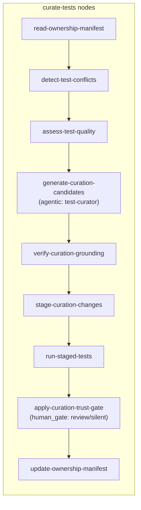

## Goal

Stage 6 Phase 2 — Test Curation. First Stage 6 phase with an LLM agent (`TestCuratorAgent`,
Haiku model, no tools, max 10 turns). Bollard can now score test quality from run history,
propose curation actions (promote/prune/rewrite), and apply them with trust-gate protection.

**Current state:**
- Phase 1 shipped: `FileOwnershipStore`, `detectManagedFileConflicts`, `bollard ownership` CLI
- `readPromotedManifest` already in `test-fingerprint.ts` (Signal 1 candidates)
- Tests: **1471 passed / 6 skipped**

**What ships in Phase 2:**

| Component | Location |
|-----------|----------|
| `TestQualityScore`, `assessTestQuality` | `@bollard/engine/src/test-quality.ts` |
| `promoteAdversarialTests`, `pruneRedundantTests` | same |
| `CurationPlan`, `CurationCandidate` | same |
| `buildCurationCorpus`, `verifyCurationGrounding` | same |
| `TestCuratorAgent` | `@bollard/agents/src/test-curator.ts` |
| `test-curator.md` prompt | `@bollard/agents/prompts/test-curator.md` |
| `curate-tests` blueprint (9 nodes) | `@bollard/blueprints/src/curate-tests.ts` |
| `bollard curate` CLI | `@bollard/cli/src/curate.ts` + `index.ts` |
| `bollard_curate_tests` MCP tool | `@bollard/mcp/src/tools.ts` |

**What is deferred (Phase 2+):**
- `auto-commit` trust level (requires git PR creation) — `review` and `silent` only in Phase 2
- `assessTestQuality` coverage delta extractor (needs coverage instrumentation data)
- MCP resource for curation status



---

## Step 1 — `packages/engine/src/test-quality.ts` (new)

### Imports

```typescript
import { readFile } from "node:fs/promises"
import { join } from "node:path"
import type { PromotedManifest } from "./test-fingerprint.js"
import type { TestOwnershipManifest } from "./ownership.js"
import type { RunRecord } from "./run-history.js"
```

### Types

```typescript
export interface TestQualityScore {
  /** Relative path from workDir. */
  filePath: string
  /** 0–100. Higher is better quality / less need for curation. */
  score: number
  /** Mutation score from most recent RunRecord, if available. */
  mutationScore?: number
  /** True when this file is in the ownership manifest's bollardManaged list. */
  isManaged: boolean
  /**
   * True when a promoted adversarial test covers the same source module,
   * making this test potentially redundant.
   */
  coveredByAdversarial: boolean
  /** RunID of the last curation pass that touched this file (from manifest). */
  lastCuratedRunId?: string
}

export interface CurationCandidate {
  /** Short unique id, e.g. "c1". */
  id: string
  /** What action the curator proposes. */
  action: "promote" | "prune" | "rewrite"
  /** Relative path from workDir. */
  filePath: string
  /** Natural language rationale. */
  claim: string
  /**
   * Grounding objects. Each quote must be a verbatim substring of the
   * quality report text or manifest summary the agent received.
   */
  grounding: Array<{ quote: string; source: "quality-report" | "manifest" | "history" }>
}

export interface CurationPlan {
  candidates: CurationCandidate[]
}
```

### `assessTestQuality`

Pure, synchronous after reads are done. Score algorithm:

```
base = 50
if mutationScore ≥ 80: base += 30
else if mutationScore ≥ 60: base += 15
else if mutationScore defined but < 60: base -= 20
if coveredByAdversarial: base -= 15   (potentially redundant)
if not isManaged: base += 5           (human-owned, less urgent to curate)
clamp to [0, 100]
```

```typescript
/**
 * Score the quality of a single test file using available signals from
 * run history and the ownership/promoted manifests.
 *
 * @param filePath   Relative path from workDir
 * @param manifest   Current ownership manifest (for isManaged / lastCuratedRunId)
 * @param promoted   Promoted adversarial manifest (for coveredByAdversarial)
 * @param records    Recent RunRecords (last 10) — scanned for mutation scores
 */
export function assessTestQuality(
  filePath: string,
  manifest: TestOwnershipManifest,
  promoted: PromotedManifest,
  records: RunRecord[],
): TestQualityScore {
  // ...implementation per algorithm above...
}
```

For `mutationScore`: scan `records` (most recent first) for any record where `testCount.passed > 0`
and `record.mutationScore` is defined. Use the most recent value found.

For `coveredByAdversarial`: check if any entry in `promoted.promoted` has a `filePath` that
shares the same module basename (without `.test.ts` / `.adversarial.test.ts` suffixes).

### `promoteAdversarialTests`

```typescript
/**
 * Return adversarial test paths from `.bollard/` that have been promoted
 * (Signal 1 — caught a real bug) and are not yet in bollardManaged.
 *
 * @param manifest   Ownership manifest (filter out already-managed paths)
 * @param promoted   Promoted manifest from test-fingerprint.ts
 * @param threshold  Minimum number of times a test was promoted to include (default: 1)
 */
export function promoteAdversarialTests(
  manifest: TestOwnershipManifest,
  promoted: PromotedManifest,
  threshold = 1,
): string[] {
  const managedPaths = new Set(manifest.bollardManaged.map((e) => e.path))
  return promoted.promoted
    .filter((p) => p.hash !== undefined) // valid entries only
    .filter((p) => !managedPaths.has(p.filePath))
    .filter((_, i) => i < 20) // cap at 20 candidates per run
    .map((p) => p.filePath)
}
```

### `pruneRedundantTests`

```typescript
/**
 * Return managed test files that are fully covered by a promoted adversarial test
 * for the same source module — candidates for pruning.
 *
 * Redundancy is determined by module basename match only (conservative).
 */
export function pruneRedundantTests(
  managed: TestOwnershipManifest["bollardManaged"],
  promoted: PromotedManifest,
): string[] {
  const promotedModules = new Set(
    promoted.promoted.map((p) =>
      p.filePath
        .replace(/\.adversarial\.test\.[jt]s$/, "")
        .replace(/\.test\.[jt]s$/, "")
        .split("/")
        .at(-1) ?? "",
    ),
  )
  return managed
    .filter((e) => {
      const base =
        e.path
          .replace(/\.test\.[jt]s$/, "")
          .split("/")
          .at(-1) ?? ""
      return promotedModules.has(base)
    })
    .map((e) => e.path)
}
```

### `buildCurationCorpus` + `verifyCurationGrounding`

The curation grounding corpus is the JSON-serialized `TestQualityScore[]` + manifest summary.
Reuse the `verifyClaimGrounding` pattern from `contract-grounding.ts` — but for curation it's
a lighter check: just verify each `grounding[].quote` appears as a literal substring in the
corpus string.

```typescript
export function buildCurationCorpus(
  scores: TestQualityScore[],
  manifest: TestOwnershipManifest,
): string {
  return [
    JSON.stringify(scores, null, 2),
    `managed: ${manifest.bollardManaged.length} files`,
    `userOwned: ${manifest.userOwned.length} files`,
  ].join("\n")
}

export interface CurationGroundingResult {
  kept: CurationCandidate[]
  dropped: Array<{ id: string; reason: string }>
}

export function verifyCurationGrounding(
  plan: CurationPlan,
  corpus: string,
): CurationGroundingResult {
  const kept: CurationCandidate[] = []
  const dropped: CurationGroundingResult["dropped"] = []
  for (const candidate of plan.candidates) {
    const allGrounded = candidate.grounding.every((g) => corpus.includes(g.quote))
    if (candidate.grounding.length === 0 || !allGrounded) {
      dropped.push({ id: candidate.id, reason: "grounding_not_in_corpus" })
    } else {
      kept.push(candidate)
    }
  }
  return { kept, dropped }
}
```

### Barrel exports in `types.ts`

Add after the ownership exports:

```typescript
export type {
  TestQualityScore,
  CurationCandidate,
  CurationPlan,
  CurationGroundingResult,
} from "./test-quality.js"
export {
  assessTestQuality,
  promoteAdversarialTests,
  pruneRedundantTests,
  buildCurationCorpus,
  verifyCurationGrounding,
} from "./test-quality.js"
```

---

## Step 2 — `packages/agents/prompts/test-curator.md` (new)

The agent receives: quality scores, adversarial promotion candidates, and current manifest.
It produces one JSON `CurationPlan`. No tools — pure generation.

```markdown
# Role

You are the test-curator agent in the Bollard pipeline. Your job is to propose concrete
curation actions based on test quality signals. You do NOT see implementation source code.

# What You Receive

- A quality report: JSON array of `TestQualityScore` objects (filePath, score 0–100,
  mutationScore, isManaged, coveredByAdversarial, lastCuratedRunId)
- A list of adversarial test candidates ready for promotion (from Signal 1 detection)
- A summary of the ownership manifest (managed + user-owned file counts)

# What to Propose

For each test file, consider exactly one of:

- **promote** — an adversarial test in `.bollard/` has caught real bugs; move it to the
  main test suite by claiming it. Only propose for paths in the adversarial candidates list.
- **prune** — a managed test file has `coveredByAdversarial: true` AND `score < 40`; it is
  redundant. Only propose for managed files.
- **rewrite** — a managed test file has `score < 60` AND `mutationScore < 60`; it has poor
  coverage and should be improved. Only propose for managed files.

Do NOT propose actions for user-owned files. Do NOT invent file paths not present in the
quality report or adversarial candidates list.

# Output Format

Output exactly one JSON document wrapped in a ` ```json ` fence. No prose outside the fence.

```json
{
  "candidates": [
    {
      "id": "c1",
      "action": "promote",
      "filePath": ".bollard/tests/cost-tracker.adversarial.test.ts",
      "claim": "This adversarial test caught a real bug and should be promoted to the main suite.",
      "grounding": [
        {
          "quote": "\"coveredByAdversarial\": false",
          "source": "quality-report"
        }
      ]
    }
  ]
}
```

## Grounding rules

Each `grounding[].quote` must be a **verbatim substring** of the quality report JSON or
manifest summary you received. The verifier runs a literal substring match — paraphrases
are rejected.

## BEFORE EMITTING — Self-check

1. Every `filePath` in your candidates exists in the quality report or adversarial candidates list.
2. Every `grounding[].quote` appears verbatim in the quality report or manifest summary.
3. You propose at most one action per file.
4. You do not propose actions for `userOwned` files.
5. `promote` actions reference only adversarial candidate paths.

Only emit after this check passes.
```

---

## Step 3 — `packages/agents/src/test-curator.ts` (new)

Follow `boundary-tester.ts` exactly:

```typescript
import { readFile } from "node:fs/promises"
import { dirname, resolve } from "node:path"
import { fileURLToPath } from "node:url"
import { defaultAdversarialConfig } from "@bollard/detect/src/concerns.js"
import type { ToolchainProfile } from "@bollard/detect/src/types.js"
import type { AgentDefinition } from "./types.js"

const THIS_DIR = dirname(fileURLToPath(import.meta.url))
const PROMPT_PATH = resolve(THIS_DIR, "../prompts/test-curator.md")

const FALLBACK_PROFILE: ToolchainProfile = {
  language: "typescript",
  checks: {},
  sourcePatterns: [],
  testPatterns: [],
  ignorePatterns: [],
  allowedCommands: [],
  adversarial: defaultAdversarialConfig({ language: "typescript" }),
}

export async function createTestCuratorAgent(
  _profile?: ToolchainProfile,
): Promise<AgentDefinition> {
  const systemPrompt = await readFile(PROMPT_PATH, "utf-8")
  return {
    role: "test-curator",
    systemPrompt,
    tools: [],
    maxTurns: 10,
    maxTokens: 8192,
    temperature: 0.3,
  }
}
```

Note: the test-curator prompt doesn't use `{{placeholders}}` so `fillPromptTemplate` is not
needed. Read the file directly.

---

## Step 4 — `packages/blueprints/src/curate-tests.ts` (new)

9-node blueprint. Import what's needed from engine, agents, verify.

```typescript
import type { Blueprint } from "@bollard/engine/src/blueprint.js"

export function createCurateTestsBlueprint(): Blueprint {
  return {
    id: "curate-tests",
    name: "Curate Tests",
    nodes: [
      // node definitions below
    ],
    maxCostUsd: 2,
    maxDurationMinutes: 10,
  }
}
```

### Node implementations

**Node 1: `read-ownership-manifest`** (deterministic)
```typescript
{
  id: "read-ownership-manifest",
  name: "Read Ownership Manifest",
  type: "deterministic",
  execute: async (ctx) => {
    const workDir = resolve(process.cwd())
    const store = new FileOwnershipStore(workDir)
    const manifest = await store.read()
    ctx.ownershipManifest = manifest
    return { status: "ok", data: manifest }
  },
}
```

**Node 2: `detect-test-conflicts`** (deterministic, `onFailure: "skip"`)

Read manifest from `ctx.results["read-ownership-manifest"]`, run `detectManagedFileConflicts`,
log conflicts. If `manifest.bollardManaged.length === 0`, emit `{ status: "ok", data: { conflicts: [], skipped: true } }`.
Do NOT throw `TAKEOVER_CONFLICT` in Phase 2 — log warn and continue (conflict enforcement is
Phase 3+).

**Node 3: `assess-test-quality`** (deterministic)

Read manifest from node 1 result. Read `promoted.json` via `readPromotedManifest(workDir)`.
Query last 10 `RunRecord` entries from `FileRunHistoryStore`. For each managed file, call
`assessTestQuality(filePath, manifest, promoted, records)`. Also call `promoteAdversarialTests`
and `pruneRedundantTests` to get candidate lists.

Return `{ status: "ok", data: { scores: TestQualityScore[], promotionCandidates: string[], pruneCandidates: string[] } }`.

If no managed files and no promotion candidates: `{ status: "ok", data: { scores: [], skipped: true } }`.

**Node 4: `generate-curation-candidates`** (agentic, `agent: "test-curator"`)

The agentic handler receives this node. The `AgenticHandler` in the CLI builds the user
message from `ctx.results["assess-test-quality"].data`:

```
Quality Report:
<JSON-serialized scores>

Adversarial Promotion Candidates:
<newline-separated list>

Manifest Summary:
managed: N files
userOwned: M files
```

**Node 5: `verify-curation-grounding`** (deterministic)

Parse agent output as `CurationPlan` JSON. Call `verifyCurationGrounding(plan, corpus)`.
If `kept.length === 0`: return `{ status: "ok", data: { kept: [], skipped: true } }` (not
a hard failure — zero actionable candidates is valid for a healthy test suite).

**Node 6: `stage-curation-changes`** (deterministic)

For each kept candidate:
- `promote`: copy the adversarial file from `.bollard/` to `packages/*/tests/` (derive
  target path by stripping `.adversarial` from the basename, same logic as `promote-test.ts`)
- `prune`: write a marker file `.bollard/curation/tests/<basename>.prune` (the actual
  deletion happens at `apply-curation-trust-gate`)
- `rewrite`: copy current managed file to `.bollard/curation/tests/<basename>.staged`
  with a comment header noting it needs rewrite; Phase 3+ will add the rewrite agent

Write the full list of staged actions to `.bollard/curation/tests/plan.json`.

**Node 7: `run-staged-tests`** (deterministic, `onFailure: "skip"`)

Copy staged `promote` files from `.bollard/curation/tests/` to their target workspace paths
(backing up originals). Run `runTests(workDir, profile)`. Restore originals regardless of
result. Return pass/fail status.

**Node 8: `apply-curation-trust-gate`** (human_gate or deterministic based on trust level)

Read `ctx.toolchainProfile?.adversarial` or fallback to `BollardConfig.takeover.tests.trust`.

- `review` (default): this node has `type: "human_gate"` — the handler shows the staged
  plan diff and asks for approval. On approve: apply staged changes. On reject: skip.
- `silent`: `type: "deterministic"` — apply staged changes directly without gate.
- `auto-commit`: deferred — treat as `review` for Phase 2.

**Node 9: `update-ownership-manifest`** (deterministic)

For each applied promote/rewrite candidate, call `store.claim(filePath, "tests", ctx.runId, headSha)`.
For each applied prune candidate, call `store.release(filePath)`.

---

## Step 5 — `packages/cli/src/curate.ts` (new)

```typescript
export async function runCurateCommand(args: string[], workDir: string): Promise<void>
```

Subcommands:
- `list-quality` — run `assessTestQuality` for all managed files, print score table
- `run` — run the `curate-tests` blueprint with `BOLLARD_AUTO_APPROVE` or interactive gate
- (help fallback)

Wire into `index.ts` (import + route + help text) after `ownership` block.

---

## Step 6 — MCP `bollard_curate_tests` in `packages/mcp/src/tools.ts`

Add to the tools list:

```typescript
{
  name: "bollard_curate_tests",
  description: "Run the curate-tests pipeline: score test quality, propose curation actions (promote/prune/rewrite), apply with trust gate. Returns quality scores and proposed candidates.",
  inputSchema: {
    type: "object",
    properties: {
      workDir: { type: "string", description: "Project root (defaults to server cwd)" },
      dryRun: { type: "boolean", description: "Score and propose without staging changes" },
    },
  },
}
```

Handler: if `dryRun`, run nodes 1–5 only and return `scores + candidates`. Otherwise run
the full blueprint.

---

## Step 7 — Tests

### `packages/engine/tests/test-quality.test.ts` (~12 tests)

```
assessTestQuality:
1. Returns score 80+ when mutationScore >= 80
2. Returns score 50 base when no mutationScore
3. Penalizes 20 when mutationScore < 60
4. Penalizes 15 when coveredByAdversarial
5. isManaged: true when file in bollardManaged
6. lastCuratedRunId populated from manifest entry

promoteAdversarialTests:
7. Returns promoted paths not in bollardManaged
8. Filters out paths already in bollardManaged
9. Caps at 20 candidates

pruneRedundantTests:
10. Returns managed file when basename matches promoted adversarial module
11. Returns empty when no match

verifyCurationGrounding:
12. Keeps candidate with verbatim quote in corpus; drops candidate with paraphrase
```

### `packages/blueprints/tests/curate-tests.test.ts` (~4 tests)

```
1. createCurateTestsBlueprint() returns blueprint with id "curate-tests"
2. Blueprint has exactly 9 nodes
3. Node ids match spec in order
4. Node types match spec (deterministic/agentic/human_gate)
```

---

## Step 8 — Validate

```bash
docker compose run --rm dev run typecheck
docker compose run --rm dev run lint
docker compose run --rm dev run test
```

Gate: **≥ 1487 passed / 6 skipped** (1471 + 12 quality + 4 blueprint = +16).

---

## Step 9 — Smoke test

```bash
docker compose run --rm dev sh -c \
  'pnpm --filter @bollard/cli run start -- curate list-quality --work-dir /app'
```

Expected: quality report printed with scores for any managed test files (if `.bollard/ownership.json`
exists) or "No managed test files" message. No error.

---

## Step 10 — Commit + docs + push

**Commit 1 — implementation:**
Files: `packages/engine/src/test-quality.ts`, `packages/engine/src/types.ts`,
`packages/agents/src/test-curator.ts`, `packages/agents/prompts/test-curator.md`,
`packages/blueprints/src/curate-tests.ts`, `packages/cli/src/curate.ts`,
`packages/cli/src/index.ts`, `packages/mcp/src/tools.ts`,
`packages/engine/tests/test-quality.test.ts`, `packages/blueprints/tests/curate-tests.test.ts`

```
Stage 6 Phase 2: curate-tests blueprint + TestCuratorAgent + assessTestQuality

Test curation pipeline (9 nodes):
- read-ownership-manifest, detect-test-conflicts, assess-test-quality (deterministic)
- generate-curation-candidates (agentic: test-curator, Haiku, 10 turns, no tools)
- verify-curation-grounding (deterministic, same ADR-0001 pattern as contract/behavioral)
- stage-curation-changes (writes to .bollard/curation/tests/)
- run-staged-tests (copy staged → workspace → test → restore)
- apply-curation-trust-gate (review: human_gate | silent: direct apply)
- update-ownership-manifest

Supporting infrastructure:
- assessTestQuality() — mutation score + adversarial coverage scoring (0-100)
- promoteAdversarialTests() — Signal 1 candidates from promoted.json
- pruneRedundantTests() — basename match against promoted adversarial tests
- buildCurationCorpus() + verifyCurationGrounding() — same grounding pattern as all scopes
- bollard curate list-quality | run CLI
- bollard_curate_tests MCP tool (dryRun: score+propose only)

auto-commit trust level deferred (Phase 2+). +16 tests; NNNN/6.
```

**Commit 2 — docs + archive:**
- CLAUDE.md: test count, Stage 6 Phase 2 stage log entry, Known Limitations bullet
- ROADMAP.md: Phase 2 marked DONE
- `git mv spec/prompts/stage6-phase2-curate-tests.md spec/archive/`

---

## Final self-check

1. typecheck + lint + test — **≥ 1487 / 0 failed**
2. `bollard curate list-quality` — runs without error
3. `createCurateTestsBlueprint().nodes` — 9 nodes in correct order
4. `git log --oneline -3` — implementation + docs commits on main
5. `ls spec/prompts/` — empty
6. `git status` — clean

---

## Out of scope

- `auto-commit` trust level — deferred (requires git PR creation)
- `rewrite` action full implementation — staged marker only; the rewrite agent is Phase 3+
- `assess-test-quality` coverage delta (needs coverage instrumentation)
- MCP resource for curation status
- `curate-ci`, `curate-deps`, `curate-docs`, `curate-monitoring` (Phases 3–6)
- Any changes to `implement-feature.ts` or existing pipeline nodes
