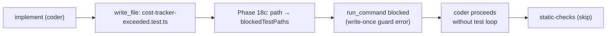

## Goal

Run a Bollard-on-Bollard verification-only self-test against `CostTracker.exceeded(): boolean` to
validate Phase 18c — the `blockedTestPaths` guard that blocks `run_command` from running a test file
after the write-once guard (Phase 18b) splices it out of `allowedWritePaths`.

The code already exists on `main`. This is an intentional verification-only run: the coder will find
the implementation in place, write a new unit test file (`cost-tracker-exceeded.test.ts` per
planner Rule 11), and the Phase 18c guard should fire the moment the coder tries to run that file —
keeping total coder turns under 15.

Validation gate: **coder turns < 15** AND **pipeline completes 31/31 nodes** (or halts only at
`run-contract-tests`/`run-tests` with `onFailure: skip`).

This does NOT add any new infrastructure. It is a pure pipeline execution + results recording task.

---

## Architecture



---

## Step 0 — Capture baseline (MUST run before any code change)

No code changes are made in this prompt — it is execution-only. Skip Step 0 baseline capture.

Confirm the tree is clean before running:

```bash
git status   # must show: nothing to commit, working tree clean
git log --oneline -3
```

---

## Step 1 — Run the self-test

Run the full `implement-feature` pipeline with auto-approve enabled (no human gates):

```bash
docker compose run --rm \
  -e BOLLARD_AUTO_APPROVE=1 \
  dev sh -c \
  'pnpm --filter @bollard/cli run start -- run implement-feature \
    --task "Add CostTracker.exceeded(): boolean method that returns true when _total > _limit" \
    --work-dir /app'
```

**What to expect:**

1. `generate-plan` (planner, Haiku): sees `exceeded()` already exists in `cost-tracker.ts`. Per Rule 11, emits `cost-tracker-exceeded.test.ts` in `affected_files.create`. `affected_files.modify` may be empty or contain only `cost-tracker.ts` (no-op).
2. `implement` (coder, Sonnet): reads `cost-tracker.ts`, sees method exists. Writes `cost-tracker-exceeded.test.ts` once (Phase 17 Rule 11 + Phase 18b write-once). Attempts `run_command pnpm test … cost-tracker-exceeded.test.ts`. **Phase 18c fires** — `run_command` returns: `Error: "cost-tracker-exceeded.test.ts" was written by write-once guard and cannot be run again.` Coder proceeds without looping. Total coder turns: **< 15**.
3. `static-checks`: may fail (no new source code) → `onFailure: skip`.
4. `run-tests`: runs only `cost-tracker-exceeded.test.ts` → tests may pass or fail → `onFailure: skip`.
5. Contract/behavioral nodes: run normally (or skip on low risk).
6. `approve-pr`: pipeline reaches human gate (or auto-approved).

**Record these values** in the Baseline capture section at the bottom of this file:
- Run ID (from CLI output, e.g. `20260527-XXXX-run-XXXXXX`)
- Coder turns (from `bollard history show <run-id>` — look for `Nt` suffix on `implement` node)
- Whether Phase 18c fired (look for "write-once guard" in output, or turns < 15 with no test loop)
- Total cost
- Final node count (e.g. 31/31)

---

## Step 2 — Validate the guard fired

After the run completes, check the history:

```bash
docker compose run --rm dev sh -c \
  'pnpm --filter @bollard/cli run start -- history show <run-id>'
```

Look for:
- `implement` node shows `Nt` (e.g. `implement  ok  $X.XX  118s  7t`) — **turns must be < 15**
- No "retrying" entries on `implement`
- `run-tests` shows `skip` (expected — boundary test for a method that already exists may fail or be trivial)

Also confirm the test file was written:

```bash
ls packages/engine/tests/cost-tracker-exceeded.test.ts
```

If the file exists and turns < 15: **Phase 18c VALIDATED**.

If turns ≥ 15 or the coder ran the test file multiple times: Phase 18c did NOT fire as expected —
check `blockedTestPaths` wiring in `write-file.ts` and `run-command.ts`.

---

## Step 3 — Record results

### 3a — Write results file

Create `spec/self-test-exceeded-results.md` with:

```markdown
# Self-Test: CostTracker.exceeded() — Phase 18c Validation

**Run ID:** <run-id>
**Date:** 2026-05-27
**Task:** Add CostTracker.exceeded(): boolean method
**Purpose:** Validate Phase 18c blockedTestPaths guard

## Result: [GREEN / RED]

| Metric | Value | Target |
|--------|-------|--------|
| Nodes completed | XX/31 | 31/31 |
| Coder turns | XX | < 15 |
| Total cost | $X.XX | < $1.00 |
| Phase 18c fired | YES/NO | YES |
| blockedTestPaths error seen | YES/NO | YES |

## Phase 18c Guard Behavior

[Describe what the coder did: wrote test file at turn N, attempted run_command at turn N+1,
received "write-once guard" error, proceeded without looping.]

## Node Timeline

[Paste key lines from `bollard history show <run-id>`]

## Conclusion

[GREEN: Phase 18c guard fired correctly, coder turns < 15, pipeline completed.]
[RED: describe what went wrong]
```

### 3b — Update CLAUDE.md

Add a new self-test entry in the Known Limitations section (after the last self-test entry), following
the exact pattern of existing entries. The entry should read approximately:

```
Self-test **2026-05-27** (run id `<run-id>`, `CostTracker.exceeded()` — Phase 18c `blockedTestPaths` guard validation) completed **31/31** nodes successfully. Total cost **$X.XX**; **implement** ~**Xs**, **$X.XX** (coder **X** turns). Phase 18c guard: **fired** — coder wrote `cost-tracker-exceeded.test.ts` at turn N, `run_command` returned write-once guard error at turn N+1. Boundary grounding **X/X** (drop 0), contract **X/X** (drop X). See [spec/self-test-exceeded-results.md](../spec/self-test-exceeded-results.md).
```

Also update the test count line if the new `cost-tracker-exceeded.test.ts` adds tests. Current count: **1305 passed / 6 skipped**.

### 3c — Archive prompt

Move this file to `spec/archive/self-test-exceeded.md` after GREEN validation.

---

## Key types (inline — do not look these up)

```typescript
// packages/agents/src/types.ts
export interface AgentContext {
  pipelineCtx: PipelineContext
  workDir: string
  allowedCommands?: string[]
  allowedWritePaths?: string[]
  /**
   * Paths removed by the write-once guard (Phase 18). run_command rejects test invocations
   * that reference any path in this set, preventing the coder from iterating on a test file
   * after writing it once.
   */
  blockedTestPaths?: string[]
  progress?: AgentProgressCallback
  testInvocationCount?: number
}
```

```typescript
// packages/engine/src/cost-tracker.ts — the method under test
/** Returns `true` if the accumulated total exceeds the limit; always a `boolean`. */
exceeded(): boolean {
  return this._total > this._limit
}
```

Phase 18c wiring (already on main — do NOT modify):

```typescript
// write-file.ts — after write succeeds:
if (ctx.allowedWritePaths !== undefined && /\.test\.[jt]s$/.test(filePath)) {
  const idx = ctx.allowedWritePaths.indexOf(filePath)
  if (idx !== -1) {
    ctx.allowedWritePaths.splice(idx, 1)
    if (ctx.blockedTestPaths === undefined) ctx.blockedTestPaths = []
    ctx.blockedTestPaths.push(filePath)
  }
}

// run-command.ts — before testInvocationCount:
if (ctx.blockedTestPaths !== undefined && ctx.blockedTestPaths.length > 0) {
  const blocked = ctx.blockedTestPaths.find((blocked) => {
    const blockedBase = blocked.split("/").at(-1) ?? ""
    return parts.some((p) => p === blocked || p.endsWith(blockedBase))
  })
  if (blocked !== undefined) {
    const base = blocked.split("/").at(-1) ?? blocked
    return [
      `Error: "${base}" was written by write-once guard and cannot be run again.`,
      "You wrote the test file once — do not run or edit it.",
      "Proceed to the next step.",
    ].join(" ")
  }
}
```

---

## Self-check

After the pipeline run completes:

1. `bollard history show <run-id>` — `implement` node shows ≤ 14 turns (`Nt` suffix)
2. `ls packages/engine/tests/cost-tracker-exceeded.test.ts` — file exists
3. `spec/self-test-exceeded-results.md` — file exists with GREEN or RED verdict
4. CLAUDE.md updated with self-test entry
5. This prompt archived to `spec/archive/`

If coder turns ≥ 15: STOP. Do not declare GREEN. Check `blockedTestPaths` wiring — likely the
path comparison is failing (basename mismatch). Report the actual turn count and the last 5 tool
calls the coder made before stopping.

---

## Out of scope

- DO NOT modify `cost-tracker.ts` — the method already exists; this is verification-only
- DO NOT modify `write-file.ts`, `run-command.ts`, or `types.ts` — Phase 18c is already on main
- DO NOT modify the planner or coder prompts
- DO NOT run `git commit` or `git push` — this is a local validation run only
- DO NOT update the eval baseline (`bollard eval tag`) — this run doesn't change agent prompts
- DO NOT update `cost-baseline` — the coder barely runs; this is not a meaningful cost sample

---

## Baseline capture

*(Fill in after Step 1)*

| Field | Value |
|-------|-------|
| Run ID | |
| Date | |
| Coder turns | |
| Total cost | |
| Nodes completed | |
| Phase 18c fired | |
| blockedTestPaths error text | |
| test file written | |
